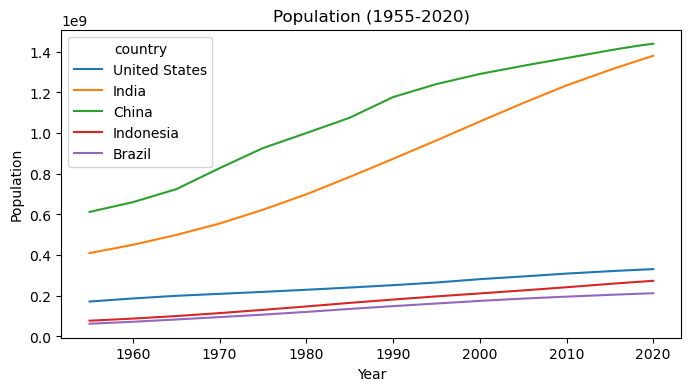
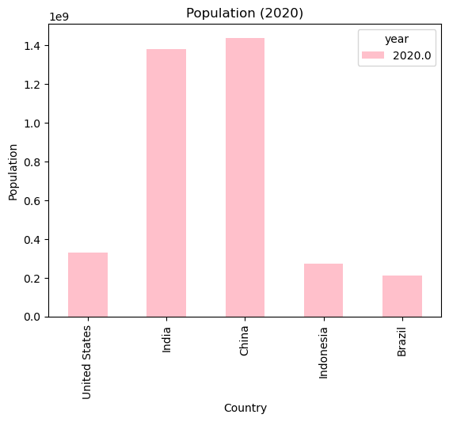
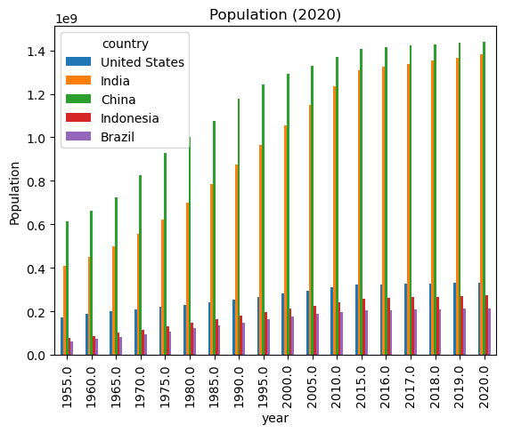
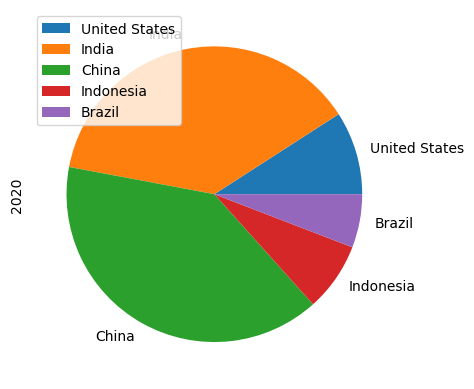

# Hello World


```python
#Printing my name
print ("Gen Castillo")
```

    Gen Castillo


```python

```

# Data Types


```python
type(1)
```


    int


```python
type(2.5)
```


    float


```python
1 + 2
```


    3


```python
4 - 1
```


    3


```python
type(True)
```


    bool


```python
type(False)
```


    bool


```python
type("i love you")
```


    str


```python
"i love you".upper()
```


    'I LOVE YOU'


```python
#Playing with different sizes for printing messages
print("i love you".upper())
print("i love you".lower())
print("i love you".title())
```

    I LOVE YOU
    i love you
    I Love You


```python
#Counting how many times the letter O is repeated within this text string
"i love you".count('o')
```


    2


```python
#With this example, I'm indicating that I want to replace the letter "o" with the letter "U"
"i love you".replace('o','U')
```


    'i lUve yUu'


# Variables

##Variables help us saved data values, below, the first like is idicating the name of my variable:


```python
message_1 = "I'm learning Python"
```


```python
message_1
```


    "I'm learning Python"


```python
message_2 = "I love you"
```


```python
message_2
```


    'I love you'


```python
message_1 + message_2
```


    "I'm learning PythonI love you"


```python
#We combined both variables but there was not a space in between, I'm adding an additional + sign with single quotes with a space in between' '
message_1 + ' ' + message_2
```


    "I'm learning Python I love you"


# Alternative way to join both messages, you can also add other things in betwen, see the example with the "AND":


```python


    f'{message_1} {message_2}'
```


    "I'm learning Python I love you"


```python
    f'{message_1} and {message_2}'
```


    "I'm learning Python and I love you"


```python

```

# List 


```python
Countries = ['united states', 'dominican republic', 'india','china']
```


```python
Countries

```


    ['united states', 'dominican republic', 'india', 'china']


# Each item inside the string has an index, starting from the first one listed as 0. For example:


```python
Countries [0]
```


    'united states'


## We can also do the list with Sliding 

### Variable_name [start:Stop] see example below


```python
Countries [0:3]
```


    ['united states', 'dominican republic', 'india']


# Adding elements to a list

##### By using .append () & .insert()


```python
Countries.append('canada')
```


```python
Countries
```


    ['united states', 'dominican republic', 'india', 'china', 'canada', 'canada']


```python
 Countries.insert(0,'spain')
```


```python
Countries

```


    ['spain',
     'united states',
     'dominican republic',
     'india',
     'china',
     'canada',
     'canada']


## Removing an element


```python
Countries.remove('spain')
```


```python
Countries


```


    ['united states', 'dominican republic', 'india', 'china', 'canada', 'canada']


# Sorting a list


```python
Numbers = [4, 5, 7, 8, 1, 2, 2]
```


```python
Numbers.sort()
```


```python
Numbers
```


    [1, 2, 2, 4, 5, 7, 8]


## Sort from largest to smallest


```python
Numbers = [4, 5, 7, 8, 1, 2, 2]
Numbers.sort(reverse=True)
Numbers
```


    [8, 7, 5, 4, 2, 2, 1]


## Update an element


```python
Numbers [0] = 10
Numbers
```


    [10, 7, 5, 4, 2, 2, 1]


```python

```

## Dictionary


```python
My_data = {'Name':'Gen Cabrera', 'Age':'26'}
```


```python
My_data

```


    {'Name': 'Gen Cabrera', 'Age': '26'}


## Copy a dictionary


```python
New_Dic_Copy = My_data.copy()
```


```python
New_Dic_Copy

```


    {'Name': 'Gen Cabrera', 'Age': '26'}


```python

```

## If Statement
if <condition>:<code>
elif another_condition:
   <condition>:<code>
       ....
else:
  <code>
      
      In the example below I start by creating a new varibale for age 18. You can change the age to see how the print massage varies.


```python
age = 14
if age>=18:
    print("You're an adult")
    
elif age>=13:
    print("You're a teenager")
    
else:
        print("You're a kid!")
        
```

    You're a teenager


## for loop
for <varible> in <list>: 
    <code>
        


```python
for <varible> in <interable> : <code>
```


```python
Countries = ['united states', 'dominican republic', 'india','china']

```


```python
Countries
```


    ['united states', 'dominican republic', 'india', 'china']


```python
for country in Countries:
    print(country)

```

    united states
    dominican republic
    india
    china


```python
for i, Countries in enumerate (Countries):
    print(i)
    print(country)
```

    0
    china
    1
    china
    2
    china
    3
    china


## The "i" is the order/number of the loop/countries


```python
My_data
```


    {'Name': 'Gen Cabrera', 'Age': '26'}


###look for elements or items inside a dictionary


```python
for key, value in My_data.items():
    print(key)
    print(value)
```

    Name
    Gen Cabrera
    Age
    26


## Function

###def function ( <params> ):
       <code>
return < data >


```python
def sum_value(a,b):
    x = a + b
    return x
```


```python
sum_value (1, 3)
```


    4


## Built-in Functions


```python
countries = ['united states', 'china', 'india', 'japan']
```


```python
len(countries)
```


    4


```python
max(['1', '2', '5', '6'])
```


    '6'


```python
min(['1', '2', '5', '6'])
```


    '1'


```python
type(countries)
```


    list


```python
for i in range(1, 10, 2):
    print (i)
```

    1
    3
    5
    7
    9


## Module

###import

## Os Module


```python
import os
```


```python
os.getcwd()
```


    '/Users/genesiscabrera'


```python
os.listdir()
```


    ['.Rhistory',
     '.config',
     'Music',
     'New Folder',
     '.condarc',
     '.DS_Store',
     '.CFUserTextEncoding',
     '.xonshrc',
     '.zshrc',
     'Pictures',
     '.zsh_history',
     '.ipython',
     'Desktop',
     'Library',
     'Public',
     'Practice.ipynb',
     '.tcshrc',
     '.RData',
     '.anaconda',
     'Movies',
     'Applications',
     '.Rapp.history',
     '.Trash',
     '.ipynb_checkpoints',
     '.jupyter',
     'Documents',
     '.anydesk',
     '.vscode',
     '.bash_profile',
     'anaconda3',
     'Downloads',
     '.continuum',
     '.zsh_sessions',
     '.Upwork',
     '.conda']


```python
os.makedirs("New Folder")
```

##with the example above we created a new folder. With this code we can see all the existing folders:os.listdir()

    ##Creating a dataframe from an array


```python
import pandas as pd
import numpy as np
```


```python
# creating an array
data=np.array([[1,4], [2,5], [3,6]])
```


```python
# creating a dataframe with pandas
df = pd.DataFrame(data, index=['row1', 'row2', 'row3'],
          columns=['col1','col2,'])
```


```python
# showing the dataframe
```


```python
df
```


<div>
<style scoped>
    .dataframe tbody tr th:only-of-type {
        vertical-align: middle;
    }

    .dataframe tbody tr th {
        vertical-align: top;
    }

    .dataframe thead th {
        text-align: right;
    }
</style>
<table border="1" class="dataframe">
  <thead>
    <tr style="text-align: right;">
      <th></th>
      <th>col1</th>
      <th>col2,</th>
    </tr>
  </thead>
  <tbody>
    <tr>
      <th>row1</th>
      <td>1</td>
      <td>4</td>
    </tr>
    <tr>
      <th>row2</th>
      <td>2</td>
      <td>5</td>
    </tr>
    <tr>
      <th>row3</th>
      <td>3</td>
      <td>6</td>
    </tr>
  </tbody>
</table>
</div>


##Option #2 to create a DataFrame


```python
# creating an array with list shape
data = [[1,4], [2,5], [3,6]]
```


```python
# creating a dataframe 
df = pd.DataFrame(data, index=['row1', 'row2', 'row3'],
          columns=['col1','col2,'])
```


```python
df
```


<div>
<style scoped>
    .dataframe tbody tr th:only-of-type {
        vertical-align: middle;
    }

    .dataframe tbody tr th {
        vertical-align: top;
    }

    .dataframe thead th {
        text-align: right;
    }
</style>
<table border="1" class="dataframe">
  <thead>
    <tr style="text-align: right;">
      <th></th>
      <th>col1</th>
      <th>col2,</th>
    </tr>
  </thead>
  <tbody>
    <tr>
      <th>row1</th>
      <td>1</td>
      <td>4</td>
    </tr>
    <tr>
      <th>row2</th>
      <td>2</td>
      <td>5</td>
    </tr>
    <tr>
      <th>row3</th>
      <td>3</td>
      <td>6</td>
    </tr>
  </tbody>
</table>
</div>


```python
## Creating a Dataframe from a dictionary
states = ['California', 'Texas', 'Florida', 'New York'] 
population = [202330, 202520, 272220, 343035]
```

### Storing lists within a dictionary


```python
# lists used for this example
dict_states = {'States': states, 'Population': population}
```


```python
# Creating the dataframe
df_population = pd.DataFrame (dict_states)
```


```python
# showing the dataframe
df_population


```


<div>
<style scoped>
    .dataframe tbody tr th:only-of-type {
        vertical-align: middle;
    }

    .dataframe tbody tr th {
        vertical-align: top;
    }

    .dataframe thead th {
        text-align: right;
    }
</style>
<table border="1" class="dataframe">
  <thead>
    <tr style="text-align: right;">
      <th></th>
      <th>States</th>
      <th>Population</th>
    </tr>
  </thead>
  <tbody>
    <tr>
      <th>0</th>
      <td>California</td>
      <td>202330</td>
    </tr>
    <tr>
      <th>1</th>
      <td>Texas</td>
      <td>202520</td>
    </tr>
    <tr>
      <th>2</th>
      <td>Florida</td>
      <td>272220</td>
    </tr>
    <tr>
      <th>3</th>
      <td>New York</td>
      <td>343035</td>
    </tr>
  </tbody>
</table>
</div>


## Create a dataframe from a CSV file


```python
import pandas as pd

```


```python
#showing the dataframe from a CSV file
df_exams = pd.read_csv('StudentsPerformance.csv')
```


```python
#show first 5 rows in a dataframe
df_exams.head()
```


<div>
<style scoped>
    .dataframe tbody tr th:only-of-type {
        vertical-align: middle;
    }

    .dataframe tbody tr th {
        vertical-align: top;
    }

    .dataframe thead th {
        text-align: right;
    }
</style>
<table border="1" class="dataframe">
  <thead>
    <tr style="text-align: right;">
      <th></th>
      <th>gender</th>
      <th>race/ethnicity</th>
      <th>parental level of education</th>
      <th>lunch</th>
      <th>test preparation course</th>
      <th>math score</th>
      <th>reading score</th>
      <th>writing score</th>
    </tr>
  </thead>
  <tbody>
    <tr>
      <th>0</th>
      <td>female</td>
      <td>group B</td>
      <td>bachelor's degree</td>
      <td>standard</td>
      <td>none</td>
      <td>72</td>
      <td>72</td>
      <td>74</td>
    </tr>
    <tr>
      <th>1</th>
      <td>female</td>
      <td>group C</td>
      <td>some college</td>
      <td>standard</td>
      <td>completed</td>
      <td>69</td>
      <td>90</td>
      <td>88</td>
    </tr>
    <tr>
      <th>2</th>
      <td>female</td>
      <td>group B</td>
      <td>master's degree</td>
      <td>standard</td>
      <td>none</td>
      <td>90</td>
      <td>95</td>
      <td>93</td>
    </tr>
    <tr>
      <th>3</th>
      <td>male</td>
      <td>group A</td>
      <td>associate's degree</td>
      <td>free/reduced</td>
      <td>none</td>
      <td>47</td>
      <td>57</td>
      <td>44</td>
    </tr>
    <tr>
      <th>4</th>
      <td>male</td>
      <td>group C</td>
      <td>some college</td>
      <td>standard</td>
      <td>none</td>
      <td>76</td>
      <td>78</td>
      <td>75</td>
    </tr>
  </tbody>
</table>
</div>


```python
#show the last 5 rows in a dataframe
df_exams.tail()
```


<div>
<style scoped>
    .dataframe tbody tr th:only-of-type {
        vertical-align: middle;
    }

    .dataframe tbody tr th {
        vertical-align: top;
    }

    .dataframe thead th {
        text-align: right;
    }
</style>
<table border="1" class="dataframe">
  <thead>
    <tr style="text-align: right;">
      <th></th>
      <th>gender</th>
      <th>race/ethnicity</th>
      <th>parental level of education</th>
      <th>lunch</th>
      <th>test preparation course</th>
      <th>math score</th>
      <th>reading score</th>
      <th>writing score</th>
    </tr>
  </thead>
  <tbody>
    <tr>
      <th>995</th>
      <td>female</td>
      <td>group E</td>
      <td>master's degree</td>
      <td>standard</td>
      <td>completed</td>
      <td>88</td>
      <td>99</td>
      <td>95</td>
    </tr>
    <tr>
      <th>996</th>
      <td>male</td>
      <td>group C</td>
      <td>high school</td>
      <td>free/reduced</td>
      <td>none</td>
      <td>62</td>
      <td>55</td>
      <td>55</td>
    </tr>
    <tr>
      <th>997</th>
      <td>female</td>
      <td>group C</td>
      <td>high school</td>
      <td>free/reduced</td>
      <td>completed</td>
      <td>59</td>
      <td>71</td>
      <td>65</td>
    </tr>
    <tr>
      <th>998</th>
      <td>female</td>
      <td>group D</td>
      <td>some college</td>
      <td>standard</td>
      <td>completed</td>
      <td>68</td>
      <td>78</td>
      <td>77</td>
    </tr>
    <tr>
      <th>999</th>
      <td>female</td>
      <td>group D</td>
      <td>some college</td>
      <td>free/reduced</td>
      <td>none</td>
      <td>77</td>
      <td>86</td>
      <td>86</td>
    </tr>
  </tbody>
</table>
</div>


```python
#show the N rows in a dataframe, by adding an argument to the formula
df_exams.tail(10)
```


<div>
<style scoped>
    .dataframe tbody tr th:only-of-type {
        vertical-align: middle;
    }

    .dataframe tbody tr th {
        vertical-align: top;
    }

    .dataframe thead th {
        text-align: right;
    }
</style>
<table border="1" class="dataframe">
  <thead>
    <tr style="text-align: right;">
      <th></th>
      <th>gender</th>
      <th>race/ethnicity</th>
      <th>parental level of education</th>
      <th>lunch</th>
      <th>test preparation course</th>
      <th>math score</th>
      <th>reading score</th>
      <th>writing score</th>
    </tr>
  </thead>
  <tbody>
    <tr>
      <th>990</th>
      <td>male</td>
      <td>group E</td>
      <td>high school</td>
      <td>free/reduced</td>
      <td>completed</td>
      <td>86</td>
      <td>81</td>
      <td>75</td>
    </tr>
    <tr>
      <th>991</th>
      <td>female</td>
      <td>group B</td>
      <td>some high school</td>
      <td>standard</td>
      <td>completed</td>
      <td>65</td>
      <td>82</td>
      <td>78</td>
    </tr>
    <tr>
      <th>992</th>
      <td>female</td>
      <td>group D</td>
      <td>associate's degree</td>
      <td>free/reduced</td>
      <td>none</td>
      <td>55</td>
      <td>76</td>
      <td>76</td>
    </tr>
    <tr>
      <th>993</th>
      <td>female</td>
      <td>group D</td>
      <td>bachelor's degree</td>
      <td>free/reduced</td>
      <td>none</td>
      <td>62</td>
      <td>72</td>
      <td>74</td>
    </tr>
    <tr>
      <th>994</th>
      <td>male</td>
      <td>group A</td>
      <td>high school</td>
      <td>standard</td>
      <td>none</td>
      <td>63</td>
      <td>63</td>
      <td>62</td>
    </tr>
    <tr>
      <th>995</th>
      <td>female</td>
      <td>group E</td>
      <td>master's degree</td>
      <td>standard</td>
      <td>completed</td>
      <td>88</td>
      <td>99</td>
      <td>95</td>
    </tr>
    <tr>
      <th>996</th>
      <td>male</td>
      <td>group C</td>
      <td>high school</td>
      <td>free/reduced</td>
      <td>none</td>
      <td>62</td>
      <td>55</td>
      <td>55</td>
    </tr>
    <tr>
      <th>997</th>
      <td>female</td>
      <td>group C</td>
      <td>high school</td>
      <td>free/reduced</td>
      <td>completed</td>
      <td>59</td>
      <td>71</td>
      <td>65</td>
    </tr>
    <tr>
      <th>998</th>
      <td>female</td>
      <td>group D</td>
      <td>some college</td>
      <td>standard</td>
      <td>completed</td>
      <td>68</td>
      <td>78</td>
      <td>77</td>
    </tr>
    <tr>
      <th>999</th>
      <td>female</td>
      <td>group D</td>
      <td>some college</td>
      <td>free/reduced</td>
      <td>none</td>
      <td>77</td>
      <td>86</td>
      <td>86</td>
    </tr>
  </tbody>
</table>
</div>


```python

```


```python
#another way to view it
df_exams
```


<div>
<style scoped>
    .dataframe tbody tr th:only-of-type {
        vertical-align: middle;
    }

    .dataframe tbody tr th {
        vertical-align: top;
    }

    .dataframe thead th {
        text-align: right;
    }
</style>
<table border="1" class="dataframe">
  <thead>
    <tr style="text-align: right;">
      <th></th>
      <th>gender</th>
      <th>race/ethnicity</th>
      <th>parental level of education</th>
      <th>lunch</th>
      <th>test preparation course</th>
      <th>math score</th>
      <th>reading score</th>
      <th>writing score</th>
    </tr>
  </thead>
  <tbody>
    <tr>
      <th>0</th>
      <td>female</td>
      <td>group B</td>
      <td>bachelor's degree</td>
      <td>standard</td>
      <td>none</td>
      <td>72</td>
      <td>72</td>
      <td>74</td>
    </tr>
    <tr>
      <th>1</th>
      <td>female</td>
      <td>group C</td>
      <td>some college</td>
      <td>standard</td>
      <td>completed</td>
      <td>69</td>
      <td>90</td>
      <td>88</td>
    </tr>
    <tr>
      <th>2</th>
      <td>female</td>
      <td>group B</td>
      <td>master's degree</td>
      <td>standard</td>
      <td>none</td>
      <td>90</td>
      <td>95</td>
      <td>93</td>
    </tr>
    <tr>
      <th>3</th>
      <td>male</td>
      <td>group A</td>
      <td>associate's degree</td>
      <td>free/reduced</td>
      <td>none</td>
      <td>47</td>
      <td>57</td>
      <td>44</td>
    </tr>
    <tr>
      <th>4</th>
      <td>male</td>
      <td>group C</td>
      <td>some college</td>
      <td>standard</td>
      <td>none</td>
      <td>76</td>
      <td>78</td>
      <td>75</td>
    </tr>
    <tr>
      <th>...</th>
      <td>...</td>
      <td>...</td>
      <td>...</td>
      <td>...</td>
      <td>...</td>
      <td>...</td>
      <td>...</td>
      <td>...</td>
    </tr>
    <tr>
      <th>995</th>
      <td>female</td>
      <td>group E</td>
      <td>master's degree</td>
      <td>standard</td>
      <td>completed</td>
      <td>88</td>
      <td>99</td>
      <td>95</td>
    </tr>
    <tr>
      <th>996</th>
      <td>male</td>
      <td>group C</td>
      <td>high school</td>
      <td>free/reduced</td>
      <td>none</td>
      <td>62</td>
      <td>55</td>
      <td>55</td>
    </tr>
    <tr>
      <th>997</th>
      <td>female</td>
      <td>group C</td>
      <td>high school</td>
      <td>free/reduced</td>
      <td>completed</td>
      <td>59</td>
      <td>71</td>
      <td>65</td>
    </tr>
    <tr>
      <th>998</th>
      <td>female</td>
      <td>group D</td>
      <td>some college</td>
      <td>standard</td>
      <td>completed</td>
      <td>68</td>
      <td>78</td>
      <td>77</td>
    </tr>
    <tr>
      <th>999</th>
      <td>female</td>
      <td>group D</td>
      <td>some college</td>
      <td>free/reduced</td>
      <td>none</td>
      <td>77</td>
      <td>86</td>
      <td>86</td>
    </tr>
  </tbody>
</table>
<p>1000 rows × 8 columns</p>
</div>


```python
#Get # of columns by using the shape attribute(first number is the number of columns & the second is the number of rows)
df_exams.shape
```


    (1000, 8)


```python
#display n rows
pd.set_option('display.max_rows', 1000)
df_exams
```


<div>
<style scoped>
    .dataframe tbody tr th:only-of-type {
        vertical-align: middle;
    }

    .dataframe tbody tr th {
        vertical-align: top;
    }

    .dataframe thead th {
        text-align: right;
    }
</style>
<table border="1" class="dataframe">
  <thead>
    <tr style="text-align: right;">
      <th></th>
      <th>gender</th>
      <th>race/ethnicity</th>
      <th>parental level of education</th>
      <th>lunch</th>
      <th>test preparation course</th>
      <th>math score</th>
      <th>reading score</th>
      <th>writing score</th>
    </tr>
  </thead>
  <tbody>
    <tr>
      <th>0</th>
      <td>female</td>
      <td>group B</td>
      <td>bachelor's degree</td>
      <td>standard</td>
      <td>none</td>
      <td>72</td>
      <td>72</td>
      <td>74</td>
    </tr>
    <tr>
      <th>1</th>
      <td>female</td>
      <td>group C</td>
      <td>some college</td>
      <td>standard</td>
      <td>completed</td>
      <td>69</td>
      <td>90</td>
      <td>88</td>
    </tr>
    <tr>
      <th>2</th>
      <td>female</td>
      <td>group B</td>
      <td>master's degree</td>
      <td>standard</td>
      <td>none</td>
      <td>90</td>
      <td>95</td>
      <td>93</td>
    </tr>
    <tr>
      <th>3</th>
      <td>male</td>
      <td>group A</td>
      <td>associate's degree</td>
      <td>free/reduced</td>
      <td>none</td>
      <td>47</td>
      <td>57</td>
      <td>44</td>
    </tr>
    <tr>
      <th>4</th>
      <td>male</td>
      <td>group C</td>
      <td>some college</td>
      <td>standard</td>
      <td>none</td>
      <td>76</td>
      <td>78</td>
      <td>75</td>
    </tr>
    <tr>
      <th>5</th>
      <td>female</td>
      <td>group B</td>
      <td>associate's degree</td>
      <td>standard</td>
      <td>none</td>
      <td>71</td>
      <td>83</td>
      <td>78</td>
    </tr>
    <tr>
      <th>6</th>
      <td>female</td>
      <td>group B</td>
      <td>some college</td>
      <td>standard</td>
      <td>completed</td>
      <td>88</td>
      <td>95</td>
      <td>92</td>
    </tr>
    <tr>
      <th>7</th>
      <td>male</td>
      <td>group B</td>
      <td>some college</td>
      <td>free/reduced</td>
      <td>none</td>
      <td>40</td>
      <td>43</td>
      <td>39</td>
    </tr>
    <tr>
      <th>8</th>
      <td>male</td>
      <td>group D</td>
      <td>high school</td>
      <td>free/reduced</td>
      <td>completed</td>
      <td>64</td>
      <td>64</td>
      <td>67</td>
    </tr>
    <tr>
      <th>9</th>
      <td>female</td>
      <td>group B</td>
      <td>high school</td>
      <td>free/reduced</td>
      <td>none</td>
      <td>38</td>
      <td>60</td>
      <td>50</td>
    </tr>
    <tr>
      <th>10</th>
      <td>male</td>
      <td>group C</td>
      <td>associate's degree</td>
      <td>standard</td>
      <td>none</td>
      <td>58</td>
      <td>54</td>
      <td>52</td>
    </tr>
    <tr>
      <th>11</th>
      <td>male</td>
      <td>group D</td>
      <td>associate's degree</td>
      <td>standard</td>
      <td>none</td>
      <td>40</td>
      <td>52</td>
      <td>43</td>
    </tr>
    <tr>
      <th>12</th>
      <td>female</td>
      <td>group B</td>
      <td>high school</td>
      <td>standard</td>
      <td>none</td>
      <td>65</td>
      <td>81</td>
      <td>73</td>
    </tr>
    <tr>
      <th>13</th>
      <td>male</td>
      <td>group A</td>
      <td>some college</td>
      <td>standard</td>
      <td>completed</td>
      <td>78</td>
      <td>72</td>
      <td>70</td>
    </tr>
    <tr>
      <th>14</th>
      <td>female</td>
      <td>group A</td>
      <td>master's degree</td>
      <td>standard</td>
      <td>none</td>
      <td>50</td>
      <td>53</td>
      <td>58</td>
    </tr>
    <tr>
      <th>15</th>
      <td>female</td>
      <td>group C</td>
      <td>some high school</td>
      <td>standard</td>
      <td>none</td>
      <td>69</td>
      <td>75</td>
      <td>78</td>
    </tr>
    <tr>
      <th>16</th>
      <td>male</td>
      <td>group C</td>
      <td>high school</td>
      <td>standard</td>
      <td>none</td>
      <td>88</td>
      <td>89</td>
      <td>86</td>
    </tr>
    <tr>
      <th>17</th>
      <td>female</td>
      <td>group B</td>
      <td>some high school</td>
      <td>free/reduced</td>
      <td>none</td>
      <td>18</td>
      <td>32</td>
      <td>28</td>
    </tr>
    <tr>
      <th>18</th>
      <td>male</td>
      <td>group C</td>
      <td>master's degree</td>
      <td>free/reduced</td>
      <td>completed</td>
      <td>46</td>
      <td>42</td>
      <td>46</td>
    </tr>
    <tr>
      <th>19</th>
      <td>female</td>
      <td>group C</td>
      <td>associate's degree</td>
      <td>free/reduced</td>
      <td>none</td>
      <td>54</td>
      <td>58</td>
      <td>61</td>
    </tr>
    <tr>
      <th>20</th>
      <td>male</td>
      <td>group D</td>
      <td>high school</td>
      <td>standard</td>
      <td>none</td>
      <td>66</td>
      <td>69</td>
      <td>63</td>
    </tr>
    <tr>
      <th>21</th>
      <td>female</td>
      <td>group B</td>
      <td>some college</td>
      <td>free/reduced</td>
      <td>completed</td>
      <td>65</td>
      <td>75</td>
      <td>70</td>
    </tr>
    <tr>
      <th>22</th>
      <td>male</td>
      <td>group D</td>
      <td>some college</td>
      <td>standard</td>
      <td>none</td>
      <td>44</td>
      <td>54</td>
      <td>53</td>
    </tr>
    <tr>
      <th>23</th>
      <td>female</td>
      <td>group C</td>
      <td>some high school</td>
      <td>standard</td>
      <td>none</td>
      <td>69</td>
      <td>73</td>
      <td>73</td>
    </tr>
    <tr>
      <th>24</th>
      <td>male</td>
      <td>group D</td>
      <td>bachelor's degree</td>
      <td>free/reduced</td>
      <td>completed</td>
      <td>74</td>
      <td>71</td>
      <td>80</td>
    </tr>
    <tr>
      <th>25</th>
      <td>male</td>
      <td>group A</td>
      <td>master's degree</td>
      <td>free/reduced</td>
      <td>none</td>
      <td>73</td>
      <td>74</td>
      <td>72</td>
    </tr>
    <tr>
      <th>26</th>
      <td>male</td>
      <td>group B</td>
      <td>some college</td>
      <td>standard</td>
      <td>none</td>
      <td>69</td>
      <td>54</td>
      <td>55</td>
    </tr>
    <tr>
      <th>27</th>
      <td>female</td>
      <td>group C</td>
      <td>bachelor's degree</td>
      <td>standard</td>
      <td>none</td>
      <td>67</td>
      <td>69</td>
      <td>75</td>
    </tr>
    <tr>
      <th>28</th>
      <td>male</td>
      <td>group C</td>
      <td>high school</td>
      <td>standard</td>
      <td>none</td>
      <td>70</td>
      <td>70</td>
      <td>65</td>
    </tr>
    <tr>
      <th>29</th>
      <td>female</td>
      <td>group D</td>
      <td>master's degree</td>
      <td>standard</td>
      <td>none</td>
      <td>62</td>
      <td>70</td>
      <td>75</td>
    </tr>
    <tr>
      <th>30</th>
      <td>female</td>
      <td>group D</td>
      <td>some college</td>
      <td>standard</td>
      <td>none</td>
      <td>69</td>
      <td>74</td>
      <td>74</td>
    </tr>
    <tr>
      <th>31</th>
      <td>female</td>
      <td>group B</td>
      <td>some college</td>
      <td>standard</td>
      <td>none</td>
      <td>63</td>
      <td>65</td>
      <td>61</td>
    </tr>
    <tr>
      <th>32</th>
      <td>female</td>
      <td>group E</td>
      <td>master's degree</td>
      <td>free/reduced</td>
      <td>none</td>
      <td>56</td>
      <td>72</td>
      <td>65</td>
    </tr>
    <tr>
      <th>33</th>
      <td>male</td>
      <td>group D</td>
      <td>some college</td>
      <td>standard</td>
      <td>none</td>
      <td>40</td>
      <td>42</td>
      <td>38</td>
    </tr>
    <tr>
      <th>34</th>
      <td>male</td>
      <td>group E</td>
      <td>some college</td>
      <td>standard</td>
      <td>none</td>
      <td>97</td>
      <td>87</td>
      <td>82</td>
    </tr>
    <tr>
      <th>35</th>
      <td>male</td>
      <td>group E</td>
      <td>associate's degree</td>
      <td>standard</td>
      <td>completed</td>
      <td>81</td>
      <td>81</td>
      <td>79</td>
    </tr>
    <tr>
      <th>36</th>
      <td>female</td>
      <td>group D</td>
      <td>associate's degree</td>
      <td>standard</td>
      <td>none</td>
      <td>74</td>
      <td>81</td>
      <td>83</td>
    </tr>
    <tr>
      <th>37</th>
      <td>female</td>
      <td>group D</td>
      <td>some high school</td>
      <td>free/reduced</td>
      <td>none</td>
      <td>50</td>
      <td>64</td>
      <td>59</td>
    </tr>
    <tr>
      <th>38</th>
      <td>female</td>
      <td>group D</td>
      <td>associate's degree</td>
      <td>free/reduced</td>
      <td>completed</td>
      <td>75</td>
      <td>90</td>
      <td>88</td>
    </tr>
    <tr>
      <th>39</th>
      <td>male</td>
      <td>group B</td>
      <td>associate's degree</td>
      <td>free/reduced</td>
      <td>none</td>
      <td>57</td>
      <td>56</td>
      <td>57</td>
    </tr>
    <tr>
      <th>40</th>
      <td>male</td>
      <td>group C</td>
      <td>associate's degree</td>
      <td>free/reduced</td>
      <td>none</td>
      <td>55</td>
      <td>61</td>
      <td>54</td>
    </tr>
    <tr>
      <th>41</th>
      <td>female</td>
      <td>group C</td>
      <td>associate's degree</td>
      <td>standard</td>
      <td>none</td>
      <td>58</td>
      <td>73</td>
      <td>68</td>
    </tr>
    <tr>
      <th>42</th>
      <td>female</td>
      <td>group B</td>
      <td>associate's degree</td>
      <td>standard</td>
      <td>none</td>
      <td>53</td>
      <td>58</td>
      <td>65</td>
    </tr>
    <tr>
      <th>43</th>
      <td>male</td>
      <td>group B</td>
      <td>some college</td>
      <td>free/reduced</td>
      <td>completed</td>
      <td>59</td>
      <td>65</td>
      <td>66</td>
    </tr>
    <tr>
      <th>44</th>
      <td>female</td>
      <td>group E</td>
      <td>associate's degree</td>
      <td>free/reduced</td>
      <td>none</td>
      <td>50</td>
      <td>56</td>
      <td>54</td>
    </tr>
    <tr>
      <th>45</th>
      <td>male</td>
      <td>group B</td>
      <td>associate's degree</td>
      <td>standard</td>
      <td>none</td>
      <td>65</td>
      <td>54</td>
      <td>57</td>
    </tr>
    <tr>
      <th>46</th>
      <td>female</td>
      <td>group A</td>
      <td>associate's degree</td>
      <td>standard</td>
      <td>completed</td>
      <td>55</td>
      <td>65</td>
      <td>62</td>
    </tr>
    <tr>
      <th>47</th>
      <td>female</td>
      <td>group C</td>
      <td>high school</td>
      <td>standard</td>
      <td>none</td>
      <td>66</td>
      <td>71</td>
      <td>76</td>
    </tr>
    <tr>
      <th>48</th>
      <td>female</td>
      <td>group D</td>
      <td>associate's degree</td>
      <td>free/reduced</td>
      <td>completed</td>
      <td>57</td>
      <td>74</td>
      <td>76</td>
    </tr>
    <tr>
      <th>49</th>
      <td>male</td>
      <td>group C</td>
      <td>high school</td>
      <td>standard</td>
      <td>completed</td>
      <td>82</td>
      <td>84</td>
      <td>82</td>
    </tr>
    <tr>
      <th>50</th>
      <td>male</td>
      <td>group E</td>
      <td>some college</td>
      <td>standard</td>
      <td>none</td>
      <td>53</td>
      <td>55</td>
      <td>48</td>
    </tr>
    <tr>
      <th>51</th>
      <td>male</td>
      <td>group E</td>
      <td>associate's degree</td>
      <td>free/reduced</td>
      <td>completed</td>
      <td>77</td>
      <td>69</td>
      <td>68</td>
    </tr>
    <tr>
      <th>52</th>
      <td>male</td>
      <td>group C</td>
      <td>some college</td>
      <td>standard</td>
      <td>none</td>
      <td>53</td>
      <td>44</td>
      <td>42</td>
    </tr>
    <tr>
      <th>53</th>
      <td>male</td>
      <td>group D</td>
      <td>high school</td>
      <td>standard</td>
      <td>none</td>
      <td>88</td>
      <td>78</td>
      <td>75</td>
    </tr>
    <tr>
      <th>54</th>
      <td>female</td>
      <td>group C</td>
      <td>some high school</td>
      <td>free/reduced</td>
      <td>completed</td>
      <td>71</td>
      <td>84</td>
      <td>87</td>
    </tr>
    <tr>
      <th>55</th>
      <td>female</td>
      <td>group C</td>
      <td>high school</td>
      <td>free/reduced</td>
      <td>none</td>
      <td>33</td>
      <td>41</td>
      <td>43</td>
    </tr>
    <tr>
      <th>56</th>
      <td>female</td>
      <td>group E</td>
      <td>associate's degree</td>
      <td>standard</td>
      <td>completed</td>
      <td>82</td>
      <td>85</td>
      <td>86</td>
    </tr>
    <tr>
      <th>57</th>
      <td>male</td>
      <td>group D</td>
      <td>associate's degree</td>
      <td>standard</td>
      <td>none</td>
      <td>52</td>
      <td>55</td>
      <td>49</td>
    </tr>
    <tr>
      <th>58</th>
      <td>male</td>
      <td>group D</td>
      <td>some college</td>
      <td>standard</td>
      <td>completed</td>
      <td>58</td>
      <td>59</td>
      <td>58</td>
    </tr>
    <tr>
      <th>59</th>
      <td>female</td>
      <td>group C</td>
      <td>some high school</td>
      <td>free/reduced</td>
      <td>none</td>
      <td>0</td>
      <td>17</td>
      <td>10</td>
    </tr>
    <tr>
      <th>60</th>
      <td>male</td>
      <td>group E</td>
      <td>bachelor's degree</td>
      <td>free/reduced</td>
      <td>completed</td>
      <td>79</td>
      <td>74</td>
      <td>72</td>
    </tr>
    <tr>
      <th>61</th>
      <td>male</td>
      <td>group A</td>
      <td>some high school</td>
      <td>free/reduced</td>
      <td>none</td>
      <td>39</td>
      <td>39</td>
      <td>34</td>
    </tr>
    <tr>
      <th>62</th>
      <td>male</td>
      <td>group A</td>
      <td>associate's degree</td>
      <td>free/reduced</td>
      <td>none</td>
      <td>62</td>
      <td>61</td>
      <td>55</td>
    </tr>
    <tr>
      <th>63</th>
      <td>female</td>
      <td>group C</td>
      <td>associate's degree</td>
      <td>standard</td>
      <td>none</td>
      <td>69</td>
      <td>80</td>
      <td>71</td>
    </tr>
    <tr>
      <th>64</th>
      <td>female</td>
      <td>group D</td>
      <td>some high school</td>
      <td>standard</td>
      <td>none</td>
      <td>59</td>
      <td>58</td>
      <td>59</td>
    </tr>
    <tr>
      <th>65</th>
      <td>male</td>
      <td>group B</td>
      <td>some high school</td>
      <td>standard</td>
      <td>none</td>
      <td>67</td>
      <td>64</td>
      <td>61</td>
    </tr>
    <tr>
      <th>66</th>
      <td>male</td>
      <td>group D</td>
      <td>some high school</td>
      <td>free/reduced</td>
      <td>none</td>
      <td>45</td>
      <td>37</td>
      <td>37</td>
    </tr>
    <tr>
      <th>67</th>
      <td>female</td>
      <td>group C</td>
      <td>some college</td>
      <td>standard</td>
      <td>none</td>
      <td>60</td>
      <td>72</td>
      <td>74</td>
    </tr>
    <tr>
      <th>68</th>
      <td>male</td>
      <td>group B</td>
      <td>associate's degree</td>
      <td>free/reduced</td>
      <td>none</td>
      <td>61</td>
      <td>58</td>
      <td>56</td>
    </tr>
    <tr>
      <th>69</th>
      <td>female</td>
      <td>group C</td>
      <td>associate's degree</td>
      <td>standard</td>
      <td>none</td>
      <td>39</td>
      <td>64</td>
      <td>57</td>
    </tr>
    <tr>
      <th>70</th>
      <td>female</td>
      <td>group D</td>
      <td>some college</td>
      <td>free/reduced</td>
      <td>completed</td>
      <td>58</td>
      <td>63</td>
      <td>73</td>
    </tr>
    <tr>
      <th>71</th>
      <td>male</td>
      <td>group D</td>
      <td>some college</td>
      <td>standard</td>
      <td>completed</td>
      <td>63</td>
      <td>55</td>
      <td>63</td>
    </tr>
    <tr>
      <th>72</th>
      <td>female</td>
      <td>group A</td>
      <td>associate's degree</td>
      <td>free/reduced</td>
      <td>none</td>
      <td>41</td>
      <td>51</td>
      <td>48</td>
    </tr>
    <tr>
      <th>73</th>
      <td>male</td>
      <td>group C</td>
      <td>some high school</td>
      <td>free/reduced</td>
      <td>none</td>
      <td>61</td>
      <td>57</td>
      <td>56</td>
    </tr>
    <tr>
      <th>74</th>
      <td>male</td>
      <td>group C</td>
      <td>some high school</td>
      <td>standard</td>
      <td>none</td>
      <td>49</td>
      <td>49</td>
      <td>41</td>
    </tr>
    <tr>
      <th>75</th>
      <td>male</td>
      <td>group B</td>
      <td>associate's degree</td>
      <td>free/reduced</td>
      <td>none</td>
      <td>44</td>
      <td>41</td>
      <td>38</td>
    </tr>
    <tr>
      <th>76</th>
      <td>male</td>
      <td>group E</td>
      <td>some high school</td>
      <td>standard</td>
      <td>none</td>
      <td>30</td>
      <td>26</td>
      <td>22</td>
    </tr>
    <tr>
      <th>77</th>
      <td>male</td>
      <td>group A</td>
      <td>bachelor's degree</td>
      <td>standard</td>
      <td>completed</td>
      <td>80</td>
      <td>78</td>
      <td>81</td>
    </tr>
    <tr>
      <th>78</th>
      <td>female</td>
      <td>group D</td>
      <td>some high school</td>
      <td>standard</td>
      <td>completed</td>
      <td>61</td>
      <td>74</td>
      <td>72</td>
    </tr>
    <tr>
      <th>79</th>
      <td>female</td>
      <td>group E</td>
      <td>master's degree</td>
      <td>standard</td>
      <td>none</td>
      <td>62</td>
      <td>68</td>
      <td>68</td>
    </tr>
    <tr>
      <th>80</th>
      <td>female</td>
      <td>group B</td>
      <td>associate's degree</td>
      <td>standard</td>
      <td>none</td>
      <td>47</td>
      <td>49</td>
      <td>50</td>
    </tr>
    <tr>
      <th>81</th>
      <td>male</td>
      <td>group B</td>
      <td>high school</td>
      <td>free/reduced</td>
      <td>none</td>
      <td>49</td>
      <td>45</td>
      <td>45</td>
    </tr>
    <tr>
      <th>82</th>
      <td>male</td>
      <td>group A</td>
      <td>some college</td>
      <td>free/reduced</td>
      <td>completed</td>
      <td>50</td>
      <td>47</td>
      <td>54</td>
    </tr>
    <tr>
      <th>83</th>
      <td>male</td>
      <td>group E</td>
      <td>associate's degree</td>
      <td>standard</td>
      <td>none</td>
      <td>72</td>
      <td>64</td>
      <td>63</td>
    </tr>
    <tr>
      <th>84</th>
      <td>male</td>
      <td>group D</td>
      <td>high school</td>
      <td>free/reduced</td>
      <td>none</td>
      <td>42</td>
      <td>39</td>
      <td>34</td>
    </tr>
    <tr>
      <th>85</th>
      <td>female</td>
      <td>group C</td>
      <td>some college</td>
      <td>standard</td>
      <td>none</td>
      <td>73</td>
      <td>80</td>
      <td>82</td>
    </tr>
    <tr>
      <th>86</th>
      <td>female</td>
      <td>group C</td>
      <td>some college</td>
      <td>free/reduced</td>
      <td>none</td>
      <td>76</td>
      <td>83</td>
      <td>88</td>
    </tr>
    <tr>
      <th>87</th>
      <td>female</td>
      <td>group D</td>
      <td>associate's degree</td>
      <td>standard</td>
      <td>none</td>
      <td>71</td>
      <td>71</td>
      <td>74</td>
    </tr>
    <tr>
      <th>88</th>
      <td>female</td>
      <td>group A</td>
      <td>some college</td>
      <td>standard</td>
      <td>none</td>
      <td>58</td>
      <td>70</td>
      <td>67</td>
    </tr>
    <tr>
      <th>89</th>
      <td>female</td>
      <td>group D</td>
      <td>some high school</td>
      <td>standard</td>
      <td>none</td>
      <td>73</td>
      <td>86</td>
      <td>82</td>
    </tr>
    <tr>
      <th>90</th>
      <td>female</td>
      <td>group C</td>
      <td>bachelor's degree</td>
      <td>standard</td>
      <td>none</td>
      <td>65</td>
      <td>72</td>
      <td>74</td>
    </tr>
    <tr>
      <th>91</th>
      <td>male</td>
      <td>group C</td>
      <td>high school</td>
      <td>free/reduced</td>
      <td>none</td>
      <td>27</td>
      <td>34</td>
      <td>36</td>
    </tr>
    <tr>
      <th>92</th>
      <td>male</td>
      <td>group C</td>
      <td>high school</td>
      <td>standard</td>
      <td>none</td>
      <td>71</td>
      <td>79</td>
      <td>71</td>
    </tr>
    <tr>
      <th>93</th>
      <td>male</td>
      <td>group C</td>
      <td>associate's degree</td>
      <td>free/reduced</td>
      <td>completed</td>
      <td>43</td>
      <td>45</td>
      <td>50</td>
    </tr>
    <tr>
      <th>94</th>
      <td>female</td>
      <td>group B</td>
      <td>some college</td>
      <td>standard</td>
      <td>none</td>
      <td>79</td>
      <td>86</td>
      <td>92</td>
    </tr>
    <tr>
      <th>95</th>
      <td>male</td>
      <td>group C</td>
      <td>associate's degree</td>
      <td>free/reduced</td>
      <td>completed</td>
      <td>78</td>
      <td>81</td>
      <td>82</td>
    </tr>
    <tr>
      <th>96</th>
      <td>male</td>
      <td>group B</td>
      <td>some high school</td>
      <td>standard</td>
      <td>completed</td>
      <td>65</td>
      <td>66</td>
      <td>62</td>
    </tr>
    <tr>
      <th>97</th>
      <td>female</td>
      <td>group E</td>
      <td>some college</td>
      <td>standard</td>
      <td>completed</td>
      <td>63</td>
      <td>72</td>
      <td>70</td>
    </tr>
    <tr>
      <th>98</th>
      <td>female</td>
      <td>group D</td>
      <td>some college</td>
      <td>free/reduced</td>
      <td>none</td>
      <td>58</td>
      <td>67</td>
      <td>62</td>
    </tr>
    <tr>
      <th>99</th>
      <td>female</td>
      <td>group D</td>
      <td>bachelor's degree</td>
      <td>standard</td>
      <td>none</td>
      <td>65</td>
      <td>67</td>
      <td>62</td>
    </tr>
    <tr>
      <th>100</th>
      <td>male</td>
      <td>group B</td>
      <td>some college</td>
      <td>standard</td>
      <td>none</td>
      <td>79</td>
      <td>67</td>
      <td>67</td>
    </tr>
    <tr>
      <th>101</th>
      <td>male</td>
      <td>group D</td>
      <td>bachelor's degree</td>
      <td>standard</td>
      <td>completed</td>
      <td>68</td>
      <td>74</td>
      <td>74</td>
    </tr>
    <tr>
      <th>102</th>
      <td>female</td>
      <td>group D</td>
      <td>associate's degree</td>
      <td>standard</td>
      <td>none</td>
      <td>85</td>
      <td>91</td>
      <td>89</td>
    </tr>
    <tr>
      <th>103</th>
      <td>male</td>
      <td>group B</td>
      <td>high school</td>
      <td>standard</td>
      <td>completed</td>
      <td>60</td>
      <td>44</td>
      <td>47</td>
    </tr>
    <tr>
      <th>104</th>
      <td>male</td>
      <td>group C</td>
      <td>some college</td>
      <td>standard</td>
      <td>completed</td>
      <td>98</td>
      <td>86</td>
      <td>90</td>
    </tr>
    <tr>
      <th>105</th>
      <td>female</td>
      <td>group C</td>
      <td>some college</td>
      <td>standard</td>
      <td>none</td>
      <td>58</td>
      <td>67</td>
      <td>72</td>
    </tr>
    <tr>
      <th>106</th>
      <td>female</td>
      <td>group D</td>
      <td>master's degree</td>
      <td>standard</td>
      <td>none</td>
      <td>87</td>
      <td>100</td>
      <td>100</td>
    </tr>
    <tr>
      <th>107</th>
      <td>male</td>
      <td>group E</td>
      <td>associate's degree</td>
      <td>standard</td>
      <td>completed</td>
      <td>66</td>
      <td>63</td>
      <td>64</td>
    </tr>
    <tr>
      <th>108</th>
      <td>female</td>
      <td>group B</td>
      <td>associate's degree</td>
      <td>free/reduced</td>
      <td>none</td>
      <td>52</td>
      <td>76</td>
      <td>70</td>
    </tr>
    <tr>
      <th>109</th>
      <td>female</td>
      <td>group B</td>
      <td>some high school</td>
      <td>standard</td>
      <td>none</td>
      <td>70</td>
      <td>64</td>
      <td>72</td>
    </tr>
    <tr>
      <th>110</th>
      <td>female</td>
      <td>group D</td>
      <td>associate's degree</td>
      <td>free/reduced</td>
      <td>completed</td>
      <td>77</td>
      <td>89</td>
      <td>98</td>
    </tr>
    <tr>
      <th>111</th>
      <td>male</td>
      <td>group C</td>
      <td>high school</td>
      <td>standard</td>
      <td>none</td>
      <td>62</td>
      <td>55</td>
      <td>49</td>
    </tr>
    <tr>
      <th>112</th>
      <td>male</td>
      <td>group A</td>
      <td>associate's degree</td>
      <td>standard</td>
      <td>none</td>
      <td>54</td>
      <td>53</td>
      <td>47</td>
    </tr>
    <tr>
      <th>113</th>
      <td>female</td>
      <td>group D</td>
      <td>some college</td>
      <td>standard</td>
      <td>none</td>
      <td>51</td>
      <td>58</td>
      <td>54</td>
    </tr>
    <tr>
      <th>114</th>
      <td>female</td>
      <td>group E</td>
      <td>bachelor's degree</td>
      <td>standard</td>
      <td>completed</td>
      <td>99</td>
      <td>100</td>
      <td>100</td>
    </tr>
    <tr>
      <th>115</th>
      <td>male</td>
      <td>group C</td>
      <td>high school</td>
      <td>standard</td>
      <td>none</td>
      <td>84</td>
      <td>77</td>
      <td>74</td>
    </tr>
    <tr>
      <th>116</th>
      <td>female</td>
      <td>group B</td>
      <td>bachelor's degree</td>
      <td>free/reduced</td>
      <td>none</td>
      <td>75</td>
      <td>85</td>
      <td>82</td>
    </tr>
    <tr>
      <th>117</th>
      <td>female</td>
      <td>group D</td>
      <td>bachelor's degree</td>
      <td>standard</td>
      <td>none</td>
      <td>78</td>
      <td>82</td>
      <td>79</td>
    </tr>
    <tr>
      <th>118</th>
      <td>female</td>
      <td>group D</td>
      <td>some high school</td>
      <td>standard</td>
      <td>none</td>
      <td>51</td>
      <td>63</td>
      <td>61</td>
    </tr>
    <tr>
      <th>119</th>
      <td>female</td>
      <td>group C</td>
      <td>some college</td>
      <td>standard</td>
      <td>none</td>
      <td>55</td>
      <td>69</td>
      <td>65</td>
    </tr>
    <tr>
      <th>120</th>
      <td>female</td>
      <td>group C</td>
      <td>bachelor's degree</td>
      <td>standard</td>
      <td>completed</td>
      <td>79</td>
      <td>92</td>
      <td>89</td>
    </tr>
    <tr>
      <th>121</th>
      <td>male</td>
      <td>group B</td>
      <td>associate's degree</td>
      <td>standard</td>
      <td>completed</td>
      <td>91</td>
      <td>89</td>
      <td>92</td>
    </tr>
    <tr>
      <th>122</th>
      <td>female</td>
      <td>group C</td>
      <td>some college</td>
      <td>standard</td>
      <td>completed</td>
      <td>88</td>
      <td>93</td>
      <td>93</td>
    </tr>
    <tr>
      <th>123</th>
      <td>male</td>
      <td>group D</td>
      <td>high school</td>
      <td>free/reduced</td>
      <td>none</td>
      <td>63</td>
      <td>57</td>
      <td>56</td>
    </tr>
    <tr>
      <th>124</th>
      <td>male</td>
      <td>group E</td>
      <td>some college</td>
      <td>standard</td>
      <td>none</td>
      <td>83</td>
      <td>80</td>
      <td>73</td>
    </tr>
    <tr>
      <th>125</th>
      <td>female</td>
      <td>group B</td>
      <td>high school</td>
      <td>standard</td>
      <td>none</td>
      <td>87</td>
      <td>95</td>
      <td>86</td>
    </tr>
    <tr>
      <th>126</th>
      <td>male</td>
      <td>group B</td>
      <td>some high school</td>
      <td>standard</td>
      <td>none</td>
      <td>72</td>
      <td>68</td>
      <td>67</td>
    </tr>
    <tr>
      <th>127</th>
      <td>male</td>
      <td>group D</td>
      <td>some college</td>
      <td>standard</td>
      <td>completed</td>
      <td>65</td>
      <td>77</td>
      <td>74</td>
    </tr>
    <tr>
      <th>128</th>
      <td>male</td>
      <td>group D</td>
      <td>master's degree</td>
      <td>standard</td>
      <td>none</td>
      <td>82</td>
      <td>82</td>
      <td>74</td>
    </tr>
    <tr>
      <th>129</th>
      <td>female</td>
      <td>group A</td>
      <td>bachelor's degree</td>
      <td>standard</td>
      <td>none</td>
      <td>51</td>
      <td>49</td>
      <td>51</td>
    </tr>
    <tr>
      <th>130</th>
      <td>male</td>
      <td>group D</td>
      <td>master's degree</td>
      <td>standard</td>
      <td>none</td>
      <td>89</td>
      <td>84</td>
      <td>82</td>
    </tr>
    <tr>
      <th>131</th>
      <td>male</td>
      <td>group C</td>
      <td>some high school</td>
      <td>free/reduced</td>
      <td>completed</td>
      <td>53</td>
      <td>37</td>
      <td>40</td>
    </tr>
    <tr>
      <th>132</th>
      <td>male</td>
      <td>group E</td>
      <td>some college</td>
      <td>free/reduced</td>
      <td>completed</td>
      <td>87</td>
      <td>74</td>
      <td>70</td>
    </tr>
    <tr>
      <th>133</th>
      <td>female</td>
      <td>group C</td>
      <td>some college</td>
      <td>standard</td>
      <td>completed</td>
      <td>75</td>
      <td>81</td>
      <td>84</td>
    </tr>
    <tr>
      <th>134</th>
      <td>male</td>
      <td>group D</td>
      <td>bachelor's degree</td>
      <td>free/reduced</td>
      <td>completed</td>
      <td>74</td>
      <td>79</td>
      <td>75</td>
    </tr>
    <tr>
      <th>135</th>
      <td>male</td>
      <td>group C</td>
      <td>bachelor's degree</td>
      <td>standard</td>
      <td>none</td>
      <td>58</td>
      <td>55</td>
      <td>48</td>
    </tr>
    <tr>
      <th>136</th>
      <td>male</td>
      <td>group B</td>
      <td>some high school</td>
      <td>standard</td>
      <td>completed</td>
      <td>51</td>
      <td>54</td>
      <td>41</td>
    </tr>
    <tr>
      <th>137</th>
      <td>male</td>
      <td>group E</td>
      <td>high school</td>
      <td>standard</td>
      <td>none</td>
      <td>70</td>
      <td>55</td>
      <td>56</td>
    </tr>
    <tr>
      <th>138</th>
      <td>female</td>
      <td>group C</td>
      <td>associate's degree</td>
      <td>standard</td>
      <td>none</td>
      <td>59</td>
      <td>66</td>
      <td>67</td>
    </tr>
    <tr>
      <th>139</th>
      <td>male</td>
      <td>group D</td>
      <td>some college</td>
      <td>standard</td>
      <td>completed</td>
      <td>71</td>
      <td>61</td>
      <td>69</td>
    </tr>
    <tr>
      <th>140</th>
      <td>female</td>
      <td>group D</td>
      <td>some high school</td>
      <td>standard</td>
      <td>none</td>
      <td>76</td>
      <td>72</td>
      <td>71</td>
    </tr>
    <tr>
      <th>141</th>
      <td>female</td>
      <td>group C</td>
      <td>some college</td>
      <td>free/reduced</td>
      <td>none</td>
      <td>59</td>
      <td>62</td>
      <td>64</td>
    </tr>
    <tr>
      <th>142</th>
      <td>female</td>
      <td>group E</td>
      <td>some college</td>
      <td>free/reduced</td>
      <td>completed</td>
      <td>42</td>
      <td>55</td>
      <td>54</td>
    </tr>
    <tr>
      <th>143</th>
      <td>male</td>
      <td>group A</td>
      <td>high school</td>
      <td>standard</td>
      <td>none</td>
      <td>57</td>
      <td>43</td>
      <td>47</td>
    </tr>
    <tr>
      <th>144</th>
      <td>male</td>
      <td>group D</td>
      <td>some college</td>
      <td>standard</td>
      <td>none</td>
      <td>88</td>
      <td>73</td>
      <td>78</td>
    </tr>
    <tr>
      <th>145</th>
      <td>female</td>
      <td>group C</td>
      <td>some college</td>
      <td>free/reduced</td>
      <td>none</td>
      <td>22</td>
      <td>39</td>
      <td>33</td>
    </tr>
    <tr>
      <th>146</th>
      <td>male</td>
      <td>group B</td>
      <td>some high school</td>
      <td>standard</td>
      <td>none</td>
      <td>88</td>
      <td>84</td>
      <td>75</td>
    </tr>
    <tr>
      <th>147</th>
      <td>male</td>
      <td>group C</td>
      <td>associate's degree</td>
      <td>free/reduced</td>
      <td>none</td>
      <td>73</td>
      <td>68</td>
      <td>66</td>
    </tr>
    <tr>
      <th>148</th>
      <td>female</td>
      <td>group D</td>
      <td>bachelor's degree</td>
      <td>standard</td>
      <td>completed</td>
      <td>68</td>
      <td>75</td>
      <td>81</td>
    </tr>
    <tr>
      <th>149</th>
      <td>male</td>
      <td>group E</td>
      <td>associate's degree</td>
      <td>free/reduced</td>
      <td>completed</td>
      <td>100</td>
      <td>100</td>
      <td>93</td>
    </tr>
    <tr>
      <th>150</th>
      <td>male</td>
      <td>group A</td>
      <td>some high school</td>
      <td>standard</td>
      <td>completed</td>
      <td>62</td>
      <td>67</td>
      <td>69</td>
    </tr>
    <tr>
      <th>151</th>
      <td>male</td>
      <td>group A</td>
      <td>bachelor's degree</td>
      <td>standard</td>
      <td>none</td>
      <td>77</td>
      <td>67</td>
      <td>68</td>
    </tr>
    <tr>
      <th>152</th>
      <td>female</td>
      <td>group B</td>
      <td>associate's degree</td>
      <td>standard</td>
      <td>completed</td>
      <td>59</td>
      <td>70</td>
      <td>66</td>
    </tr>
    <tr>
      <th>153</th>
      <td>male</td>
      <td>group D</td>
      <td>bachelor's degree</td>
      <td>standard</td>
      <td>none</td>
      <td>54</td>
      <td>49</td>
      <td>47</td>
    </tr>
    <tr>
      <th>154</th>
      <td>male</td>
      <td>group D</td>
      <td>some high school</td>
      <td>standard</td>
      <td>none</td>
      <td>62</td>
      <td>67</td>
      <td>61</td>
    </tr>
    <tr>
      <th>155</th>
      <td>female</td>
      <td>group C</td>
      <td>some college</td>
      <td>standard</td>
      <td>completed</td>
      <td>70</td>
      <td>89</td>
      <td>88</td>
    </tr>
    <tr>
      <th>156</th>
      <td>female</td>
      <td>group E</td>
      <td>high school</td>
      <td>free/reduced</td>
      <td>completed</td>
      <td>66</td>
      <td>74</td>
      <td>78</td>
    </tr>
    <tr>
      <th>157</th>
      <td>male</td>
      <td>group B</td>
      <td>some college</td>
      <td>free/reduced</td>
      <td>none</td>
      <td>60</td>
      <td>60</td>
      <td>60</td>
    </tr>
    <tr>
      <th>158</th>
      <td>female</td>
      <td>group B</td>
      <td>associate's degree</td>
      <td>standard</td>
      <td>completed</td>
      <td>61</td>
      <td>86</td>
      <td>87</td>
    </tr>
    <tr>
      <th>159</th>
      <td>male</td>
      <td>group D</td>
      <td>associate's degree</td>
      <td>free/reduced</td>
      <td>none</td>
      <td>66</td>
      <td>62</td>
      <td>64</td>
    </tr>
    <tr>
      <th>160</th>
      <td>male</td>
      <td>group B</td>
      <td>associate's degree</td>
      <td>free/reduced</td>
      <td>completed</td>
      <td>82</td>
      <td>78</td>
      <td>74</td>
    </tr>
    <tr>
      <th>161</th>
      <td>female</td>
      <td>group E</td>
      <td>some college</td>
      <td>free/reduced</td>
      <td>completed</td>
      <td>75</td>
      <td>88</td>
      <td>85</td>
    </tr>
    <tr>
      <th>162</th>
      <td>male</td>
      <td>group B</td>
      <td>master's degree</td>
      <td>free/reduced</td>
      <td>none</td>
      <td>49</td>
      <td>53</td>
      <td>52</td>
    </tr>
    <tr>
      <th>163</th>
      <td>male</td>
      <td>group C</td>
      <td>high school</td>
      <td>standard</td>
      <td>none</td>
      <td>52</td>
      <td>53</td>
      <td>49</td>
    </tr>
    <tr>
      <th>164</th>
      <td>female</td>
      <td>group E</td>
      <td>master's degree</td>
      <td>standard</td>
      <td>none</td>
      <td>81</td>
      <td>92</td>
      <td>91</td>
    </tr>
    <tr>
      <th>165</th>
      <td>female</td>
      <td>group C</td>
      <td>bachelor's degree</td>
      <td>standard</td>
      <td>completed</td>
      <td>96</td>
      <td>100</td>
      <td>100</td>
    </tr>
    <tr>
      <th>166</th>
      <td>male</td>
      <td>group C</td>
      <td>high school</td>
      <td>free/reduced</td>
      <td>completed</td>
      <td>53</td>
      <td>51</td>
      <td>51</td>
    </tr>
    <tr>
      <th>167</th>
      <td>female</td>
      <td>group B</td>
      <td>master's degree</td>
      <td>free/reduced</td>
      <td>completed</td>
      <td>58</td>
      <td>76</td>
      <td>78</td>
    </tr>
    <tr>
      <th>168</th>
      <td>female</td>
      <td>group B</td>
      <td>high school</td>
      <td>standard</td>
      <td>completed</td>
      <td>68</td>
      <td>83</td>
      <td>78</td>
    </tr>
    <tr>
      <th>169</th>
      <td>female</td>
      <td>group C</td>
      <td>some college</td>
      <td>free/reduced</td>
      <td>completed</td>
      <td>67</td>
      <td>75</td>
      <td>70</td>
    </tr>
    <tr>
      <th>170</th>
      <td>male</td>
      <td>group A</td>
      <td>high school</td>
      <td>standard</td>
      <td>completed</td>
      <td>72</td>
      <td>73</td>
      <td>74</td>
    </tr>
    <tr>
      <th>171</th>
      <td>male</td>
      <td>group E</td>
      <td>some high school</td>
      <td>standard</td>
      <td>none</td>
      <td>94</td>
      <td>88</td>
      <td>78</td>
    </tr>
    <tr>
      <th>172</th>
      <td>female</td>
      <td>group D</td>
      <td>some college</td>
      <td>standard</td>
      <td>none</td>
      <td>79</td>
      <td>86</td>
      <td>81</td>
    </tr>
    <tr>
      <th>173</th>
      <td>female</td>
      <td>group C</td>
      <td>associate's degree</td>
      <td>standard</td>
      <td>none</td>
      <td>63</td>
      <td>67</td>
      <td>70</td>
    </tr>
    <tr>
      <th>174</th>
      <td>female</td>
      <td>group C</td>
      <td>bachelor's degree</td>
      <td>free/reduced</td>
      <td>completed</td>
      <td>43</td>
      <td>51</td>
      <td>54</td>
    </tr>
    <tr>
      <th>175</th>
      <td>female</td>
      <td>group C</td>
      <td>master's degree</td>
      <td>standard</td>
      <td>completed</td>
      <td>81</td>
      <td>91</td>
      <td>87</td>
    </tr>
    <tr>
      <th>176</th>
      <td>female</td>
      <td>group B</td>
      <td>high school</td>
      <td>free/reduced</td>
      <td>completed</td>
      <td>46</td>
      <td>54</td>
      <td>58</td>
    </tr>
    <tr>
      <th>177</th>
      <td>female</td>
      <td>group C</td>
      <td>associate's degree</td>
      <td>standard</td>
      <td>completed</td>
      <td>71</td>
      <td>77</td>
      <td>77</td>
    </tr>
    <tr>
      <th>178</th>
      <td>female</td>
      <td>group B</td>
      <td>master's degree</td>
      <td>free/reduced</td>
      <td>completed</td>
      <td>52</td>
      <td>70</td>
      <td>62</td>
    </tr>
    <tr>
      <th>179</th>
      <td>female</td>
      <td>group D</td>
      <td>some high school</td>
      <td>standard</td>
      <td>completed</td>
      <td>97</td>
      <td>100</td>
      <td>100</td>
    </tr>
    <tr>
      <th>180</th>
      <td>male</td>
      <td>group C</td>
      <td>master's degree</td>
      <td>free/reduced</td>
      <td>completed</td>
      <td>62</td>
      <td>68</td>
      <td>75</td>
    </tr>
    <tr>
      <th>181</th>
      <td>female</td>
      <td>group C</td>
      <td>some college</td>
      <td>free/reduced</td>
      <td>none</td>
      <td>46</td>
      <td>64</td>
      <td>66</td>
    </tr>
    <tr>
      <th>182</th>
      <td>female</td>
      <td>group E</td>
      <td>high school</td>
      <td>standard</td>
      <td>none</td>
      <td>50</td>
      <td>50</td>
      <td>47</td>
    </tr>
    <tr>
      <th>183</th>
      <td>female</td>
      <td>group D</td>
      <td>associate's degree</td>
      <td>standard</td>
      <td>none</td>
      <td>65</td>
      <td>69</td>
      <td>70</td>
    </tr>
    <tr>
      <th>184</th>
      <td>male</td>
      <td>group C</td>
      <td>some high school</td>
      <td>free/reduced</td>
      <td>completed</td>
      <td>45</td>
      <td>52</td>
      <td>49</td>
    </tr>
    <tr>
      <th>185</th>
      <td>male</td>
      <td>group C</td>
      <td>associate's degree</td>
      <td>free/reduced</td>
      <td>completed</td>
      <td>65</td>
      <td>67</td>
      <td>65</td>
    </tr>
    <tr>
      <th>186</th>
      <td>male</td>
      <td>group E</td>
      <td>high school</td>
      <td>standard</td>
      <td>none</td>
      <td>80</td>
      <td>76</td>
      <td>65</td>
    </tr>
    <tr>
      <th>187</th>
      <td>male</td>
      <td>group D</td>
      <td>some high school</td>
      <td>standard</td>
      <td>completed</td>
      <td>62</td>
      <td>66</td>
      <td>68</td>
    </tr>
    <tr>
      <th>188</th>
      <td>male</td>
      <td>group B</td>
      <td>some high school</td>
      <td>free/reduced</td>
      <td>none</td>
      <td>48</td>
      <td>52</td>
      <td>45</td>
    </tr>
    <tr>
      <th>189</th>
      <td>female</td>
      <td>group C</td>
      <td>bachelor's degree</td>
      <td>standard</td>
      <td>none</td>
      <td>77</td>
      <td>88</td>
      <td>87</td>
    </tr>
    <tr>
      <th>190</th>
      <td>female</td>
      <td>group E</td>
      <td>associate's degree</td>
      <td>standard</td>
      <td>none</td>
      <td>66</td>
      <td>65</td>
      <td>69</td>
    </tr>
    <tr>
      <th>191</th>
      <td>male</td>
      <td>group D</td>
      <td>some college</td>
      <td>standard</td>
      <td>completed</td>
      <td>76</td>
      <td>83</td>
      <td>79</td>
    </tr>
    <tr>
      <th>192</th>
      <td>female</td>
      <td>group B</td>
      <td>some high school</td>
      <td>standard</td>
      <td>none</td>
      <td>62</td>
      <td>64</td>
      <td>66</td>
    </tr>
    <tr>
      <th>193</th>
      <td>male</td>
      <td>group D</td>
      <td>some college</td>
      <td>standard</td>
      <td>completed</td>
      <td>77</td>
      <td>62</td>
      <td>62</td>
    </tr>
    <tr>
      <th>194</th>
      <td>female</td>
      <td>group C</td>
      <td>master's degree</td>
      <td>standard</td>
      <td>completed</td>
      <td>69</td>
      <td>84</td>
      <td>85</td>
    </tr>
    <tr>
      <th>195</th>
      <td>male</td>
      <td>group D</td>
      <td>associate's degree</td>
      <td>standard</td>
      <td>none</td>
      <td>61</td>
      <td>55</td>
      <td>52</td>
    </tr>
    <tr>
      <th>196</th>
      <td>male</td>
      <td>group C</td>
      <td>some high school</td>
      <td>free/reduced</td>
      <td>completed</td>
      <td>59</td>
      <td>69</td>
      <td>65</td>
    </tr>
    <tr>
      <th>197</th>
      <td>male</td>
      <td>group E</td>
      <td>high school</td>
      <td>free/reduced</td>
      <td>none</td>
      <td>55</td>
      <td>56</td>
      <td>51</td>
    </tr>
    <tr>
      <th>198</th>
      <td>female</td>
      <td>group B</td>
      <td>some college</td>
      <td>free/reduced</td>
      <td>none</td>
      <td>45</td>
      <td>53</td>
      <td>55</td>
    </tr>
    <tr>
      <th>199</th>
      <td>female</td>
      <td>group B</td>
      <td>bachelor's degree</td>
      <td>free/reduced</td>
      <td>none</td>
      <td>78</td>
      <td>79</td>
      <td>76</td>
    </tr>
    <tr>
      <th>200</th>
      <td>female</td>
      <td>group C</td>
      <td>associate's degree</td>
      <td>standard</td>
      <td>completed</td>
      <td>67</td>
      <td>84</td>
      <td>86</td>
    </tr>
    <tr>
      <th>201</th>
      <td>female</td>
      <td>group D</td>
      <td>some college</td>
      <td>free/reduced</td>
      <td>none</td>
      <td>65</td>
      <td>81</td>
      <td>77</td>
    </tr>
    <tr>
      <th>202</th>
      <td>male</td>
      <td>group C</td>
      <td>associate's degree</td>
      <td>standard</td>
      <td>none</td>
      <td>69</td>
      <td>77</td>
      <td>69</td>
    </tr>
    <tr>
      <th>203</th>
      <td>female</td>
      <td>group B</td>
      <td>associate's degree</td>
      <td>standard</td>
      <td>none</td>
      <td>57</td>
      <td>69</td>
      <td>68</td>
    </tr>
    <tr>
      <th>204</th>
      <td>male</td>
      <td>group C</td>
      <td>some college</td>
      <td>standard</td>
      <td>none</td>
      <td>59</td>
      <td>41</td>
      <td>42</td>
    </tr>
    <tr>
      <th>205</th>
      <td>male</td>
      <td>group D</td>
      <td>some high school</td>
      <td>standard</td>
      <td>completed</td>
      <td>74</td>
      <td>71</td>
      <td>78</td>
    </tr>
    <tr>
      <th>206</th>
      <td>male</td>
      <td>group E</td>
      <td>bachelor's degree</td>
      <td>standard</td>
      <td>none</td>
      <td>82</td>
      <td>62</td>
      <td>62</td>
    </tr>
    <tr>
      <th>207</th>
      <td>male</td>
      <td>group E</td>
      <td>high school</td>
      <td>standard</td>
      <td>completed</td>
      <td>81</td>
      <td>80</td>
      <td>76</td>
    </tr>
    <tr>
      <th>208</th>
      <td>female</td>
      <td>group B</td>
      <td>some college</td>
      <td>free/reduced</td>
      <td>none</td>
      <td>74</td>
      <td>81</td>
      <td>76</td>
    </tr>
    <tr>
      <th>209</th>
      <td>female</td>
      <td>group B</td>
      <td>some college</td>
      <td>free/reduced</td>
      <td>none</td>
      <td>58</td>
      <td>61</td>
      <td>66</td>
    </tr>
    <tr>
      <th>210</th>
      <td>male</td>
      <td>group D</td>
      <td>some high school</td>
      <td>free/reduced</td>
      <td>completed</td>
      <td>80</td>
      <td>79</td>
      <td>79</td>
    </tr>
    <tr>
      <th>211</th>
      <td>male</td>
      <td>group C</td>
      <td>some college</td>
      <td>free/reduced</td>
      <td>none</td>
      <td>35</td>
      <td>28</td>
      <td>27</td>
    </tr>
    <tr>
      <th>212</th>
      <td>female</td>
      <td>group C</td>
      <td>high school</td>
      <td>free/reduced</td>
      <td>none</td>
      <td>42</td>
      <td>62</td>
      <td>60</td>
    </tr>
    <tr>
      <th>213</th>
      <td>male</td>
      <td>group C</td>
      <td>associate's degree</td>
      <td>free/reduced</td>
      <td>completed</td>
      <td>60</td>
      <td>51</td>
      <td>56</td>
    </tr>
    <tr>
      <th>214</th>
      <td>male</td>
      <td>group E</td>
      <td>high school</td>
      <td>standard</td>
      <td>completed</td>
      <td>87</td>
      <td>91</td>
      <td>81</td>
    </tr>
    <tr>
      <th>215</th>
      <td>male</td>
      <td>group B</td>
      <td>some high school</td>
      <td>standard</td>
      <td>completed</td>
      <td>84</td>
      <td>83</td>
      <td>75</td>
    </tr>
    <tr>
      <th>216</th>
      <td>female</td>
      <td>group E</td>
      <td>associate's degree</td>
      <td>free/reduced</td>
      <td>completed</td>
      <td>83</td>
      <td>86</td>
      <td>88</td>
    </tr>
    <tr>
      <th>217</th>
      <td>female</td>
      <td>group C</td>
      <td>high school</td>
      <td>free/reduced</td>
      <td>none</td>
      <td>34</td>
      <td>42</td>
      <td>39</td>
    </tr>
    <tr>
      <th>218</th>
      <td>male</td>
      <td>group B</td>
      <td>high school</td>
      <td>free/reduced</td>
      <td>none</td>
      <td>66</td>
      <td>77</td>
      <td>70</td>
    </tr>
    <tr>
      <th>219</th>
      <td>male</td>
      <td>group B</td>
      <td>some high school</td>
      <td>standard</td>
      <td>completed</td>
      <td>61</td>
      <td>56</td>
      <td>56</td>
    </tr>
    <tr>
      <th>220</th>
      <td>female</td>
      <td>group D</td>
      <td>high school</td>
      <td>standard</td>
      <td>completed</td>
      <td>56</td>
      <td>68</td>
      <td>74</td>
    </tr>
    <tr>
      <th>221</th>
      <td>male</td>
      <td>group B</td>
      <td>associate's degree</td>
      <td>standard</td>
      <td>none</td>
      <td>87</td>
      <td>85</td>
      <td>73</td>
    </tr>
    <tr>
      <th>222</th>
      <td>female</td>
      <td>group C</td>
      <td>some high school</td>
      <td>free/reduced</td>
      <td>none</td>
      <td>55</td>
      <td>65</td>
      <td>62</td>
    </tr>
    <tr>
      <th>223</th>
      <td>male</td>
      <td>group D</td>
      <td>some high school</td>
      <td>standard</td>
      <td>none</td>
      <td>86</td>
      <td>80</td>
      <td>75</td>
    </tr>
    <tr>
      <th>224</th>
      <td>female</td>
      <td>group B</td>
      <td>associate's degree</td>
      <td>standard</td>
      <td>completed</td>
      <td>52</td>
      <td>66</td>
      <td>73</td>
    </tr>
    <tr>
      <th>225</th>
      <td>female</td>
      <td>group E</td>
      <td>master's degree</td>
      <td>free/reduced</td>
      <td>none</td>
      <td>45</td>
      <td>56</td>
      <td>54</td>
    </tr>
    <tr>
      <th>226</th>
      <td>female</td>
      <td>group C</td>
      <td>some college</td>
      <td>standard</td>
      <td>none</td>
      <td>72</td>
      <td>72</td>
      <td>71</td>
    </tr>
    <tr>
      <th>227</th>
      <td>male</td>
      <td>group D</td>
      <td>high school</td>
      <td>standard</td>
      <td>none</td>
      <td>57</td>
      <td>50</td>
      <td>54</td>
    </tr>
    <tr>
      <th>228</th>
      <td>male</td>
      <td>group A</td>
      <td>some high school</td>
      <td>free/reduced</td>
      <td>none</td>
      <td>68</td>
      <td>72</td>
      <td>64</td>
    </tr>
    <tr>
      <th>229</th>
      <td>female</td>
      <td>group C</td>
      <td>some college</td>
      <td>standard</td>
      <td>completed</td>
      <td>88</td>
      <td>95</td>
      <td>94</td>
    </tr>
    <tr>
      <th>230</th>
      <td>male</td>
      <td>group D</td>
      <td>some college</td>
      <td>standard</td>
      <td>none</td>
      <td>76</td>
      <td>64</td>
      <td>66</td>
    </tr>
    <tr>
      <th>231</th>
      <td>male</td>
      <td>group C</td>
      <td>associate's degree</td>
      <td>standard</td>
      <td>none</td>
      <td>46</td>
      <td>43</td>
      <td>42</td>
    </tr>
    <tr>
      <th>232</th>
      <td>female</td>
      <td>group B</td>
      <td>bachelor's degree</td>
      <td>standard</td>
      <td>none</td>
      <td>67</td>
      <td>86</td>
      <td>83</td>
    </tr>
    <tr>
      <th>233</th>
      <td>male</td>
      <td>group E</td>
      <td>some high school</td>
      <td>standard</td>
      <td>none</td>
      <td>92</td>
      <td>87</td>
      <td>78</td>
    </tr>
    <tr>
      <th>234</th>
      <td>male</td>
      <td>group C</td>
      <td>bachelor's degree</td>
      <td>standard</td>
      <td>completed</td>
      <td>83</td>
      <td>82</td>
      <td>84</td>
    </tr>
    <tr>
      <th>235</th>
      <td>male</td>
      <td>group D</td>
      <td>associate's degree</td>
      <td>standard</td>
      <td>none</td>
      <td>80</td>
      <td>75</td>
      <td>77</td>
    </tr>
    <tr>
      <th>236</th>
      <td>male</td>
      <td>group D</td>
      <td>bachelor's degree</td>
      <td>free/reduced</td>
      <td>none</td>
      <td>63</td>
      <td>66</td>
      <td>67</td>
    </tr>
    <tr>
      <th>237</th>
      <td>female</td>
      <td>group D</td>
      <td>some high school</td>
      <td>standard</td>
      <td>completed</td>
      <td>64</td>
      <td>60</td>
      <td>74</td>
    </tr>
    <tr>
      <th>238</th>
      <td>male</td>
      <td>group B</td>
      <td>some college</td>
      <td>standard</td>
      <td>none</td>
      <td>54</td>
      <td>52</td>
      <td>51</td>
    </tr>
    <tr>
      <th>239</th>
      <td>male</td>
      <td>group C</td>
      <td>associate's degree</td>
      <td>standard</td>
      <td>none</td>
      <td>84</td>
      <td>80</td>
      <td>80</td>
    </tr>
    <tr>
      <th>240</th>
      <td>male</td>
      <td>group D</td>
      <td>high school</td>
      <td>free/reduced</td>
      <td>completed</td>
      <td>73</td>
      <td>68</td>
      <td>66</td>
    </tr>
    <tr>
      <th>241</th>
      <td>female</td>
      <td>group E</td>
      <td>bachelor's degree</td>
      <td>standard</td>
      <td>none</td>
      <td>80</td>
      <td>83</td>
      <td>83</td>
    </tr>
    <tr>
      <th>242</th>
      <td>female</td>
      <td>group D</td>
      <td>high school</td>
      <td>standard</td>
      <td>none</td>
      <td>56</td>
      <td>52</td>
      <td>55</td>
    </tr>
    <tr>
      <th>243</th>
      <td>male</td>
      <td>group E</td>
      <td>some college</td>
      <td>standard</td>
      <td>none</td>
      <td>59</td>
      <td>51</td>
      <td>43</td>
    </tr>
    <tr>
      <th>244</th>
      <td>male</td>
      <td>group D</td>
      <td>some high school</td>
      <td>standard</td>
      <td>none</td>
      <td>75</td>
      <td>74</td>
      <td>69</td>
    </tr>
    <tr>
      <th>245</th>
      <td>male</td>
      <td>group C</td>
      <td>associate's degree</td>
      <td>standard</td>
      <td>none</td>
      <td>85</td>
      <td>76</td>
      <td>71</td>
    </tr>
    <tr>
      <th>246</th>
      <td>male</td>
      <td>group E</td>
      <td>associate's degree</td>
      <td>standard</td>
      <td>none</td>
      <td>89</td>
      <td>76</td>
      <td>74</td>
    </tr>
    <tr>
      <th>247</th>
      <td>female</td>
      <td>group B</td>
      <td>high school</td>
      <td>standard</td>
      <td>completed</td>
      <td>58</td>
      <td>70</td>
      <td>68</td>
    </tr>
    <tr>
      <th>248</th>
      <td>female</td>
      <td>group B</td>
      <td>high school</td>
      <td>standard</td>
      <td>none</td>
      <td>65</td>
      <td>64</td>
      <td>62</td>
    </tr>
    <tr>
      <th>249</th>
      <td>male</td>
      <td>group C</td>
      <td>high school</td>
      <td>standard</td>
      <td>none</td>
      <td>68</td>
      <td>60</td>
      <td>53</td>
    </tr>
    <tr>
      <th>250</th>
      <td>male</td>
      <td>group A</td>
      <td>some high school</td>
      <td>standard</td>
      <td>completed</td>
      <td>47</td>
      <td>49</td>
      <td>49</td>
    </tr>
    <tr>
      <th>251</th>
      <td>female</td>
      <td>group D</td>
      <td>some college</td>
      <td>free/reduced</td>
      <td>none</td>
      <td>71</td>
      <td>83</td>
      <td>83</td>
    </tr>
    <tr>
      <th>252</th>
      <td>female</td>
      <td>group B</td>
      <td>some high school</td>
      <td>standard</td>
      <td>completed</td>
      <td>60</td>
      <td>70</td>
      <td>70</td>
    </tr>
    <tr>
      <th>253</th>
      <td>male</td>
      <td>group D</td>
      <td>master's degree</td>
      <td>standard</td>
      <td>none</td>
      <td>80</td>
      <td>80</td>
      <td>72</td>
    </tr>
    <tr>
      <th>254</th>
      <td>male</td>
      <td>group D</td>
      <td>high school</td>
      <td>standard</td>
      <td>none</td>
      <td>54</td>
      <td>52</td>
      <td>52</td>
    </tr>
    <tr>
      <th>255</th>
      <td>female</td>
      <td>group E</td>
      <td>some college</td>
      <td>standard</td>
      <td>none</td>
      <td>62</td>
      <td>73</td>
      <td>70</td>
    </tr>
    <tr>
      <th>256</th>
      <td>female</td>
      <td>group C</td>
      <td>associate's degree</td>
      <td>free/reduced</td>
      <td>none</td>
      <td>64</td>
      <td>73</td>
      <td>68</td>
    </tr>
    <tr>
      <th>257</th>
      <td>male</td>
      <td>group C</td>
      <td>associate's degree</td>
      <td>standard</td>
      <td>completed</td>
      <td>78</td>
      <td>77</td>
      <td>77</td>
    </tr>
    <tr>
      <th>258</th>
      <td>female</td>
      <td>group B</td>
      <td>some college</td>
      <td>standard</td>
      <td>none</td>
      <td>70</td>
      <td>75</td>
      <td>78</td>
    </tr>
    <tr>
      <th>259</th>
      <td>female</td>
      <td>group C</td>
      <td>master's degree</td>
      <td>free/reduced</td>
      <td>completed</td>
      <td>65</td>
      <td>81</td>
      <td>81</td>
    </tr>
    <tr>
      <th>260</th>
      <td>female</td>
      <td>group C</td>
      <td>some high school</td>
      <td>free/reduced</td>
      <td>completed</td>
      <td>64</td>
      <td>79</td>
      <td>77</td>
    </tr>
    <tr>
      <th>261</th>
      <td>male</td>
      <td>group C</td>
      <td>some college</td>
      <td>standard</td>
      <td>completed</td>
      <td>79</td>
      <td>79</td>
      <td>78</td>
    </tr>
    <tr>
      <th>262</th>
      <td>female</td>
      <td>group C</td>
      <td>some high school</td>
      <td>free/reduced</td>
      <td>none</td>
      <td>44</td>
      <td>50</td>
      <td>51</td>
    </tr>
    <tr>
      <th>263</th>
      <td>female</td>
      <td>group E</td>
      <td>high school</td>
      <td>standard</td>
      <td>none</td>
      <td>99</td>
      <td>93</td>
      <td>90</td>
    </tr>
    <tr>
      <th>264</th>
      <td>male</td>
      <td>group D</td>
      <td>high school</td>
      <td>standard</td>
      <td>none</td>
      <td>76</td>
      <td>73</td>
      <td>68</td>
    </tr>
    <tr>
      <th>265</th>
      <td>male</td>
      <td>group D</td>
      <td>some high school</td>
      <td>free/reduced</td>
      <td>none</td>
      <td>59</td>
      <td>42</td>
      <td>41</td>
    </tr>
    <tr>
      <th>266</th>
      <td>female</td>
      <td>group C</td>
      <td>bachelor's degree</td>
      <td>standard</td>
      <td>none</td>
      <td>63</td>
      <td>75</td>
      <td>81</td>
    </tr>
    <tr>
      <th>267</th>
      <td>female</td>
      <td>group D</td>
      <td>high school</td>
      <td>standard</td>
      <td>none</td>
      <td>69</td>
      <td>72</td>
      <td>77</td>
    </tr>
    <tr>
      <th>268</th>
      <td>female</td>
      <td>group D</td>
      <td>associate's degree</td>
      <td>standard</td>
      <td>completed</td>
      <td>88</td>
      <td>92</td>
      <td>95</td>
    </tr>
    <tr>
      <th>269</th>
      <td>female</td>
      <td>group E</td>
      <td>some college</td>
      <td>free/reduced</td>
      <td>none</td>
      <td>71</td>
      <td>76</td>
      <td>70</td>
    </tr>
    <tr>
      <th>270</th>
      <td>male</td>
      <td>group C</td>
      <td>bachelor's degree</td>
      <td>standard</td>
      <td>none</td>
      <td>69</td>
      <td>63</td>
      <td>61</td>
    </tr>
    <tr>
      <th>271</th>
      <td>male</td>
      <td>group C</td>
      <td>some college</td>
      <td>standard</td>
      <td>none</td>
      <td>58</td>
      <td>49</td>
      <td>42</td>
    </tr>
    <tr>
      <th>272</th>
      <td>female</td>
      <td>group D</td>
      <td>associate's degree</td>
      <td>free/reduced</td>
      <td>none</td>
      <td>47</td>
      <td>53</td>
      <td>58</td>
    </tr>
    <tr>
      <th>273</th>
      <td>female</td>
      <td>group D</td>
      <td>some college</td>
      <td>standard</td>
      <td>none</td>
      <td>65</td>
      <td>70</td>
      <td>71</td>
    </tr>
    <tr>
      <th>274</th>
      <td>male</td>
      <td>group B</td>
      <td>some college</td>
      <td>standard</td>
      <td>completed</td>
      <td>88</td>
      <td>85</td>
      <td>76</td>
    </tr>
    <tr>
      <th>275</th>
      <td>male</td>
      <td>group C</td>
      <td>bachelor's degree</td>
      <td>standard</td>
      <td>none</td>
      <td>83</td>
      <td>78</td>
      <td>73</td>
    </tr>
    <tr>
      <th>276</th>
      <td>female</td>
      <td>group C</td>
      <td>some high school</td>
      <td>standard</td>
      <td>completed</td>
      <td>85</td>
      <td>92</td>
      <td>93</td>
    </tr>
    <tr>
      <th>277</th>
      <td>female</td>
      <td>group E</td>
      <td>high school</td>
      <td>standard</td>
      <td>completed</td>
      <td>59</td>
      <td>63</td>
      <td>75</td>
    </tr>
    <tr>
      <th>278</th>
      <td>female</td>
      <td>group C</td>
      <td>some high school</td>
      <td>free/reduced</td>
      <td>none</td>
      <td>65</td>
      <td>86</td>
      <td>80</td>
    </tr>
    <tr>
      <th>279</th>
      <td>male</td>
      <td>group B</td>
      <td>bachelor's degree</td>
      <td>free/reduced</td>
      <td>none</td>
      <td>73</td>
      <td>56</td>
      <td>57</td>
    </tr>
    <tr>
      <th>280</th>
      <td>male</td>
      <td>group D</td>
      <td>high school</td>
      <td>standard</td>
      <td>none</td>
      <td>53</td>
      <td>52</td>
      <td>42</td>
    </tr>
    <tr>
      <th>281</th>
      <td>male</td>
      <td>group D</td>
      <td>high school</td>
      <td>standard</td>
      <td>none</td>
      <td>45</td>
      <td>48</td>
      <td>46</td>
    </tr>
    <tr>
      <th>282</th>
      <td>female</td>
      <td>group D</td>
      <td>bachelor's degree</td>
      <td>free/reduced</td>
      <td>none</td>
      <td>73</td>
      <td>79</td>
      <td>84</td>
    </tr>
    <tr>
      <th>283</th>
      <td>female</td>
      <td>group D</td>
      <td>some college</td>
      <td>free/reduced</td>
      <td>completed</td>
      <td>70</td>
      <td>78</td>
      <td>78</td>
    </tr>
    <tr>
      <th>284</th>
      <td>female</td>
      <td>group B</td>
      <td>some high school</td>
      <td>standard</td>
      <td>none</td>
      <td>37</td>
      <td>46</td>
      <td>46</td>
    </tr>
    <tr>
      <th>285</th>
      <td>male</td>
      <td>group B</td>
      <td>associate's degree</td>
      <td>standard</td>
      <td>completed</td>
      <td>81</td>
      <td>82</td>
      <td>82</td>
    </tr>
    <tr>
      <th>286</th>
      <td>male</td>
      <td>group E</td>
      <td>associate's degree</td>
      <td>standard</td>
      <td>completed</td>
      <td>97</td>
      <td>82</td>
      <td>88</td>
    </tr>
    <tr>
      <th>287</th>
      <td>female</td>
      <td>group B</td>
      <td>some high school</td>
      <td>standard</td>
      <td>none</td>
      <td>67</td>
      <td>89</td>
      <td>82</td>
    </tr>
    <tr>
      <th>288</th>
      <td>male</td>
      <td>group B</td>
      <td>bachelor's degree</td>
      <td>free/reduced</td>
      <td>none</td>
      <td>88</td>
      <td>75</td>
      <td>76</td>
    </tr>
    <tr>
      <th>289</th>
      <td>male</td>
      <td>group E</td>
      <td>some high school</td>
      <td>standard</td>
      <td>completed</td>
      <td>77</td>
      <td>76</td>
      <td>77</td>
    </tr>
    <tr>
      <th>290</th>
      <td>male</td>
      <td>group C</td>
      <td>associate's degree</td>
      <td>standard</td>
      <td>none</td>
      <td>76</td>
      <td>70</td>
      <td>68</td>
    </tr>
    <tr>
      <th>291</th>
      <td>male</td>
      <td>group D</td>
      <td>some high school</td>
      <td>standard</td>
      <td>none</td>
      <td>86</td>
      <td>73</td>
      <td>70</td>
    </tr>
    <tr>
      <th>292</th>
      <td>male</td>
      <td>group C</td>
      <td>some high school</td>
      <td>standard</td>
      <td>completed</td>
      <td>63</td>
      <td>60</td>
      <td>57</td>
    </tr>
    <tr>
      <th>293</th>
      <td>female</td>
      <td>group E</td>
      <td>bachelor's degree</td>
      <td>standard</td>
      <td>none</td>
      <td>65</td>
      <td>73</td>
      <td>75</td>
    </tr>
    <tr>
      <th>294</th>
      <td>male</td>
      <td>group D</td>
      <td>high school</td>
      <td>free/reduced</td>
      <td>completed</td>
      <td>78</td>
      <td>77</td>
      <td>80</td>
    </tr>
    <tr>
      <th>295</th>
      <td>male</td>
      <td>group B</td>
      <td>associate's degree</td>
      <td>free/reduced</td>
      <td>none</td>
      <td>67</td>
      <td>62</td>
      <td>60</td>
    </tr>
    <tr>
      <th>296</th>
      <td>male</td>
      <td>group A</td>
      <td>some high school</td>
      <td>standard</td>
      <td>completed</td>
      <td>46</td>
      <td>41</td>
      <td>43</td>
    </tr>
    <tr>
      <th>297</th>
      <td>male</td>
      <td>group E</td>
      <td>associate's degree</td>
      <td>standard</td>
      <td>completed</td>
      <td>71</td>
      <td>74</td>
      <td>68</td>
    </tr>
    <tr>
      <th>298</th>
      <td>male</td>
      <td>group C</td>
      <td>high school</td>
      <td>free/reduced</td>
      <td>completed</td>
      <td>40</td>
      <td>46</td>
      <td>50</td>
    </tr>
    <tr>
      <th>299</th>
      <td>male</td>
      <td>group D</td>
      <td>associate's degree</td>
      <td>free/reduced</td>
      <td>none</td>
      <td>90</td>
      <td>87</td>
      <td>75</td>
    </tr>
    <tr>
      <th>300</th>
      <td>male</td>
      <td>group A</td>
      <td>some college</td>
      <td>free/reduced</td>
      <td>completed</td>
      <td>81</td>
      <td>78</td>
      <td>81</td>
    </tr>
    <tr>
      <th>301</th>
      <td>male</td>
      <td>group D</td>
      <td>some high school</td>
      <td>free/reduced</td>
      <td>none</td>
      <td>56</td>
      <td>54</td>
      <td>52</td>
    </tr>
    <tr>
      <th>302</th>
      <td>female</td>
      <td>group C</td>
      <td>associate's degree</td>
      <td>standard</td>
      <td>completed</td>
      <td>67</td>
      <td>84</td>
      <td>81</td>
    </tr>
    <tr>
      <th>303</th>
      <td>male</td>
      <td>group B</td>
      <td>associate's degree</td>
      <td>standard</td>
      <td>none</td>
      <td>80</td>
      <td>76</td>
      <td>64</td>
    </tr>
    <tr>
      <th>304</th>
      <td>female</td>
      <td>group C</td>
      <td>associate's degree</td>
      <td>standard</td>
      <td>completed</td>
      <td>74</td>
      <td>75</td>
      <td>83</td>
    </tr>
    <tr>
      <th>305</th>
      <td>male</td>
      <td>group A</td>
      <td>some college</td>
      <td>standard</td>
      <td>none</td>
      <td>69</td>
      <td>67</td>
      <td>69</td>
    </tr>
    <tr>
      <th>306</th>
      <td>male</td>
      <td>group E</td>
      <td>some college</td>
      <td>standard</td>
      <td>completed</td>
      <td>99</td>
      <td>87</td>
      <td>81</td>
    </tr>
    <tr>
      <th>307</th>
      <td>male</td>
      <td>group C</td>
      <td>some high school</td>
      <td>standard</td>
      <td>none</td>
      <td>51</td>
      <td>52</td>
      <td>44</td>
    </tr>
    <tr>
      <th>308</th>
      <td>female</td>
      <td>group B</td>
      <td>associate's degree</td>
      <td>free/reduced</td>
      <td>none</td>
      <td>53</td>
      <td>71</td>
      <td>67</td>
    </tr>
    <tr>
      <th>309</th>
      <td>female</td>
      <td>group D</td>
      <td>high school</td>
      <td>free/reduced</td>
      <td>none</td>
      <td>49</td>
      <td>57</td>
      <td>52</td>
    </tr>
    <tr>
      <th>310</th>
      <td>female</td>
      <td>group B</td>
      <td>associate's degree</td>
      <td>standard</td>
      <td>none</td>
      <td>73</td>
      <td>76</td>
      <td>80</td>
    </tr>
    <tr>
      <th>311</th>
      <td>male</td>
      <td>group B</td>
      <td>bachelor's degree</td>
      <td>standard</td>
      <td>none</td>
      <td>66</td>
      <td>60</td>
      <td>57</td>
    </tr>
    <tr>
      <th>312</th>
      <td>male</td>
      <td>group D</td>
      <td>bachelor's degree</td>
      <td>standard</td>
      <td>completed</td>
      <td>67</td>
      <td>61</td>
      <td>68</td>
    </tr>
    <tr>
      <th>313</th>
      <td>female</td>
      <td>group C</td>
      <td>associate's degree</td>
      <td>free/reduced</td>
      <td>completed</td>
      <td>68</td>
      <td>67</td>
      <td>69</td>
    </tr>
    <tr>
      <th>314</th>
      <td>female</td>
      <td>group C</td>
      <td>bachelor's degree</td>
      <td>standard</td>
      <td>completed</td>
      <td>59</td>
      <td>64</td>
      <td>75</td>
    </tr>
    <tr>
      <th>315</th>
      <td>male</td>
      <td>group C</td>
      <td>high school</td>
      <td>standard</td>
      <td>none</td>
      <td>71</td>
      <td>66</td>
      <td>65</td>
    </tr>
    <tr>
      <th>316</th>
      <td>female</td>
      <td>group D</td>
      <td>master's degree</td>
      <td>standard</td>
      <td>completed</td>
      <td>77</td>
      <td>82</td>
      <td>91</td>
    </tr>
    <tr>
      <th>317</th>
      <td>male</td>
      <td>group C</td>
      <td>associate's degree</td>
      <td>standard</td>
      <td>none</td>
      <td>83</td>
      <td>72</td>
      <td>78</td>
    </tr>
    <tr>
      <th>318</th>
      <td>male</td>
      <td>group B</td>
      <td>bachelor's degree</td>
      <td>standard</td>
      <td>none</td>
      <td>63</td>
      <td>71</td>
      <td>69</td>
    </tr>
    <tr>
      <th>319</th>
      <td>female</td>
      <td>group D</td>
      <td>associate's degree</td>
      <td>free/reduced</td>
      <td>none</td>
      <td>56</td>
      <td>65</td>
      <td>63</td>
    </tr>
    <tr>
      <th>320</th>
      <td>female</td>
      <td>group C</td>
      <td>high school</td>
      <td>free/reduced</td>
      <td>completed</td>
      <td>67</td>
      <td>79</td>
      <td>84</td>
    </tr>
    <tr>
      <th>321</th>
      <td>female</td>
      <td>group E</td>
      <td>high school</td>
      <td>standard</td>
      <td>none</td>
      <td>75</td>
      <td>86</td>
      <td>79</td>
    </tr>
    <tr>
      <th>322</th>
      <td>female</td>
      <td>group C</td>
      <td>some college</td>
      <td>standard</td>
      <td>none</td>
      <td>71</td>
      <td>81</td>
      <td>80</td>
    </tr>
    <tr>
      <th>323</th>
      <td>female</td>
      <td>group C</td>
      <td>some high school</td>
      <td>free/reduced</td>
      <td>none</td>
      <td>43</td>
      <td>53</td>
      <td>53</td>
    </tr>
    <tr>
      <th>324</th>
      <td>female</td>
      <td>group C</td>
      <td>high school</td>
      <td>free/reduced</td>
      <td>none</td>
      <td>41</td>
      <td>46</td>
      <td>43</td>
    </tr>
    <tr>
      <th>325</th>
      <td>female</td>
      <td>group C</td>
      <td>some college</td>
      <td>standard</td>
      <td>none</td>
      <td>82</td>
      <td>90</td>
      <td>94</td>
    </tr>
    <tr>
      <th>326</th>
      <td>male</td>
      <td>group C</td>
      <td>some college</td>
      <td>standard</td>
      <td>none</td>
      <td>61</td>
      <td>61</td>
      <td>62</td>
    </tr>
    <tr>
      <th>327</th>
      <td>male</td>
      <td>group A</td>
      <td>some college</td>
      <td>free/reduced</td>
      <td>none</td>
      <td>28</td>
      <td>23</td>
      <td>19</td>
    </tr>
    <tr>
      <th>328</th>
      <td>male</td>
      <td>group C</td>
      <td>associate's degree</td>
      <td>standard</td>
      <td>completed</td>
      <td>82</td>
      <td>75</td>
      <td>77</td>
    </tr>
    <tr>
      <th>329</th>
      <td>female</td>
      <td>group B</td>
      <td>some high school</td>
      <td>standard</td>
      <td>none</td>
      <td>41</td>
      <td>55</td>
      <td>51</td>
    </tr>
    <tr>
      <th>330</th>
      <td>male</td>
      <td>group C</td>
      <td>high school</td>
      <td>standard</td>
      <td>none</td>
      <td>71</td>
      <td>60</td>
      <td>61</td>
    </tr>
    <tr>
      <th>331</th>
      <td>male</td>
      <td>group C</td>
      <td>associate's degree</td>
      <td>standard</td>
      <td>none</td>
      <td>47</td>
      <td>37</td>
      <td>35</td>
    </tr>
    <tr>
      <th>332</th>
      <td>male</td>
      <td>group E</td>
      <td>associate's degree</td>
      <td>standard</td>
      <td>completed</td>
      <td>62</td>
      <td>56</td>
      <td>53</td>
    </tr>
    <tr>
      <th>333</th>
      <td>male</td>
      <td>group B</td>
      <td>associate's degree</td>
      <td>standard</td>
      <td>none</td>
      <td>90</td>
      <td>78</td>
      <td>81</td>
    </tr>
    <tr>
      <th>334</th>
      <td>female</td>
      <td>group C</td>
      <td>bachelor's degree</td>
      <td>standard</td>
      <td>none</td>
      <td>83</td>
      <td>93</td>
      <td>95</td>
    </tr>
    <tr>
      <th>335</th>
      <td>female</td>
      <td>group B</td>
      <td>some college</td>
      <td>free/reduced</td>
      <td>none</td>
      <td>61</td>
      <td>68</td>
      <td>66</td>
    </tr>
    <tr>
      <th>336</th>
      <td>male</td>
      <td>group D</td>
      <td>some high school</td>
      <td>standard</td>
      <td>completed</td>
      <td>76</td>
      <td>70</td>
      <td>69</td>
    </tr>
    <tr>
      <th>337</th>
      <td>male</td>
      <td>group C</td>
      <td>associate's degree</td>
      <td>standard</td>
      <td>none</td>
      <td>49</td>
      <td>51</td>
      <td>43</td>
    </tr>
    <tr>
      <th>338</th>
      <td>female</td>
      <td>group B</td>
      <td>some high school</td>
      <td>free/reduced</td>
      <td>none</td>
      <td>24</td>
      <td>38</td>
      <td>27</td>
    </tr>
    <tr>
      <th>339</th>
      <td>female</td>
      <td>group D</td>
      <td>some high school</td>
      <td>free/reduced</td>
      <td>completed</td>
      <td>35</td>
      <td>55</td>
      <td>60</td>
    </tr>
    <tr>
      <th>340</th>
      <td>male</td>
      <td>group C</td>
      <td>high school</td>
      <td>free/reduced</td>
      <td>none</td>
      <td>58</td>
      <td>61</td>
      <td>52</td>
    </tr>
    <tr>
      <th>341</th>
      <td>female</td>
      <td>group C</td>
      <td>high school</td>
      <td>standard</td>
      <td>none</td>
      <td>61</td>
      <td>73</td>
      <td>63</td>
    </tr>
    <tr>
      <th>342</th>
      <td>female</td>
      <td>group B</td>
      <td>high school</td>
      <td>standard</td>
      <td>completed</td>
      <td>69</td>
      <td>76</td>
      <td>74</td>
    </tr>
    <tr>
      <th>343</th>
      <td>male</td>
      <td>group D</td>
      <td>associate's degree</td>
      <td>standard</td>
      <td>completed</td>
      <td>67</td>
      <td>72</td>
      <td>67</td>
    </tr>
    <tr>
      <th>344</th>
      <td>male</td>
      <td>group D</td>
      <td>some college</td>
      <td>standard</td>
      <td>none</td>
      <td>79</td>
      <td>73</td>
      <td>67</td>
    </tr>
    <tr>
      <th>345</th>
      <td>female</td>
      <td>group C</td>
      <td>high school</td>
      <td>standard</td>
      <td>none</td>
      <td>72</td>
      <td>80</td>
      <td>75</td>
    </tr>
    <tr>
      <th>346</th>
      <td>male</td>
      <td>group B</td>
      <td>some college</td>
      <td>standard</td>
      <td>none</td>
      <td>62</td>
      <td>61</td>
      <td>57</td>
    </tr>
    <tr>
      <th>347</th>
      <td>female</td>
      <td>group C</td>
      <td>bachelor's degree</td>
      <td>standard</td>
      <td>completed</td>
      <td>77</td>
      <td>94</td>
      <td>95</td>
    </tr>
    <tr>
      <th>348</th>
      <td>male</td>
      <td>group D</td>
      <td>high school</td>
      <td>free/reduced</td>
      <td>none</td>
      <td>75</td>
      <td>74</td>
      <td>66</td>
    </tr>
    <tr>
      <th>349</th>
      <td>male</td>
      <td>group E</td>
      <td>associate's degree</td>
      <td>standard</td>
      <td>none</td>
      <td>87</td>
      <td>74</td>
      <td>76</td>
    </tr>
    <tr>
      <th>350</th>
      <td>female</td>
      <td>group B</td>
      <td>bachelor's degree</td>
      <td>standard</td>
      <td>none</td>
      <td>52</td>
      <td>65</td>
      <td>69</td>
    </tr>
    <tr>
      <th>351</th>
      <td>male</td>
      <td>group E</td>
      <td>some college</td>
      <td>standard</td>
      <td>none</td>
      <td>66</td>
      <td>57</td>
      <td>52</td>
    </tr>
    <tr>
      <th>352</th>
      <td>female</td>
      <td>group C</td>
      <td>some college</td>
      <td>standard</td>
      <td>completed</td>
      <td>63</td>
      <td>78</td>
      <td>80</td>
    </tr>
    <tr>
      <th>353</th>
      <td>female</td>
      <td>group C</td>
      <td>associate's degree</td>
      <td>standard</td>
      <td>none</td>
      <td>46</td>
      <td>58</td>
      <td>57</td>
    </tr>
    <tr>
      <th>354</th>
      <td>female</td>
      <td>group C</td>
      <td>some college</td>
      <td>standard</td>
      <td>none</td>
      <td>59</td>
      <td>71</td>
      <td>70</td>
    </tr>
    <tr>
      <th>355</th>
      <td>female</td>
      <td>group B</td>
      <td>bachelor's degree</td>
      <td>standard</td>
      <td>none</td>
      <td>61</td>
      <td>72</td>
      <td>70</td>
    </tr>
    <tr>
      <th>356</th>
      <td>male</td>
      <td>group A</td>
      <td>associate's degree</td>
      <td>standard</td>
      <td>none</td>
      <td>63</td>
      <td>61</td>
      <td>61</td>
    </tr>
    <tr>
      <th>357</th>
      <td>female</td>
      <td>group C</td>
      <td>some college</td>
      <td>free/reduced</td>
      <td>completed</td>
      <td>42</td>
      <td>66</td>
      <td>69</td>
    </tr>
    <tr>
      <th>358</th>
      <td>male</td>
      <td>group D</td>
      <td>some college</td>
      <td>free/reduced</td>
      <td>none</td>
      <td>59</td>
      <td>62</td>
      <td>61</td>
    </tr>
    <tr>
      <th>359</th>
      <td>female</td>
      <td>group D</td>
      <td>some college</td>
      <td>standard</td>
      <td>none</td>
      <td>80</td>
      <td>90</td>
      <td>89</td>
    </tr>
    <tr>
      <th>360</th>
      <td>female</td>
      <td>group B</td>
      <td>high school</td>
      <td>standard</td>
      <td>none</td>
      <td>58</td>
      <td>62</td>
      <td>59</td>
    </tr>
    <tr>
      <th>361</th>
      <td>male</td>
      <td>group B</td>
      <td>some high school</td>
      <td>standard</td>
      <td>completed</td>
      <td>85</td>
      <td>84</td>
      <td>78</td>
    </tr>
    <tr>
      <th>362</th>
      <td>female</td>
      <td>group C</td>
      <td>some college</td>
      <td>standard</td>
      <td>none</td>
      <td>52</td>
      <td>58</td>
      <td>58</td>
    </tr>
    <tr>
      <th>363</th>
      <td>female</td>
      <td>group D</td>
      <td>some high school</td>
      <td>free/reduced</td>
      <td>none</td>
      <td>27</td>
      <td>34</td>
      <td>32</td>
    </tr>
    <tr>
      <th>364</th>
      <td>male</td>
      <td>group C</td>
      <td>some college</td>
      <td>standard</td>
      <td>none</td>
      <td>59</td>
      <td>60</td>
      <td>58</td>
    </tr>
    <tr>
      <th>365</th>
      <td>male</td>
      <td>group A</td>
      <td>bachelor's degree</td>
      <td>free/reduced</td>
      <td>completed</td>
      <td>49</td>
      <td>58</td>
      <td>60</td>
    </tr>
    <tr>
      <th>366</th>
      <td>male</td>
      <td>group C</td>
      <td>high school</td>
      <td>standard</td>
      <td>completed</td>
      <td>69</td>
      <td>58</td>
      <td>53</td>
    </tr>
    <tr>
      <th>367</th>
      <td>male</td>
      <td>group C</td>
      <td>bachelor's degree</td>
      <td>free/reduced</td>
      <td>none</td>
      <td>61</td>
      <td>66</td>
      <td>61</td>
    </tr>
    <tr>
      <th>368</th>
      <td>female</td>
      <td>group A</td>
      <td>some high school</td>
      <td>free/reduced</td>
      <td>none</td>
      <td>44</td>
      <td>64</td>
      <td>58</td>
    </tr>
    <tr>
      <th>369</th>
      <td>female</td>
      <td>group D</td>
      <td>some high school</td>
      <td>standard</td>
      <td>none</td>
      <td>73</td>
      <td>84</td>
      <td>85</td>
    </tr>
    <tr>
      <th>370</th>
      <td>male</td>
      <td>group E</td>
      <td>some college</td>
      <td>standard</td>
      <td>none</td>
      <td>84</td>
      <td>77</td>
      <td>71</td>
    </tr>
    <tr>
      <th>371</th>
      <td>female</td>
      <td>group C</td>
      <td>some college</td>
      <td>free/reduced</td>
      <td>completed</td>
      <td>45</td>
      <td>73</td>
      <td>70</td>
    </tr>
    <tr>
      <th>372</th>
      <td>male</td>
      <td>group D</td>
      <td>some high school</td>
      <td>standard</td>
      <td>none</td>
      <td>74</td>
      <td>74</td>
      <td>72</td>
    </tr>
    <tr>
      <th>373</th>
      <td>female</td>
      <td>group D</td>
      <td>some college</td>
      <td>standard</td>
      <td>completed</td>
      <td>82</td>
      <td>97</td>
      <td>96</td>
    </tr>
    <tr>
      <th>374</th>
      <td>female</td>
      <td>group D</td>
      <td>bachelor's degree</td>
      <td>standard</td>
      <td>none</td>
      <td>59</td>
      <td>70</td>
      <td>73</td>
    </tr>
    <tr>
      <th>375</th>
      <td>male</td>
      <td>group E</td>
      <td>associate's degree</td>
      <td>free/reduced</td>
      <td>none</td>
      <td>46</td>
      <td>43</td>
      <td>41</td>
    </tr>
    <tr>
      <th>376</th>
      <td>female</td>
      <td>group D</td>
      <td>some high school</td>
      <td>standard</td>
      <td>none</td>
      <td>80</td>
      <td>90</td>
      <td>82</td>
    </tr>
    <tr>
      <th>377</th>
      <td>female</td>
      <td>group D</td>
      <td>master's degree</td>
      <td>free/reduced</td>
      <td>completed</td>
      <td>85</td>
      <td>95</td>
      <td>100</td>
    </tr>
    <tr>
      <th>378</th>
      <td>female</td>
      <td>group A</td>
      <td>some high school</td>
      <td>standard</td>
      <td>none</td>
      <td>71</td>
      <td>83</td>
      <td>77</td>
    </tr>
    <tr>
      <th>379</th>
      <td>male</td>
      <td>group A</td>
      <td>bachelor's degree</td>
      <td>standard</td>
      <td>none</td>
      <td>66</td>
      <td>64</td>
      <td>62</td>
    </tr>
    <tr>
      <th>380</th>
      <td>female</td>
      <td>group B</td>
      <td>associate's degree</td>
      <td>standard</td>
      <td>none</td>
      <td>80</td>
      <td>86</td>
      <td>83</td>
    </tr>
    <tr>
      <th>381</th>
      <td>male</td>
      <td>group C</td>
      <td>associate's degree</td>
      <td>standard</td>
      <td>completed</td>
      <td>87</td>
      <td>100</td>
      <td>95</td>
    </tr>
    <tr>
      <th>382</th>
      <td>male</td>
      <td>group C</td>
      <td>master's degree</td>
      <td>free/reduced</td>
      <td>none</td>
      <td>79</td>
      <td>81</td>
      <td>71</td>
    </tr>
    <tr>
      <th>383</th>
      <td>female</td>
      <td>group E</td>
      <td>some high school</td>
      <td>free/reduced</td>
      <td>none</td>
      <td>38</td>
      <td>49</td>
      <td>45</td>
    </tr>
    <tr>
      <th>384</th>
      <td>female</td>
      <td>group A</td>
      <td>some high school</td>
      <td>free/reduced</td>
      <td>none</td>
      <td>38</td>
      <td>43</td>
      <td>43</td>
    </tr>
    <tr>
      <th>385</th>
      <td>female</td>
      <td>group E</td>
      <td>some college</td>
      <td>standard</td>
      <td>none</td>
      <td>67</td>
      <td>76</td>
      <td>75</td>
    </tr>
    <tr>
      <th>386</th>
      <td>female</td>
      <td>group E</td>
      <td>bachelor's degree</td>
      <td>standard</td>
      <td>none</td>
      <td>64</td>
      <td>73</td>
      <td>70</td>
    </tr>
    <tr>
      <th>387</th>
      <td>female</td>
      <td>group C</td>
      <td>associate's degree</td>
      <td>free/reduced</td>
      <td>none</td>
      <td>57</td>
      <td>78</td>
      <td>67</td>
    </tr>
    <tr>
      <th>388</th>
      <td>female</td>
      <td>group D</td>
      <td>high school</td>
      <td>standard</td>
      <td>none</td>
      <td>62</td>
      <td>64</td>
      <td>64</td>
    </tr>
    <tr>
      <th>389</th>
      <td>male</td>
      <td>group D</td>
      <td>master's degree</td>
      <td>standard</td>
      <td>none</td>
      <td>73</td>
      <td>70</td>
      <td>75</td>
    </tr>
    <tr>
      <th>390</th>
      <td>male</td>
      <td>group E</td>
      <td>some high school</td>
      <td>free/reduced</td>
      <td>completed</td>
      <td>73</td>
      <td>67</td>
      <td>59</td>
    </tr>
    <tr>
      <th>391</th>
      <td>female</td>
      <td>group D</td>
      <td>some college</td>
      <td>standard</td>
      <td>none</td>
      <td>77</td>
      <td>68</td>
      <td>77</td>
    </tr>
    <tr>
      <th>392</th>
      <td>male</td>
      <td>group E</td>
      <td>some college</td>
      <td>standard</td>
      <td>none</td>
      <td>76</td>
      <td>67</td>
      <td>67</td>
    </tr>
    <tr>
      <th>393</th>
      <td>male</td>
      <td>group C</td>
      <td>associate's degree</td>
      <td>standard</td>
      <td>completed</td>
      <td>57</td>
      <td>54</td>
      <td>56</td>
    </tr>
    <tr>
      <th>394</th>
      <td>female</td>
      <td>group C</td>
      <td>some high school</td>
      <td>standard</td>
      <td>completed</td>
      <td>65</td>
      <td>74</td>
      <td>77</td>
    </tr>
    <tr>
      <th>395</th>
      <td>male</td>
      <td>group A</td>
      <td>high school</td>
      <td>free/reduced</td>
      <td>none</td>
      <td>48</td>
      <td>45</td>
      <td>41</td>
    </tr>
    <tr>
      <th>396</th>
      <td>female</td>
      <td>group B</td>
      <td>high school</td>
      <td>free/reduced</td>
      <td>none</td>
      <td>50</td>
      <td>67</td>
      <td>63</td>
    </tr>
    <tr>
      <th>397</th>
      <td>female</td>
      <td>group C</td>
      <td>associate's degree</td>
      <td>standard</td>
      <td>none</td>
      <td>85</td>
      <td>89</td>
      <td>95</td>
    </tr>
    <tr>
      <th>398</th>
      <td>male</td>
      <td>group B</td>
      <td>some high school</td>
      <td>standard</td>
      <td>none</td>
      <td>74</td>
      <td>63</td>
      <td>57</td>
    </tr>
    <tr>
      <th>399</th>
      <td>male</td>
      <td>group D</td>
      <td>some high school</td>
      <td>standard</td>
      <td>none</td>
      <td>60</td>
      <td>59</td>
      <td>54</td>
    </tr>
    <tr>
      <th>400</th>
      <td>female</td>
      <td>group C</td>
      <td>some high school</td>
      <td>standard</td>
      <td>completed</td>
      <td>59</td>
      <td>54</td>
      <td>67</td>
    </tr>
    <tr>
      <th>401</th>
      <td>male</td>
      <td>group A</td>
      <td>some college</td>
      <td>standard</td>
      <td>none</td>
      <td>53</td>
      <td>43</td>
      <td>43</td>
    </tr>
    <tr>
      <th>402</th>
      <td>female</td>
      <td>group A</td>
      <td>some college</td>
      <td>free/reduced</td>
      <td>none</td>
      <td>49</td>
      <td>65</td>
      <td>55</td>
    </tr>
    <tr>
      <th>403</th>
      <td>female</td>
      <td>group D</td>
      <td>high school</td>
      <td>standard</td>
      <td>completed</td>
      <td>88</td>
      <td>99</td>
      <td>100</td>
    </tr>
    <tr>
      <th>404</th>
      <td>female</td>
      <td>group C</td>
      <td>high school</td>
      <td>standard</td>
      <td>none</td>
      <td>54</td>
      <td>59</td>
      <td>62</td>
    </tr>
    <tr>
      <th>405</th>
      <td>female</td>
      <td>group C</td>
      <td>some high school</td>
      <td>standard</td>
      <td>none</td>
      <td>63</td>
      <td>73</td>
      <td>68</td>
    </tr>
    <tr>
      <th>406</th>
      <td>male</td>
      <td>group B</td>
      <td>associate's degree</td>
      <td>standard</td>
      <td>completed</td>
      <td>65</td>
      <td>65</td>
      <td>63</td>
    </tr>
    <tr>
      <th>407</th>
      <td>female</td>
      <td>group B</td>
      <td>associate's degree</td>
      <td>standard</td>
      <td>none</td>
      <td>82</td>
      <td>80</td>
      <td>77</td>
    </tr>
    <tr>
      <th>408</th>
      <td>female</td>
      <td>group D</td>
      <td>high school</td>
      <td>free/reduced</td>
      <td>completed</td>
      <td>52</td>
      <td>57</td>
      <td>56</td>
    </tr>
    <tr>
      <th>409</th>
      <td>male</td>
      <td>group D</td>
      <td>associate's degree</td>
      <td>standard</td>
      <td>completed</td>
      <td>87</td>
      <td>84</td>
      <td>85</td>
    </tr>
    <tr>
      <th>410</th>
      <td>female</td>
      <td>group D</td>
      <td>master's degree</td>
      <td>standard</td>
      <td>completed</td>
      <td>70</td>
      <td>71</td>
      <td>74</td>
    </tr>
    <tr>
      <th>411</th>
      <td>male</td>
      <td>group E</td>
      <td>some college</td>
      <td>standard</td>
      <td>completed</td>
      <td>84</td>
      <td>83</td>
      <td>78</td>
    </tr>
    <tr>
      <th>412</th>
      <td>male</td>
      <td>group D</td>
      <td>associate's degree</td>
      <td>standard</td>
      <td>none</td>
      <td>71</td>
      <td>66</td>
      <td>60</td>
    </tr>
    <tr>
      <th>413</th>
      <td>male</td>
      <td>group B</td>
      <td>some high school</td>
      <td>standard</td>
      <td>completed</td>
      <td>63</td>
      <td>67</td>
      <td>67</td>
    </tr>
    <tr>
      <th>414</th>
      <td>female</td>
      <td>group C</td>
      <td>bachelor's degree</td>
      <td>free/reduced</td>
      <td>completed</td>
      <td>51</td>
      <td>72</td>
      <td>79</td>
    </tr>
    <tr>
      <th>415</th>
      <td>male</td>
      <td>group E</td>
      <td>high school</td>
      <td>standard</td>
      <td>none</td>
      <td>84</td>
      <td>73</td>
      <td>69</td>
    </tr>
    <tr>
      <th>416</th>
      <td>male</td>
      <td>group C</td>
      <td>bachelor's degree</td>
      <td>standard</td>
      <td>completed</td>
      <td>71</td>
      <td>74</td>
      <td>68</td>
    </tr>
    <tr>
      <th>417</th>
      <td>male</td>
      <td>group C</td>
      <td>associate's degree</td>
      <td>standard</td>
      <td>none</td>
      <td>74</td>
      <td>73</td>
      <td>67</td>
    </tr>
    <tr>
      <th>418</th>
      <td>male</td>
      <td>group D</td>
      <td>some college</td>
      <td>standard</td>
      <td>none</td>
      <td>68</td>
      <td>59</td>
      <td>62</td>
    </tr>
    <tr>
      <th>419</th>
      <td>male</td>
      <td>group E</td>
      <td>high school</td>
      <td>free/reduced</td>
      <td>completed</td>
      <td>57</td>
      <td>56</td>
      <td>54</td>
    </tr>
    <tr>
      <th>420</th>
      <td>female</td>
      <td>group C</td>
      <td>associate's degree</td>
      <td>free/reduced</td>
      <td>completed</td>
      <td>82</td>
      <td>93</td>
      <td>93</td>
    </tr>
    <tr>
      <th>421</th>
      <td>female</td>
      <td>group D</td>
      <td>high school</td>
      <td>standard</td>
      <td>completed</td>
      <td>57</td>
      <td>58</td>
      <td>64</td>
    </tr>
    <tr>
      <th>422</th>
      <td>female</td>
      <td>group D</td>
      <td>master's degree</td>
      <td>free/reduced</td>
      <td>completed</td>
      <td>47</td>
      <td>58</td>
      <td>67</td>
    </tr>
    <tr>
      <th>423</th>
      <td>female</td>
      <td>group A</td>
      <td>some high school</td>
      <td>standard</td>
      <td>completed</td>
      <td>59</td>
      <td>85</td>
      <td>80</td>
    </tr>
    <tr>
      <th>424</th>
      <td>male</td>
      <td>group B</td>
      <td>some college</td>
      <td>free/reduced</td>
      <td>none</td>
      <td>41</td>
      <td>39</td>
      <td>34</td>
    </tr>
    <tr>
      <th>425</th>
      <td>female</td>
      <td>group C</td>
      <td>some college</td>
      <td>free/reduced</td>
      <td>none</td>
      <td>62</td>
      <td>67</td>
      <td>62</td>
    </tr>
    <tr>
      <th>426</th>
      <td>male</td>
      <td>group C</td>
      <td>bachelor's degree</td>
      <td>standard</td>
      <td>none</td>
      <td>86</td>
      <td>83</td>
      <td>86</td>
    </tr>
    <tr>
      <th>427</th>
      <td>male</td>
      <td>group C</td>
      <td>some high school</td>
      <td>free/reduced</td>
      <td>none</td>
      <td>69</td>
      <td>71</td>
      <td>65</td>
    </tr>
    <tr>
      <th>428</th>
      <td>male</td>
      <td>group A</td>
      <td>some high school</td>
      <td>free/reduced</td>
      <td>none</td>
      <td>65</td>
      <td>59</td>
      <td>53</td>
    </tr>
    <tr>
      <th>429</th>
      <td>male</td>
      <td>group C</td>
      <td>some high school</td>
      <td>free/reduced</td>
      <td>none</td>
      <td>68</td>
      <td>63</td>
      <td>54</td>
    </tr>
    <tr>
      <th>430</th>
      <td>male</td>
      <td>group C</td>
      <td>associate's degree</td>
      <td>free/reduced</td>
      <td>none</td>
      <td>64</td>
      <td>66</td>
      <td>59</td>
    </tr>
    <tr>
      <th>431</th>
      <td>female</td>
      <td>group C</td>
      <td>high school</td>
      <td>standard</td>
      <td>none</td>
      <td>61</td>
      <td>72</td>
      <td>70</td>
    </tr>
    <tr>
      <th>432</th>
      <td>male</td>
      <td>group C</td>
      <td>high school</td>
      <td>standard</td>
      <td>none</td>
      <td>61</td>
      <td>56</td>
      <td>55</td>
    </tr>
    <tr>
      <th>433</th>
      <td>female</td>
      <td>group A</td>
      <td>some high school</td>
      <td>free/reduced</td>
      <td>none</td>
      <td>47</td>
      <td>59</td>
      <td>50</td>
    </tr>
    <tr>
      <th>434</th>
      <td>male</td>
      <td>group C</td>
      <td>some high school</td>
      <td>standard</td>
      <td>none</td>
      <td>73</td>
      <td>66</td>
      <td>66</td>
    </tr>
    <tr>
      <th>435</th>
      <td>male</td>
      <td>group C</td>
      <td>some college</td>
      <td>free/reduced</td>
      <td>completed</td>
      <td>50</td>
      <td>48</td>
      <td>53</td>
    </tr>
    <tr>
      <th>436</th>
      <td>male</td>
      <td>group D</td>
      <td>associate's degree</td>
      <td>standard</td>
      <td>none</td>
      <td>75</td>
      <td>68</td>
      <td>64</td>
    </tr>
    <tr>
      <th>437</th>
      <td>male</td>
      <td>group D</td>
      <td>associate's degree</td>
      <td>free/reduced</td>
      <td>none</td>
      <td>75</td>
      <td>66</td>
      <td>73</td>
    </tr>
    <tr>
      <th>438</th>
      <td>male</td>
      <td>group C</td>
      <td>high school</td>
      <td>standard</td>
      <td>none</td>
      <td>70</td>
      <td>56</td>
      <td>51</td>
    </tr>
    <tr>
      <th>439</th>
      <td>male</td>
      <td>group D</td>
      <td>some high school</td>
      <td>standard</td>
      <td>completed</td>
      <td>89</td>
      <td>88</td>
      <td>82</td>
    </tr>
    <tr>
      <th>440</th>
      <td>female</td>
      <td>group C</td>
      <td>some college</td>
      <td>standard</td>
      <td>completed</td>
      <td>67</td>
      <td>81</td>
      <td>79</td>
    </tr>
    <tr>
      <th>441</th>
      <td>female</td>
      <td>group D</td>
      <td>high school</td>
      <td>standard</td>
      <td>none</td>
      <td>78</td>
      <td>81</td>
      <td>80</td>
    </tr>
    <tr>
      <th>442</th>
      <td>female</td>
      <td>group A</td>
      <td>some high school</td>
      <td>free/reduced</td>
      <td>none</td>
      <td>59</td>
      <td>73</td>
      <td>69</td>
    </tr>
    <tr>
      <th>443</th>
      <td>female</td>
      <td>group B</td>
      <td>associate's degree</td>
      <td>standard</td>
      <td>none</td>
      <td>73</td>
      <td>83</td>
      <td>76</td>
    </tr>
    <tr>
      <th>444</th>
      <td>male</td>
      <td>group A</td>
      <td>some high school</td>
      <td>free/reduced</td>
      <td>none</td>
      <td>79</td>
      <td>82</td>
      <td>73</td>
    </tr>
    <tr>
      <th>445</th>
      <td>female</td>
      <td>group C</td>
      <td>some high school</td>
      <td>standard</td>
      <td>completed</td>
      <td>67</td>
      <td>74</td>
      <td>77</td>
    </tr>
    <tr>
      <th>446</th>
      <td>male</td>
      <td>group D</td>
      <td>some college</td>
      <td>free/reduced</td>
      <td>none</td>
      <td>69</td>
      <td>66</td>
      <td>60</td>
    </tr>
    <tr>
      <th>447</th>
      <td>male</td>
      <td>group C</td>
      <td>high school</td>
      <td>standard</td>
      <td>completed</td>
      <td>86</td>
      <td>81</td>
      <td>80</td>
    </tr>
    <tr>
      <th>448</th>
      <td>male</td>
      <td>group B</td>
      <td>high school</td>
      <td>standard</td>
      <td>none</td>
      <td>47</td>
      <td>46</td>
      <td>42</td>
    </tr>
    <tr>
      <th>449</th>
      <td>male</td>
      <td>group B</td>
      <td>associate's degree</td>
      <td>standard</td>
      <td>none</td>
      <td>81</td>
      <td>73</td>
      <td>72</td>
    </tr>
    <tr>
      <th>450</th>
      <td>female</td>
      <td>group C</td>
      <td>some college</td>
      <td>free/reduced</td>
      <td>completed</td>
      <td>64</td>
      <td>85</td>
      <td>85</td>
    </tr>
    <tr>
      <th>451</th>
      <td>female</td>
      <td>group E</td>
      <td>some college</td>
      <td>standard</td>
      <td>none</td>
      <td>100</td>
      <td>92</td>
      <td>97</td>
    </tr>
    <tr>
      <th>452</th>
      <td>female</td>
      <td>group C</td>
      <td>associate's degree</td>
      <td>free/reduced</td>
      <td>none</td>
      <td>65</td>
      <td>77</td>
      <td>74</td>
    </tr>
    <tr>
      <th>453</th>
      <td>male</td>
      <td>group C</td>
      <td>some college</td>
      <td>free/reduced</td>
      <td>none</td>
      <td>65</td>
      <td>58</td>
      <td>49</td>
    </tr>
    <tr>
      <th>454</th>
      <td>female</td>
      <td>group C</td>
      <td>associate's degree</td>
      <td>free/reduced</td>
      <td>none</td>
      <td>53</td>
      <td>61</td>
      <td>62</td>
    </tr>
    <tr>
      <th>455</th>
      <td>male</td>
      <td>group C</td>
      <td>bachelor's degree</td>
      <td>free/reduced</td>
      <td>none</td>
      <td>37</td>
      <td>56</td>
      <td>47</td>
    </tr>
    <tr>
      <th>456</th>
      <td>female</td>
      <td>group D</td>
      <td>bachelor's degree</td>
      <td>standard</td>
      <td>none</td>
      <td>79</td>
      <td>89</td>
      <td>89</td>
    </tr>
    <tr>
      <th>457</th>
      <td>male</td>
      <td>group D</td>
      <td>associate's degree</td>
      <td>free/reduced</td>
      <td>none</td>
      <td>53</td>
      <td>54</td>
      <td>48</td>
    </tr>
    <tr>
      <th>458</th>
      <td>female</td>
      <td>group E</td>
      <td>bachelor's degree</td>
      <td>standard</td>
      <td>none</td>
      <td>100</td>
      <td>100</td>
      <td>100</td>
    </tr>
    <tr>
      <th>459</th>
      <td>male</td>
      <td>group B</td>
      <td>high school</td>
      <td>standard</td>
      <td>completed</td>
      <td>72</td>
      <td>65</td>
      <td>68</td>
    </tr>
    <tr>
      <th>460</th>
      <td>male</td>
      <td>group C</td>
      <td>bachelor's degree</td>
      <td>free/reduced</td>
      <td>none</td>
      <td>53</td>
      <td>58</td>
      <td>55</td>
    </tr>
    <tr>
      <th>461</th>
      <td>male</td>
      <td>group B</td>
      <td>some college</td>
      <td>free/reduced</td>
      <td>none</td>
      <td>54</td>
      <td>54</td>
      <td>45</td>
    </tr>
    <tr>
      <th>462</th>
      <td>female</td>
      <td>group E</td>
      <td>some college</td>
      <td>standard</td>
      <td>none</td>
      <td>71</td>
      <td>70</td>
      <td>76</td>
    </tr>
    <tr>
      <th>463</th>
      <td>female</td>
      <td>group C</td>
      <td>some college</td>
      <td>free/reduced</td>
      <td>none</td>
      <td>77</td>
      <td>90</td>
      <td>91</td>
    </tr>
    <tr>
      <th>464</th>
      <td>male</td>
      <td>group A</td>
      <td>bachelor's degree</td>
      <td>standard</td>
      <td>completed</td>
      <td>75</td>
      <td>58</td>
      <td>62</td>
    </tr>
    <tr>
      <th>465</th>
      <td>female</td>
      <td>group C</td>
      <td>some college</td>
      <td>standard</td>
      <td>none</td>
      <td>84</td>
      <td>87</td>
      <td>91</td>
    </tr>
    <tr>
      <th>466</th>
      <td>female</td>
      <td>group D</td>
      <td>associate's degree</td>
      <td>free/reduced</td>
      <td>none</td>
      <td>26</td>
      <td>31</td>
      <td>38</td>
    </tr>
    <tr>
      <th>467</th>
      <td>male</td>
      <td>group A</td>
      <td>high school</td>
      <td>free/reduced</td>
      <td>completed</td>
      <td>72</td>
      <td>67</td>
      <td>65</td>
    </tr>
    <tr>
      <th>468</th>
      <td>female</td>
      <td>group A</td>
      <td>high school</td>
      <td>free/reduced</td>
      <td>completed</td>
      <td>77</td>
      <td>88</td>
      <td>85</td>
    </tr>
    <tr>
      <th>469</th>
      <td>male</td>
      <td>group C</td>
      <td>some college</td>
      <td>standard</td>
      <td>none</td>
      <td>91</td>
      <td>74</td>
      <td>76</td>
    </tr>
    <tr>
      <th>470</th>
      <td>female</td>
      <td>group C</td>
      <td>associate's degree</td>
      <td>standard</td>
      <td>completed</td>
      <td>83</td>
      <td>85</td>
      <td>90</td>
    </tr>
    <tr>
      <th>471</th>
      <td>female</td>
      <td>group C</td>
      <td>high school</td>
      <td>standard</td>
      <td>none</td>
      <td>63</td>
      <td>69</td>
      <td>74</td>
    </tr>
    <tr>
      <th>472</th>
      <td>female</td>
      <td>group C</td>
      <td>associate's degree</td>
      <td>standard</td>
      <td>completed</td>
      <td>68</td>
      <td>86</td>
      <td>84</td>
    </tr>
    <tr>
      <th>473</th>
      <td>female</td>
      <td>group D</td>
      <td>some high school</td>
      <td>standard</td>
      <td>none</td>
      <td>59</td>
      <td>67</td>
      <td>61</td>
    </tr>
    <tr>
      <th>474</th>
      <td>female</td>
      <td>group B</td>
      <td>associate's degree</td>
      <td>standard</td>
      <td>completed</td>
      <td>90</td>
      <td>90</td>
      <td>91</td>
    </tr>
    <tr>
      <th>475</th>
      <td>female</td>
      <td>group D</td>
      <td>bachelor's degree</td>
      <td>standard</td>
      <td>completed</td>
      <td>71</td>
      <td>76</td>
      <td>83</td>
    </tr>
    <tr>
      <th>476</th>
      <td>male</td>
      <td>group E</td>
      <td>bachelor's degree</td>
      <td>standard</td>
      <td>completed</td>
      <td>76</td>
      <td>62</td>
      <td>66</td>
    </tr>
    <tr>
      <th>477</th>
      <td>male</td>
      <td>group D</td>
      <td>associate's degree</td>
      <td>standard</td>
      <td>none</td>
      <td>80</td>
      <td>68</td>
      <td>72</td>
    </tr>
    <tr>
      <th>478</th>
      <td>female</td>
      <td>group D</td>
      <td>master's degree</td>
      <td>standard</td>
      <td>none</td>
      <td>55</td>
      <td>64</td>
      <td>70</td>
    </tr>
    <tr>
      <th>479</th>
      <td>male</td>
      <td>group E</td>
      <td>associate's degree</td>
      <td>standard</td>
      <td>none</td>
      <td>76</td>
      <td>71</td>
      <td>67</td>
    </tr>
    <tr>
      <th>480</th>
      <td>male</td>
      <td>group B</td>
      <td>high school</td>
      <td>standard</td>
      <td>completed</td>
      <td>73</td>
      <td>71</td>
      <td>68</td>
    </tr>
    <tr>
      <th>481</th>
      <td>female</td>
      <td>group D</td>
      <td>associate's degree</td>
      <td>free/reduced</td>
      <td>none</td>
      <td>52</td>
      <td>59</td>
      <td>56</td>
    </tr>
    <tr>
      <th>482</th>
      <td>male</td>
      <td>group C</td>
      <td>some college</td>
      <td>free/reduced</td>
      <td>none</td>
      <td>68</td>
      <td>68</td>
      <td>61</td>
    </tr>
    <tr>
      <th>483</th>
      <td>male</td>
      <td>group A</td>
      <td>high school</td>
      <td>standard</td>
      <td>none</td>
      <td>59</td>
      <td>52</td>
      <td>46</td>
    </tr>
    <tr>
      <th>484</th>
      <td>female</td>
      <td>group B</td>
      <td>associate's degree</td>
      <td>standard</td>
      <td>none</td>
      <td>49</td>
      <td>52</td>
      <td>54</td>
    </tr>
    <tr>
      <th>485</th>
      <td>male</td>
      <td>group C</td>
      <td>high school</td>
      <td>standard</td>
      <td>none</td>
      <td>70</td>
      <td>74</td>
      <td>71</td>
    </tr>
    <tr>
      <th>486</th>
      <td>male</td>
      <td>group D</td>
      <td>some college</td>
      <td>free/reduced</td>
      <td>none</td>
      <td>61</td>
      <td>47</td>
      <td>56</td>
    </tr>
    <tr>
      <th>487</th>
      <td>female</td>
      <td>group C</td>
      <td>associate's degree</td>
      <td>free/reduced</td>
      <td>none</td>
      <td>60</td>
      <td>75</td>
      <td>74</td>
    </tr>
    <tr>
      <th>488</th>
      <td>male</td>
      <td>group B</td>
      <td>some high school</td>
      <td>standard</td>
      <td>completed</td>
      <td>64</td>
      <td>53</td>
      <td>57</td>
    </tr>
    <tr>
      <th>489</th>
      <td>male</td>
      <td>group A</td>
      <td>associate's degree</td>
      <td>free/reduced</td>
      <td>completed</td>
      <td>79</td>
      <td>82</td>
      <td>82</td>
    </tr>
    <tr>
      <th>490</th>
      <td>female</td>
      <td>group A</td>
      <td>associate's degree</td>
      <td>free/reduced</td>
      <td>none</td>
      <td>65</td>
      <td>85</td>
      <td>76</td>
    </tr>
    <tr>
      <th>491</th>
      <td>female</td>
      <td>group C</td>
      <td>associate's degree</td>
      <td>standard</td>
      <td>none</td>
      <td>64</td>
      <td>64</td>
      <td>70</td>
    </tr>
    <tr>
      <th>492</th>
      <td>female</td>
      <td>group C</td>
      <td>some college</td>
      <td>standard</td>
      <td>none</td>
      <td>83</td>
      <td>83</td>
      <td>90</td>
    </tr>
    <tr>
      <th>493</th>
      <td>female</td>
      <td>group C</td>
      <td>bachelor's degree</td>
      <td>standard</td>
      <td>none</td>
      <td>81</td>
      <td>88</td>
      <td>90</td>
    </tr>
    <tr>
      <th>494</th>
      <td>female</td>
      <td>group B</td>
      <td>high school</td>
      <td>standard</td>
      <td>none</td>
      <td>54</td>
      <td>64</td>
      <td>68</td>
    </tr>
    <tr>
      <th>495</th>
      <td>male</td>
      <td>group D</td>
      <td>high school</td>
      <td>standard</td>
      <td>completed</td>
      <td>68</td>
      <td>64</td>
      <td>66</td>
    </tr>
    <tr>
      <th>496</th>
      <td>female</td>
      <td>group C</td>
      <td>some college</td>
      <td>standard</td>
      <td>none</td>
      <td>54</td>
      <td>48</td>
      <td>52</td>
    </tr>
    <tr>
      <th>497</th>
      <td>female</td>
      <td>group D</td>
      <td>some college</td>
      <td>free/reduced</td>
      <td>completed</td>
      <td>59</td>
      <td>78</td>
      <td>76</td>
    </tr>
    <tr>
      <th>498</th>
      <td>female</td>
      <td>group B</td>
      <td>some high school</td>
      <td>standard</td>
      <td>none</td>
      <td>66</td>
      <td>69</td>
      <td>68</td>
    </tr>
    <tr>
      <th>499</th>
      <td>male</td>
      <td>group E</td>
      <td>some college</td>
      <td>standard</td>
      <td>none</td>
      <td>76</td>
      <td>71</td>
      <td>72</td>
    </tr>
    <tr>
      <th>500</th>
      <td>female</td>
      <td>group D</td>
      <td>master's degree</td>
      <td>standard</td>
      <td>none</td>
      <td>74</td>
      <td>79</td>
      <td>82</td>
    </tr>
    <tr>
      <th>501</th>
      <td>female</td>
      <td>group B</td>
      <td>associate's degree</td>
      <td>standard</td>
      <td>completed</td>
      <td>94</td>
      <td>87</td>
      <td>92</td>
    </tr>
    <tr>
      <th>502</th>
      <td>male</td>
      <td>group C</td>
      <td>some college</td>
      <td>free/reduced</td>
      <td>none</td>
      <td>63</td>
      <td>61</td>
      <td>54</td>
    </tr>
    <tr>
      <th>503</th>
      <td>female</td>
      <td>group E</td>
      <td>associate's degree</td>
      <td>standard</td>
      <td>completed</td>
      <td>95</td>
      <td>89</td>
      <td>92</td>
    </tr>
    <tr>
      <th>504</th>
      <td>female</td>
      <td>group D</td>
      <td>master's degree</td>
      <td>free/reduced</td>
      <td>none</td>
      <td>40</td>
      <td>59</td>
      <td>54</td>
    </tr>
    <tr>
      <th>505</th>
      <td>female</td>
      <td>group B</td>
      <td>some high school</td>
      <td>standard</td>
      <td>none</td>
      <td>82</td>
      <td>82</td>
      <td>80</td>
    </tr>
    <tr>
      <th>506</th>
      <td>male</td>
      <td>group A</td>
      <td>high school</td>
      <td>standard</td>
      <td>none</td>
      <td>68</td>
      <td>70</td>
      <td>66</td>
    </tr>
    <tr>
      <th>507</th>
      <td>male</td>
      <td>group B</td>
      <td>bachelor's degree</td>
      <td>free/reduced</td>
      <td>none</td>
      <td>55</td>
      <td>59</td>
      <td>54</td>
    </tr>
    <tr>
      <th>508</th>
      <td>male</td>
      <td>group C</td>
      <td>master's degree</td>
      <td>standard</td>
      <td>none</td>
      <td>79</td>
      <td>78</td>
      <td>77</td>
    </tr>
    <tr>
      <th>509</th>
      <td>female</td>
      <td>group C</td>
      <td>bachelor's degree</td>
      <td>standard</td>
      <td>none</td>
      <td>86</td>
      <td>92</td>
      <td>87</td>
    </tr>
    <tr>
      <th>510</th>
      <td>male</td>
      <td>group D</td>
      <td>some college</td>
      <td>standard</td>
      <td>none</td>
      <td>76</td>
      <td>71</td>
      <td>73</td>
    </tr>
    <tr>
      <th>511</th>
      <td>male</td>
      <td>group A</td>
      <td>some high school</td>
      <td>standard</td>
      <td>none</td>
      <td>64</td>
      <td>50</td>
      <td>43</td>
    </tr>
    <tr>
      <th>512</th>
      <td>male</td>
      <td>group D</td>
      <td>some high school</td>
      <td>free/reduced</td>
      <td>none</td>
      <td>62</td>
      <td>49</td>
      <td>52</td>
    </tr>
    <tr>
      <th>513</th>
      <td>female</td>
      <td>group B</td>
      <td>some high school</td>
      <td>standard</td>
      <td>completed</td>
      <td>54</td>
      <td>61</td>
      <td>62</td>
    </tr>
    <tr>
      <th>514</th>
      <td>female</td>
      <td>group B</td>
      <td>master's degree</td>
      <td>free/reduced</td>
      <td>completed</td>
      <td>77</td>
      <td>97</td>
      <td>94</td>
    </tr>
    <tr>
      <th>515</th>
      <td>female</td>
      <td>group C</td>
      <td>some high school</td>
      <td>standard</td>
      <td>completed</td>
      <td>76</td>
      <td>87</td>
      <td>85</td>
    </tr>
    <tr>
      <th>516</th>
      <td>female</td>
      <td>group D</td>
      <td>some college</td>
      <td>standard</td>
      <td>none</td>
      <td>74</td>
      <td>89</td>
      <td>84</td>
    </tr>
    <tr>
      <th>517</th>
      <td>female</td>
      <td>group E</td>
      <td>some college</td>
      <td>standard</td>
      <td>completed</td>
      <td>66</td>
      <td>74</td>
      <td>73</td>
    </tr>
    <tr>
      <th>518</th>
      <td>female</td>
      <td>group D</td>
      <td>some high school</td>
      <td>standard</td>
      <td>completed</td>
      <td>66</td>
      <td>78</td>
      <td>78</td>
    </tr>
    <tr>
      <th>519</th>
      <td>female</td>
      <td>group B</td>
      <td>high school</td>
      <td>free/reduced</td>
      <td>completed</td>
      <td>67</td>
      <td>78</td>
      <td>79</td>
    </tr>
    <tr>
      <th>520</th>
      <td>male</td>
      <td>group D</td>
      <td>some college</td>
      <td>standard</td>
      <td>none</td>
      <td>71</td>
      <td>49</td>
      <td>52</td>
    </tr>
    <tr>
      <th>521</th>
      <td>female</td>
      <td>group C</td>
      <td>associate's degree</td>
      <td>standard</td>
      <td>none</td>
      <td>91</td>
      <td>86</td>
      <td>84</td>
    </tr>
    <tr>
      <th>522</th>
      <td>male</td>
      <td>group D</td>
      <td>bachelor's degree</td>
      <td>standard</td>
      <td>none</td>
      <td>69</td>
      <td>58</td>
      <td>57</td>
    </tr>
    <tr>
      <th>523</th>
      <td>male</td>
      <td>group C</td>
      <td>master's degree</td>
      <td>free/reduced</td>
      <td>none</td>
      <td>54</td>
      <td>59</td>
      <td>50</td>
    </tr>
    <tr>
      <th>524</th>
      <td>male</td>
      <td>group C</td>
      <td>high school</td>
      <td>standard</td>
      <td>completed</td>
      <td>53</td>
      <td>52</td>
      <td>49</td>
    </tr>
    <tr>
      <th>525</th>
      <td>male</td>
      <td>group E</td>
      <td>some college</td>
      <td>standard</td>
      <td>none</td>
      <td>68</td>
      <td>60</td>
      <td>59</td>
    </tr>
    <tr>
      <th>526</th>
      <td>male</td>
      <td>group C</td>
      <td>some high school</td>
      <td>free/reduced</td>
      <td>completed</td>
      <td>56</td>
      <td>61</td>
      <td>60</td>
    </tr>
    <tr>
      <th>527</th>
      <td>female</td>
      <td>group C</td>
      <td>high school</td>
      <td>free/reduced</td>
      <td>none</td>
      <td>36</td>
      <td>53</td>
      <td>43</td>
    </tr>
    <tr>
      <th>528</th>
      <td>female</td>
      <td>group D</td>
      <td>bachelor's degree</td>
      <td>free/reduced</td>
      <td>none</td>
      <td>29</td>
      <td>41</td>
      <td>47</td>
    </tr>
    <tr>
      <th>529</th>
      <td>female</td>
      <td>group C</td>
      <td>associate's degree</td>
      <td>standard</td>
      <td>none</td>
      <td>62</td>
      <td>74</td>
      <td>70</td>
    </tr>
    <tr>
      <th>530</th>
      <td>female</td>
      <td>group C</td>
      <td>associate's degree</td>
      <td>standard</td>
      <td>completed</td>
      <td>68</td>
      <td>67</td>
      <td>73</td>
    </tr>
    <tr>
      <th>531</th>
      <td>female</td>
      <td>group C</td>
      <td>some high school</td>
      <td>standard</td>
      <td>none</td>
      <td>47</td>
      <td>54</td>
      <td>53</td>
    </tr>
    <tr>
      <th>532</th>
      <td>male</td>
      <td>group E</td>
      <td>associate's degree</td>
      <td>standard</td>
      <td>completed</td>
      <td>62</td>
      <td>61</td>
      <td>58</td>
    </tr>
    <tr>
      <th>533</th>
      <td>female</td>
      <td>group E</td>
      <td>associate's degree</td>
      <td>standard</td>
      <td>completed</td>
      <td>79</td>
      <td>88</td>
      <td>94</td>
    </tr>
    <tr>
      <th>534</th>
      <td>male</td>
      <td>group B</td>
      <td>high school</td>
      <td>standard</td>
      <td>completed</td>
      <td>73</td>
      <td>69</td>
      <td>68</td>
    </tr>
    <tr>
      <th>535</th>
      <td>female</td>
      <td>group C</td>
      <td>bachelor's degree</td>
      <td>free/reduced</td>
      <td>completed</td>
      <td>66</td>
      <td>83</td>
      <td>83</td>
    </tr>
    <tr>
      <th>536</th>
      <td>male</td>
      <td>group C</td>
      <td>associate's degree</td>
      <td>standard</td>
      <td>completed</td>
      <td>51</td>
      <td>60</td>
      <td>58</td>
    </tr>
    <tr>
      <th>537</th>
      <td>female</td>
      <td>group D</td>
      <td>high school</td>
      <td>standard</td>
      <td>none</td>
      <td>51</td>
      <td>66</td>
      <td>62</td>
    </tr>
    <tr>
      <th>538</th>
      <td>male</td>
      <td>group E</td>
      <td>bachelor's degree</td>
      <td>standard</td>
      <td>completed</td>
      <td>85</td>
      <td>66</td>
      <td>71</td>
    </tr>
    <tr>
      <th>539</th>
      <td>male</td>
      <td>group A</td>
      <td>associate's degree</td>
      <td>standard</td>
      <td>completed</td>
      <td>97</td>
      <td>92</td>
      <td>86</td>
    </tr>
    <tr>
      <th>540</th>
      <td>male</td>
      <td>group C</td>
      <td>high school</td>
      <td>standard</td>
      <td>completed</td>
      <td>75</td>
      <td>69</td>
      <td>68</td>
    </tr>
    <tr>
      <th>541</th>
      <td>male</td>
      <td>group D</td>
      <td>associate's degree</td>
      <td>free/reduced</td>
      <td>completed</td>
      <td>79</td>
      <td>82</td>
      <td>80</td>
    </tr>
    <tr>
      <th>542</th>
      <td>female</td>
      <td>group C</td>
      <td>associate's degree</td>
      <td>standard</td>
      <td>none</td>
      <td>81</td>
      <td>77</td>
      <td>79</td>
    </tr>
    <tr>
      <th>543</th>
      <td>female</td>
      <td>group D</td>
      <td>associate's degree</td>
      <td>standard</td>
      <td>none</td>
      <td>82</td>
      <td>95</td>
      <td>89</td>
    </tr>
    <tr>
      <th>544</th>
      <td>female</td>
      <td>group D</td>
      <td>master's degree</td>
      <td>standard</td>
      <td>none</td>
      <td>64</td>
      <td>63</td>
      <td>66</td>
    </tr>
    <tr>
      <th>545</th>
      <td>male</td>
      <td>group E</td>
      <td>some high school</td>
      <td>free/reduced</td>
      <td>completed</td>
      <td>78</td>
      <td>83</td>
      <td>80</td>
    </tr>
    <tr>
      <th>546</th>
      <td>female</td>
      <td>group A</td>
      <td>some high school</td>
      <td>standard</td>
      <td>completed</td>
      <td>92</td>
      <td>100</td>
      <td>97</td>
    </tr>
    <tr>
      <th>547</th>
      <td>male</td>
      <td>group C</td>
      <td>high school</td>
      <td>standard</td>
      <td>completed</td>
      <td>72</td>
      <td>67</td>
      <td>64</td>
    </tr>
    <tr>
      <th>548</th>
      <td>female</td>
      <td>group C</td>
      <td>high school</td>
      <td>free/reduced</td>
      <td>none</td>
      <td>62</td>
      <td>67</td>
      <td>64</td>
    </tr>
    <tr>
      <th>549</th>
      <td>male</td>
      <td>group C</td>
      <td>master's degree</td>
      <td>standard</td>
      <td>none</td>
      <td>79</td>
      <td>72</td>
      <td>69</td>
    </tr>
    <tr>
      <th>550</th>
      <td>male</td>
      <td>group C</td>
      <td>some high school</td>
      <td>free/reduced</td>
      <td>none</td>
      <td>79</td>
      <td>76</td>
      <td>65</td>
    </tr>
    <tr>
      <th>551</th>
      <td>male</td>
      <td>group B</td>
      <td>bachelor's degree</td>
      <td>free/reduced</td>
      <td>completed</td>
      <td>87</td>
      <td>90</td>
      <td>88</td>
    </tr>
    <tr>
      <th>552</th>
      <td>female</td>
      <td>group B</td>
      <td>associate's degree</td>
      <td>standard</td>
      <td>none</td>
      <td>40</td>
      <td>48</td>
      <td>50</td>
    </tr>
    <tr>
      <th>553</th>
      <td>male</td>
      <td>group D</td>
      <td>some college</td>
      <td>free/reduced</td>
      <td>none</td>
      <td>77</td>
      <td>62</td>
      <td>64</td>
    </tr>
    <tr>
      <th>554</th>
      <td>male</td>
      <td>group E</td>
      <td>associate's degree</td>
      <td>standard</td>
      <td>none</td>
      <td>53</td>
      <td>45</td>
      <td>40</td>
    </tr>
    <tr>
      <th>555</th>
      <td>female</td>
      <td>group C</td>
      <td>some college</td>
      <td>free/reduced</td>
      <td>none</td>
      <td>32</td>
      <td>39</td>
      <td>33</td>
    </tr>
    <tr>
      <th>556</th>
      <td>female</td>
      <td>group C</td>
      <td>associate's degree</td>
      <td>standard</td>
      <td>completed</td>
      <td>55</td>
      <td>72</td>
      <td>79</td>
    </tr>
    <tr>
      <th>557</th>
      <td>male</td>
      <td>group C</td>
      <td>master's degree</td>
      <td>free/reduced</td>
      <td>none</td>
      <td>61</td>
      <td>67</td>
      <td>66</td>
    </tr>
    <tr>
      <th>558</th>
      <td>female</td>
      <td>group B</td>
      <td>associate's degree</td>
      <td>free/reduced</td>
      <td>none</td>
      <td>53</td>
      <td>70</td>
      <td>70</td>
    </tr>
    <tr>
      <th>559</th>
      <td>male</td>
      <td>group D</td>
      <td>some high school</td>
      <td>standard</td>
      <td>none</td>
      <td>73</td>
      <td>66</td>
      <td>62</td>
    </tr>
    <tr>
      <th>560</th>
      <td>female</td>
      <td>group D</td>
      <td>some college</td>
      <td>standard</td>
      <td>completed</td>
      <td>74</td>
      <td>75</td>
      <td>79</td>
    </tr>
    <tr>
      <th>561</th>
      <td>female</td>
      <td>group C</td>
      <td>some college</td>
      <td>standard</td>
      <td>none</td>
      <td>63</td>
      <td>74</td>
      <td>74</td>
    </tr>
    <tr>
      <th>562</th>
      <td>male</td>
      <td>group C</td>
      <td>bachelor's degree</td>
      <td>standard</td>
      <td>completed</td>
      <td>96</td>
      <td>90</td>
      <td>92</td>
    </tr>
    <tr>
      <th>563</th>
      <td>female</td>
      <td>group D</td>
      <td>some college</td>
      <td>free/reduced</td>
      <td>completed</td>
      <td>63</td>
      <td>80</td>
      <td>80</td>
    </tr>
    <tr>
      <th>564</th>
      <td>male</td>
      <td>group B</td>
      <td>bachelor's degree</td>
      <td>free/reduced</td>
      <td>none</td>
      <td>48</td>
      <td>51</td>
      <td>46</td>
    </tr>
    <tr>
      <th>565</th>
      <td>male</td>
      <td>group B</td>
      <td>associate's degree</td>
      <td>standard</td>
      <td>none</td>
      <td>48</td>
      <td>43</td>
      <td>45</td>
    </tr>
    <tr>
      <th>566</th>
      <td>female</td>
      <td>group E</td>
      <td>bachelor's degree</td>
      <td>free/reduced</td>
      <td>completed</td>
      <td>92</td>
      <td>100</td>
      <td>100</td>
    </tr>
    <tr>
      <th>567</th>
      <td>female</td>
      <td>group D</td>
      <td>master's degree</td>
      <td>free/reduced</td>
      <td>completed</td>
      <td>61</td>
      <td>71</td>
      <td>78</td>
    </tr>
    <tr>
      <th>568</th>
      <td>male</td>
      <td>group B</td>
      <td>high school</td>
      <td>free/reduced</td>
      <td>none</td>
      <td>63</td>
      <td>48</td>
      <td>47</td>
    </tr>
    <tr>
      <th>569</th>
      <td>male</td>
      <td>group D</td>
      <td>bachelor's degree</td>
      <td>free/reduced</td>
      <td>none</td>
      <td>68</td>
      <td>68</td>
      <td>67</td>
    </tr>
    <tr>
      <th>570</th>
      <td>male</td>
      <td>group B</td>
      <td>some college</td>
      <td>standard</td>
      <td>completed</td>
      <td>71</td>
      <td>75</td>
      <td>70</td>
    </tr>
    <tr>
      <th>571</th>
      <td>male</td>
      <td>group A</td>
      <td>bachelor's degree</td>
      <td>standard</td>
      <td>none</td>
      <td>91</td>
      <td>96</td>
      <td>92</td>
    </tr>
    <tr>
      <th>572</th>
      <td>female</td>
      <td>group C</td>
      <td>some college</td>
      <td>standard</td>
      <td>none</td>
      <td>53</td>
      <td>62</td>
      <td>56</td>
    </tr>
    <tr>
      <th>573</th>
      <td>female</td>
      <td>group C</td>
      <td>high school</td>
      <td>free/reduced</td>
      <td>completed</td>
      <td>50</td>
      <td>66</td>
      <td>64</td>
    </tr>
    <tr>
      <th>574</th>
      <td>female</td>
      <td>group E</td>
      <td>high school</td>
      <td>standard</td>
      <td>none</td>
      <td>74</td>
      <td>81</td>
      <td>71</td>
    </tr>
    <tr>
      <th>575</th>
      <td>male</td>
      <td>group A</td>
      <td>associate's degree</td>
      <td>free/reduced</td>
      <td>completed</td>
      <td>40</td>
      <td>55</td>
      <td>53</td>
    </tr>
    <tr>
      <th>576</th>
      <td>male</td>
      <td>group A</td>
      <td>some college</td>
      <td>standard</td>
      <td>completed</td>
      <td>61</td>
      <td>51</td>
      <td>52</td>
    </tr>
    <tr>
      <th>577</th>
      <td>female</td>
      <td>group B</td>
      <td>high school</td>
      <td>standard</td>
      <td>none</td>
      <td>81</td>
      <td>91</td>
      <td>89</td>
    </tr>
    <tr>
      <th>578</th>
      <td>female</td>
      <td>group B</td>
      <td>some college</td>
      <td>free/reduced</td>
      <td>completed</td>
      <td>48</td>
      <td>56</td>
      <td>58</td>
    </tr>
    <tr>
      <th>579</th>
      <td>female</td>
      <td>group D</td>
      <td>master's degree</td>
      <td>standard</td>
      <td>none</td>
      <td>53</td>
      <td>61</td>
      <td>68</td>
    </tr>
    <tr>
      <th>580</th>
      <td>female</td>
      <td>group D</td>
      <td>some high school</td>
      <td>standard</td>
      <td>none</td>
      <td>81</td>
      <td>97</td>
      <td>96</td>
    </tr>
    <tr>
      <th>581</th>
      <td>female</td>
      <td>group E</td>
      <td>some high school</td>
      <td>standard</td>
      <td>none</td>
      <td>77</td>
      <td>79</td>
      <td>80</td>
    </tr>
    <tr>
      <th>582</th>
      <td>female</td>
      <td>group D</td>
      <td>bachelor's degree</td>
      <td>free/reduced</td>
      <td>none</td>
      <td>63</td>
      <td>73</td>
      <td>78</td>
    </tr>
    <tr>
      <th>583</th>
      <td>female</td>
      <td>group D</td>
      <td>associate's degree</td>
      <td>standard</td>
      <td>completed</td>
      <td>73</td>
      <td>75</td>
      <td>80</td>
    </tr>
    <tr>
      <th>584</th>
      <td>female</td>
      <td>group D</td>
      <td>some college</td>
      <td>standard</td>
      <td>none</td>
      <td>69</td>
      <td>77</td>
      <td>77</td>
    </tr>
    <tr>
      <th>585</th>
      <td>female</td>
      <td>group C</td>
      <td>associate's degree</td>
      <td>standard</td>
      <td>none</td>
      <td>65</td>
      <td>76</td>
      <td>76</td>
    </tr>
    <tr>
      <th>586</th>
      <td>female</td>
      <td>group A</td>
      <td>high school</td>
      <td>standard</td>
      <td>none</td>
      <td>55</td>
      <td>73</td>
      <td>73</td>
    </tr>
    <tr>
      <th>587</th>
      <td>female</td>
      <td>group C</td>
      <td>bachelor's degree</td>
      <td>free/reduced</td>
      <td>none</td>
      <td>44</td>
      <td>63</td>
      <td>62</td>
    </tr>
    <tr>
      <th>588</th>
      <td>female</td>
      <td>group C</td>
      <td>some college</td>
      <td>standard</td>
      <td>none</td>
      <td>54</td>
      <td>64</td>
      <td>65</td>
    </tr>
    <tr>
      <th>589</th>
      <td>female</td>
      <td>group A</td>
      <td>some high school</td>
      <td>standard</td>
      <td>none</td>
      <td>48</td>
      <td>66</td>
      <td>65</td>
    </tr>
    <tr>
      <th>590</th>
      <td>male</td>
      <td>group C</td>
      <td>some college</td>
      <td>free/reduced</td>
      <td>none</td>
      <td>58</td>
      <td>57</td>
      <td>54</td>
    </tr>
    <tr>
      <th>591</th>
      <td>male</td>
      <td>group A</td>
      <td>some high school</td>
      <td>standard</td>
      <td>none</td>
      <td>71</td>
      <td>62</td>
      <td>50</td>
    </tr>
    <tr>
      <th>592</th>
      <td>male</td>
      <td>group E</td>
      <td>bachelor's degree</td>
      <td>standard</td>
      <td>none</td>
      <td>68</td>
      <td>68</td>
      <td>64</td>
    </tr>
    <tr>
      <th>593</th>
      <td>female</td>
      <td>group E</td>
      <td>high school</td>
      <td>standard</td>
      <td>none</td>
      <td>74</td>
      <td>76</td>
      <td>73</td>
    </tr>
    <tr>
      <th>594</th>
      <td>female</td>
      <td>group C</td>
      <td>bachelor's degree</td>
      <td>standard</td>
      <td>completed</td>
      <td>92</td>
      <td>100</td>
      <td>99</td>
    </tr>
    <tr>
      <th>595</th>
      <td>female</td>
      <td>group C</td>
      <td>bachelor's degree</td>
      <td>standard</td>
      <td>completed</td>
      <td>56</td>
      <td>79</td>
      <td>72</td>
    </tr>
    <tr>
      <th>596</th>
      <td>male</td>
      <td>group B</td>
      <td>high school</td>
      <td>free/reduced</td>
      <td>none</td>
      <td>30</td>
      <td>24</td>
      <td>15</td>
    </tr>
    <tr>
      <th>597</th>
      <td>male</td>
      <td>group A</td>
      <td>some high school</td>
      <td>standard</td>
      <td>none</td>
      <td>53</td>
      <td>54</td>
      <td>48</td>
    </tr>
    <tr>
      <th>598</th>
      <td>female</td>
      <td>group D</td>
      <td>high school</td>
      <td>standard</td>
      <td>none</td>
      <td>69</td>
      <td>77</td>
      <td>73</td>
    </tr>
    <tr>
      <th>599</th>
      <td>female</td>
      <td>group D</td>
      <td>some high school</td>
      <td>standard</td>
      <td>none</td>
      <td>65</td>
      <td>82</td>
      <td>81</td>
    </tr>
    <tr>
      <th>600</th>
      <td>female</td>
      <td>group D</td>
      <td>master's degree</td>
      <td>standard</td>
      <td>none</td>
      <td>54</td>
      <td>60</td>
      <td>63</td>
    </tr>
    <tr>
      <th>601</th>
      <td>female</td>
      <td>group C</td>
      <td>high school</td>
      <td>standard</td>
      <td>none</td>
      <td>29</td>
      <td>29</td>
      <td>30</td>
    </tr>
    <tr>
      <th>602</th>
      <td>female</td>
      <td>group E</td>
      <td>some college</td>
      <td>standard</td>
      <td>none</td>
      <td>76</td>
      <td>78</td>
      <td>80</td>
    </tr>
    <tr>
      <th>603</th>
      <td>male</td>
      <td>group D</td>
      <td>high school</td>
      <td>free/reduced</td>
      <td>none</td>
      <td>60</td>
      <td>57</td>
      <td>51</td>
    </tr>
    <tr>
      <th>604</th>
      <td>male</td>
      <td>group D</td>
      <td>master's degree</td>
      <td>free/reduced</td>
      <td>completed</td>
      <td>84</td>
      <td>89</td>
      <td>90</td>
    </tr>
    <tr>
      <th>605</th>
      <td>male</td>
      <td>group C</td>
      <td>some high school</td>
      <td>standard</td>
      <td>none</td>
      <td>75</td>
      <td>72</td>
      <td>62</td>
    </tr>
    <tr>
      <th>606</th>
      <td>female</td>
      <td>group C</td>
      <td>associate's degree</td>
      <td>standard</td>
      <td>none</td>
      <td>85</td>
      <td>84</td>
      <td>82</td>
    </tr>
    <tr>
      <th>607</th>
      <td>female</td>
      <td>group C</td>
      <td>master's degree</td>
      <td>free/reduced</td>
      <td>none</td>
      <td>40</td>
      <td>58</td>
      <td>54</td>
    </tr>
    <tr>
      <th>608</th>
      <td>female</td>
      <td>group E</td>
      <td>some college</td>
      <td>standard</td>
      <td>none</td>
      <td>61</td>
      <td>64</td>
      <td>62</td>
    </tr>
    <tr>
      <th>609</th>
      <td>female</td>
      <td>group B</td>
      <td>associate's degree</td>
      <td>standard</td>
      <td>none</td>
      <td>58</td>
      <td>63</td>
      <td>65</td>
    </tr>
    <tr>
      <th>610</th>
      <td>male</td>
      <td>group D</td>
      <td>some college</td>
      <td>free/reduced</td>
      <td>completed</td>
      <td>69</td>
      <td>60</td>
      <td>63</td>
    </tr>
    <tr>
      <th>611</th>
      <td>female</td>
      <td>group C</td>
      <td>some college</td>
      <td>standard</td>
      <td>none</td>
      <td>58</td>
      <td>59</td>
      <td>66</td>
    </tr>
    <tr>
      <th>612</th>
      <td>male</td>
      <td>group C</td>
      <td>bachelor's degree</td>
      <td>standard</td>
      <td>completed</td>
      <td>94</td>
      <td>90</td>
      <td>91</td>
    </tr>
    <tr>
      <th>613</th>
      <td>female</td>
      <td>group C</td>
      <td>associate's degree</td>
      <td>standard</td>
      <td>none</td>
      <td>65</td>
      <td>77</td>
      <td>74</td>
    </tr>
    <tr>
      <th>614</th>
      <td>female</td>
      <td>group A</td>
      <td>associate's degree</td>
      <td>standard</td>
      <td>none</td>
      <td>82</td>
      <td>93</td>
      <td>93</td>
    </tr>
    <tr>
      <th>615</th>
      <td>female</td>
      <td>group C</td>
      <td>high school</td>
      <td>standard</td>
      <td>none</td>
      <td>60</td>
      <td>68</td>
      <td>72</td>
    </tr>
    <tr>
      <th>616</th>
      <td>female</td>
      <td>group E</td>
      <td>bachelor's degree</td>
      <td>standard</td>
      <td>none</td>
      <td>37</td>
      <td>45</td>
      <td>38</td>
    </tr>
    <tr>
      <th>617</th>
      <td>male</td>
      <td>group D</td>
      <td>bachelor's degree</td>
      <td>standard</td>
      <td>none</td>
      <td>88</td>
      <td>78</td>
      <td>83</td>
    </tr>
    <tr>
      <th>618</th>
      <td>male</td>
      <td>group D</td>
      <td>master's degree</td>
      <td>standard</td>
      <td>none</td>
      <td>95</td>
      <td>81</td>
      <td>84</td>
    </tr>
    <tr>
      <th>619</th>
      <td>male</td>
      <td>group C</td>
      <td>associate's degree</td>
      <td>free/reduced</td>
      <td>completed</td>
      <td>65</td>
      <td>73</td>
      <td>68</td>
    </tr>
    <tr>
      <th>620</th>
      <td>female</td>
      <td>group C</td>
      <td>high school</td>
      <td>free/reduced</td>
      <td>none</td>
      <td>35</td>
      <td>61</td>
      <td>54</td>
    </tr>
    <tr>
      <th>621</th>
      <td>male</td>
      <td>group B</td>
      <td>bachelor's degree</td>
      <td>free/reduced</td>
      <td>none</td>
      <td>62</td>
      <td>63</td>
      <td>56</td>
    </tr>
    <tr>
      <th>622</th>
      <td>male</td>
      <td>group C</td>
      <td>high school</td>
      <td>free/reduced</td>
      <td>completed</td>
      <td>58</td>
      <td>51</td>
      <td>52</td>
    </tr>
    <tr>
      <th>623</th>
      <td>male</td>
      <td>group A</td>
      <td>some college</td>
      <td>standard</td>
      <td>completed</td>
      <td>100</td>
      <td>96</td>
      <td>86</td>
    </tr>
    <tr>
      <th>624</th>
      <td>female</td>
      <td>group E</td>
      <td>bachelor's degree</td>
      <td>free/reduced</td>
      <td>none</td>
      <td>61</td>
      <td>58</td>
      <td>62</td>
    </tr>
    <tr>
      <th>625</th>
      <td>male</td>
      <td>group D</td>
      <td>some college</td>
      <td>standard</td>
      <td>completed</td>
      <td>100</td>
      <td>97</td>
      <td>99</td>
    </tr>
    <tr>
      <th>626</th>
      <td>male</td>
      <td>group B</td>
      <td>associate's degree</td>
      <td>free/reduced</td>
      <td>completed</td>
      <td>69</td>
      <td>70</td>
      <td>63</td>
    </tr>
    <tr>
      <th>627</th>
      <td>male</td>
      <td>group D</td>
      <td>associate's degree</td>
      <td>standard</td>
      <td>none</td>
      <td>61</td>
      <td>48</td>
      <td>46</td>
    </tr>
    <tr>
      <th>628</th>
      <td>male</td>
      <td>group D</td>
      <td>some college</td>
      <td>free/reduced</td>
      <td>none</td>
      <td>49</td>
      <td>57</td>
      <td>46</td>
    </tr>
    <tr>
      <th>629</th>
      <td>female</td>
      <td>group C</td>
      <td>some high school</td>
      <td>standard</td>
      <td>completed</td>
      <td>44</td>
      <td>51</td>
      <td>55</td>
    </tr>
    <tr>
      <th>630</th>
      <td>male</td>
      <td>group D</td>
      <td>some college</td>
      <td>standard</td>
      <td>none</td>
      <td>67</td>
      <td>64</td>
      <td>70</td>
    </tr>
    <tr>
      <th>631</th>
      <td>male</td>
      <td>group B</td>
      <td>high school</td>
      <td>standard</td>
      <td>none</td>
      <td>79</td>
      <td>60</td>
      <td>65</td>
    </tr>
    <tr>
      <th>632</th>
      <td>female</td>
      <td>group B</td>
      <td>bachelor's degree</td>
      <td>standard</td>
      <td>completed</td>
      <td>66</td>
      <td>74</td>
      <td>81</td>
    </tr>
    <tr>
      <th>633</th>
      <td>female</td>
      <td>group C</td>
      <td>high school</td>
      <td>standard</td>
      <td>none</td>
      <td>75</td>
      <td>88</td>
      <td>85</td>
    </tr>
    <tr>
      <th>634</th>
      <td>male</td>
      <td>group D</td>
      <td>some high school</td>
      <td>standard</td>
      <td>none</td>
      <td>84</td>
      <td>84</td>
      <td>80</td>
    </tr>
    <tr>
      <th>635</th>
      <td>male</td>
      <td>group A</td>
      <td>high school</td>
      <td>standard</td>
      <td>none</td>
      <td>71</td>
      <td>74</td>
      <td>64</td>
    </tr>
    <tr>
      <th>636</th>
      <td>female</td>
      <td>group B</td>
      <td>high school</td>
      <td>free/reduced</td>
      <td>completed</td>
      <td>67</td>
      <td>80</td>
      <td>81</td>
    </tr>
    <tr>
      <th>637</th>
      <td>female</td>
      <td>group D</td>
      <td>some high school</td>
      <td>standard</td>
      <td>completed</td>
      <td>80</td>
      <td>92</td>
      <td>88</td>
    </tr>
    <tr>
      <th>638</th>
      <td>male</td>
      <td>group E</td>
      <td>some college</td>
      <td>standard</td>
      <td>none</td>
      <td>86</td>
      <td>76</td>
      <td>74</td>
    </tr>
    <tr>
      <th>639</th>
      <td>female</td>
      <td>group D</td>
      <td>associate's degree</td>
      <td>standard</td>
      <td>none</td>
      <td>76</td>
      <td>74</td>
      <td>73</td>
    </tr>
    <tr>
      <th>640</th>
      <td>male</td>
      <td>group D</td>
      <td>high school</td>
      <td>standard</td>
      <td>none</td>
      <td>41</td>
      <td>52</td>
      <td>51</td>
    </tr>
    <tr>
      <th>641</th>
      <td>female</td>
      <td>group D</td>
      <td>associate's degree</td>
      <td>free/reduced</td>
      <td>completed</td>
      <td>74</td>
      <td>88</td>
      <td>90</td>
    </tr>
    <tr>
      <th>642</th>
      <td>female</td>
      <td>group B</td>
      <td>some high school</td>
      <td>free/reduced</td>
      <td>none</td>
      <td>72</td>
      <td>81</td>
      <td>79</td>
    </tr>
    <tr>
      <th>643</th>
      <td>female</td>
      <td>group E</td>
      <td>high school</td>
      <td>standard</td>
      <td>completed</td>
      <td>74</td>
      <td>79</td>
      <td>80</td>
    </tr>
    <tr>
      <th>644</th>
      <td>male</td>
      <td>group B</td>
      <td>high school</td>
      <td>standard</td>
      <td>none</td>
      <td>70</td>
      <td>65</td>
      <td>60</td>
    </tr>
    <tr>
      <th>645</th>
      <td>female</td>
      <td>group B</td>
      <td>bachelor's degree</td>
      <td>standard</td>
      <td>completed</td>
      <td>65</td>
      <td>81</td>
      <td>81</td>
    </tr>
    <tr>
      <th>646</th>
      <td>female</td>
      <td>group D</td>
      <td>associate's degree</td>
      <td>standard</td>
      <td>none</td>
      <td>59</td>
      <td>70</td>
      <td>65</td>
    </tr>
    <tr>
      <th>647</th>
      <td>female</td>
      <td>group E</td>
      <td>high school</td>
      <td>free/reduced</td>
      <td>none</td>
      <td>64</td>
      <td>62</td>
      <td>68</td>
    </tr>
    <tr>
      <th>648</th>
      <td>female</td>
      <td>group B</td>
      <td>high school</td>
      <td>standard</td>
      <td>none</td>
      <td>50</td>
      <td>53</td>
      <td>55</td>
    </tr>
    <tr>
      <th>649</th>
      <td>female</td>
      <td>group D</td>
      <td>some college</td>
      <td>standard</td>
      <td>completed</td>
      <td>69</td>
      <td>79</td>
      <td>81</td>
    </tr>
    <tr>
      <th>650</th>
      <td>male</td>
      <td>group C</td>
      <td>some high school</td>
      <td>free/reduced</td>
      <td>completed</td>
      <td>51</td>
      <td>56</td>
      <td>53</td>
    </tr>
    <tr>
      <th>651</th>
      <td>female</td>
      <td>group A</td>
      <td>high school</td>
      <td>standard</td>
      <td>completed</td>
      <td>68</td>
      <td>80</td>
      <td>76</td>
    </tr>
    <tr>
      <th>652</th>
      <td>female</td>
      <td>group D</td>
      <td>some college</td>
      <td>standard</td>
      <td>completed</td>
      <td>85</td>
      <td>86</td>
      <td>98</td>
    </tr>
    <tr>
      <th>653</th>
      <td>female</td>
      <td>group A</td>
      <td>associate's degree</td>
      <td>standard</td>
      <td>completed</td>
      <td>65</td>
      <td>70</td>
      <td>74</td>
    </tr>
    <tr>
      <th>654</th>
      <td>female</td>
      <td>group B</td>
      <td>some high school</td>
      <td>standard</td>
      <td>none</td>
      <td>73</td>
      <td>79</td>
      <td>79</td>
    </tr>
    <tr>
      <th>655</th>
      <td>female</td>
      <td>group B</td>
      <td>some college</td>
      <td>standard</td>
      <td>none</td>
      <td>62</td>
      <td>67</td>
      <td>67</td>
    </tr>
    <tr>
      <th>656</th>
      <td>male</td>
      <td>group C</td>
      <td>associate's degree</td>
      <td>free/reduced</td>
      <td>none</td>
      <td>77</td>
      <td>67</td>
      <td>64</td>
    </tr>
    <tr>
      <th>657</th>
      <td>male</td>
      <td>group D</td>
      <td>some high school</td>
      <td>standard</td>
      <td>none</td>
      <td>69</td>
      <td>66</td>
      <td>61</td>
    </tr>
    <tr>
      <th>658</th>
      <td>female</td>
      <td>group D</td>
      <td>associate's degree</td>
      <td>free/reduced</td>
      <td>none</td>
      <td>43</td>
      <td>60</td>
      <td>58</td>
    </tr>
    <tr>
      <th>659</th>
      <td>male</td>
      <td>group D</td>
      <td>associate's degree</td>
      <td>standard</td>
      <td>none</td>
      <td>90</td>
      <td>87</td>
      <td>85</td>
    </tr>
    <tr>
      <th>660</th>
      <td>male</td>
      <td>group C</td>
      <td>some college</td>
      <td>free/reduced</td>
      <td>none</td>
      <td>74</td>
      <td>77</td>
      <td>73</td>
    </tr>
    <tr>
      <th>661</th>
      <td>male</td>
      <td>group C</td>
      <td>some high school</td>
      <td>standard</td>
      <td>none</td>
      <td>73</td>
      <td>66</td>
      <td>63</td>
    </tr>
    <tr>
      <th>662</th>
      <td>female</td>
      <td>group D</td>
      <td>some college</td>
      <td>free/reduced</td>
      <td>none</td>
      <td>55</td>
      <td>71</td>
      <td>69</td>
    </tr>
    <tr>
      <th>663</th>
      <td>female</td>
      <td>group C</td>
      <td>high school</td>
      <td>standard</td>
      <td>none</td>
      <td>65</td>
      <td>69</td>
      <td>67</td>
    </tr>
    <tr>
      <th>664</th>
      <td>male</td>
      <td>group D</td>
      <td>associate's degree</td>
      <td>standard</td>
      <td>none</td>
      <td>80</td>
      <td>63</td>
      <td>63</td>
    </tr>
    <tr>
      <th>665</th>
      <td>female</td>
      <td>group C</td>
      <td>some high school</td>
      <td>free/reduced</td>
      <td>completed</td>
      <td>50</td>
      <td>60</td>
      <td>60</td>
    </tr>
    <tr>
      <th>666</th>
      <td>female</td>
      <td>group C</td>
      <td>some college</td>
      <td>free/reduced</td>
      <td>completed</td>
      <td>63</td>
      <td>73</td>
      <td>71</td>
    </tr>
    <tr>
      <th>667</th>
      <td>female</td>
      <td>group B</td>
      <td>bachelor's degree</td>
      <td>free/reduced</td>
      <td>none</td>
      <td>77</td>
      <td>85</td>
      <td>87</td>
    </tr>
    <tr>
      <th>668</th>
      <td>male</td>
      <td>group C</td>
      <td>some college</td>
      <td>standard</td>
      <td>none</td>
      <td>73</td>
      <td>74</td>
      <td>61</td>
    </tr>
    <tr>
      <th>669</th>
      <td>male</td>
      <td>group D</td>
      <td>associate's degree</td>
      <td>standard</td>
      <td>completed</td>
      <td>81</td>
      <td>72</td>
      <td>77</td>
    </tr>
    <tr>
      <th>670</th>
      <td>female</td>
      <td>group C</td>
      <td>high school</td>
      <td>free/reduced</td>
      <td>none</td>
      <td>66</td>
      <td>76</td>
      <td>68</td>
    </tr>
    <tr>
      <th>671</th>
      <td>male</td>
      <td>group D</td>
      <td>associate's degree</td>
      <td>free/reduced</td>
      <td>none</td>
      <td>52</td>
      <td>57</td>
      <td>50</td>
    </tr>
    <tr>
      <th>672</th>
      <td>female</td>
      <td>group C</td>
      <td>some college</td>
      <td>standard</td>
      <td>none</td>
      <td>69</td>
      <td>78</td>
      <td>76</td>
    </tr>
    <tr>
      <th>673</th>
      <td>female</td>
      <td>group C</td>
      <td>associate's degree</td>
      <td>standard</td>
      <td>completed</td>
      <td>65</td>
      <td>84</td>
      <td>84</td>
    </tr>
    <tr>
      <th>674</th>
      <td>female</td>
      <td>group D</td>
      <td>high school</td>
      <td>standard</td>
      <td>completed</td>
      <td>69</td>
      <td>77</td>
      <td>78</td>
    </tr>
    <tr>
      <th>675</th>
      <td>female</td>
      <td>group B</td>
      <td>some college</td>
      <td>standard</td>
      <td>completed</td>
      <td>50</td>
      <td>64</td>
      <td>66</td>
    </tr>
    <tr>
      <th>676</th>
      <td>female</td>
      <td>group E</td>
      <td>some college</td>
      <td>standard</td>
      <td>completed</td>
      <td>73</td>
      <td>78</td>
      <td>76</td>
    </tr>
    <tr>
      <th>677</th>
      <td>female</td>
      <td>group C</td>
      <td>some high school</td>
      <td>standard</td>
      <td>completed</td>
      <td>70</td>
      <td>82</td>
      <td>76</td>
    </tr>
    <tr>
      <th>678</th>
      <td>male</td>
      <td>group D</td>
      <td>associate's degree</td>
      <td>free/reduced</td>
      <td>none</td>
      <td>81</td>
      <td>75</td>
      <td>78</td>
    </tr>
    <tr>
      <th>679</th>
      <td>male</td>
      <td>group D</td>
      <td>some college</td>
      <td>free/reduced</td>
      <td>none</td>
      <td>63</td>
      <td>61</td>
      <td>60</td>
    </tr>
    <tr>
      <th>680</th>
      <td>female</td>
      <td>group D</td>
      <td>high school</td>
      <td>standard</td>
      <td>none</td>
      <td>67</td>
      <td>72</td>
      <td>74</td>
    </tr>
    <tr>
      <th>681</th>
      <td>male</td>
      <td>group B</td>
      <td>high school</td>
      <td>standard</td>
      <td>none</td>
      <td>60</td>
      <td>68</td>
      <td>60</td>
    </tr>
    <tr>
      <th>682</th>
      <td>male</td>
      <td>group B</td>
      <td>high school</td>
      <td>standard</td>
      <td>none</td>
      <td>62</td>
      <td>55</td>
      <td>54</td>
    </tr>
    <tr>
      <th>683</th>
      <td>female</td>
      <td>group C</td>
      <td>some high school</td>
      <td>free/reduced</td>
      <td>completed</td>
      <td>29</td>
      <td>40</td>
      <td>44</td>
    </tr>
    <tr>
      <th>684</th>
      <td>male</td>
      <td>group B</td>
      <td>some college</td>
      <td>standard</td>
      <td>completed</td>
      <td>62</td>
      <td>66</td>
      <td>68</td>
    </tr>
    <tr>
      <th>685</th>
      <td>female</td>
      <td>group E</td>
      <td>master's degree</td>
      <td>standard</td>
      <td>completed</td>
      <td>94</td>
      <td>99</td>
      <td>100</td>
    </tr>
    <tr>
      <th>686</th>
      <td>male</td>
      <td>group E</td>
      <td>some college</td>
      <td>standard</td>
      <td>completed</td>
      <td>85</td>
      <td>75</td>
      <td>68</td>
    </tr>
    <tr>
      <th>687</th>
      <td>male</td>
      <td>group D</td>
      <td>associate's degree</td>
      <td>free/reduced</td>
      <td>none</td>
      <td>77</td>
      <td>78</td>
      <td>73</td>
    </tr>
    <tr>
      <th>688</th>
      <td>male</td>
      <td>group A</td>
      <td>high school</td>
      <td>free/reduced</td>
      <td>none</td>
      <td>53</td>
      <td>58</td>
      <td>44</td>
    </tr>
    <tr>
      <th>689</th>
      <td>male</td>
      <td>group E</td>
      <td>some college</td>
      <td>free/reduced</td>
      <td>none</td>
      <td>93</td>
      <td>90</td>
      <td>83</td>
    </tr>
    <tr>
      <th>690</th>
      <td>female</td>
      <td>group C</td>
      <td>associate's degree</td>
      <td>standard</td>
      <td>none</td>
      <td>49</td>
      <td>53</td>
      <td>53</td>
    </tr>
    <tr>
      <th>691</th>
      <td>female</td>
      <td>group E</td>
      <td>associate's degree</td>
      <td>free/reduced</td>
      <td>none</td>
      <td>73</td>
      <td>76</td>
      <td>78</td>
    </tr>
    <tr>
      <th>692</th>
      <td>female</td>
      <td>group C</td>
      <td>bachelor's degree</td>
      <td>free/reduced</td>
      <td>completed</td>
      <td>66</td>
      <td>74</td>
      <td>81</td>
    </tr>
    <tr>
      <th>693</th>
      <td>female</td>
      <td>group D</td>
      <td>associate's degree</td>
      <td>standard</td>
      <td>none</td>
      <td>77</td>
      <td>77</td>
      <td>73</td>
    </tr>
    <tr>
      <th>694</th>
      <td>female</td>
      <td>group C</td>
      <td>some high school</td>
      <td>standard</td>
      <td>none</td>
      <td>49</td>
      <td>63</td>
      <td>56</td>
    </tr>
    <tr>
      <th>695</th>
      <td>female</td>
      <td>group D</td>
      <td>some college</td>
      <td>free/reduced</td>
      <td>none</td>
      <td>79</td>
      <td>89</td>
      <td>86</td>
    </tr>
    <tr>
      <th>696</th>
      <td>female</td>
      <td>group C</td>
      <td>associate's degree</td>
      <td>standard</td>
      <td>completed</td>
      <td>75</td>
      <td>82</td>
      <td>90</td>
    </tr>
    <tr>
      <th>697</th>
      <td>female</td>
      <td>group A</td>
      <td>bachelor's degree</td>
      <td>standard</td>
      <td>none</td>
      <td>59</td>
      <td>72</td>
      <td>70</td>
    </tr>
    <tr>
      <th>698</th>
      <td>female</td>
      <td>group D</td>
      <td>associate's degree</td>
      <td>standard</td>
      <td>completed</td>
      <td>57</td>
      <td>78</td>
      <td>79</td>
    </tr>
    <tr>
      <th>699</th>
      <td>male</td>
      <td>group C</td>
      <td>high school</td>
      <td>free/reduced</td>
      <td>none</td>
      <td>66</td>
      <td>66</td>
      <td>59</td>
    </tr>
    <tr>
      <th>700</th>
      <td>female</td>
      <td>group E</td>
      <td>bachelor's degree</td>
      <td>standard</td>
      <td>completed</td>
      <td>79</td>
      <td>81</td>
      <td>82</td>
    </tr>
    <tr>
      <th>701</th>
      <td>female</td>
      <td>group B</td>
      <td>some high school</td>
      <td>standard</td>
      <td>none</td>
      <td>57</td>
      <td>67</td>
      <td>72</td>
    </tr>
    <tr>
      <th>702</th>
      <td>male</td>
      <td>group A</td>
      <td>bachelor's degree</td>
      <td>standard</td>
      <td>completed</td>
      <td>87</td>
      <td>84</td>
      <td>87</td>
    </tr>
    <tr>
      <th>703</th>
      <td>female</td>
      <td>group D</td>
      <td>some college</td>
      <td>standard</td>
      <td>none</td>
      <td>63</td>
      <td>64</td>
      <td>67</td>
    </tr>
    <tr>
      <th>704</th>
      <td>female</td>
      <td>group B</td>
      <td>some high school</td>
      <td>free/reduced</td>
      <td>completed</td>
      <td>59</td>
      <td>63</td>
      <td>64</td>
    </tr>
    <tr>
      <th>705</th>
      <td>male</td>
      <td>group A</td>
      <td>bachelor's degree</td>
      <td>free/reduced</td>
      <td>none</td>
      <td>62</td>
      <td>72</td>
      <td>65</td>
    </tr>
    <tr>
      <th>706</th>
      <td>male</td>
      <td>group D</td>
      <td>high school</td>
      <td>standard</td>
      <td>none</td>
      <td>46</td>
      <td>34</td>
      <td>36</td>
    </tr>
    <tr>
      <th>707</th>
      <td>male</td>
      <td>group C</td>
      <td>some college</td>
      <td>standard</td>
      <td>none</td>
      <td>66</td>
      <td>59</td>
      <td>52</td>
    </tr>
    <tr>
      <th>708</th>
      <td>male</td>
      <td>group D</td>
      <td>high school</td>
      <td>standard</td>
      <td>none</td>
      <td>89</td>
      <td>87</td>
      <td>79</td>
    </tr>
    <tr>
      <th>709</th>
      <td>female</td>
      <td>group D</td>
      <td>associate's degree</td>
      <td>free/reduced</td>
      <td>completed</td>
      <td>42</td>
      <td>61</td>
      <td>58</td>
    </tr>
    <tr>
      <th>710</th>
      <td>male</td>
      <td>group C</td>
      <td>some college</td>
      <td>standard</td>
      <td>completed</td>
      <td>93</td>
      <td>84</td>
      <td>90</td>
    </tr>
    <tr>
      <th>711</th>
      <td>female</td>
      <td>group E</td>
      <td>some high school</td>
      <td>standard</td>
      <td>completed</td>
      <td>80</td>
      <td>85</td>
      <td>85</td>
    </tr>
    <tr>
      <th>712</th>
      <td>female</td>
      <td>group D</td>
      <td>some college</td>
      <td>standard</td>
      <td>none</td>
      <td>98</td>
      <td>100</td>
      <td>99</td>
    </tr>
    <tr>
      <th>713</th>
      <td>male</td>
      <td>group D</td>
      <td>master's degree</td>
      <td>standard</td>
      <td>none</td>
      <td>81</td>
      <td>81</td>
      <td>84</td>
    </tr>
    <tr>
      <th>714</th>
      <td>female</td>
      <td>group B</td>
      <td>some high school</td>
      <td>standard</td>
      <td>completed</td>
      <td>60</td>
      <td>70</td>
      <td>74</td>
    </tr>
    <tr>
      <th>715</th>
      <td>female</td>
      <td>group B</td>
      <td>associate's degree</td>
      <td>free/reduced</td>
      <td>completed</td>
      <td>76</td>
      <td>94</td>
      <td>87</td>
    </tr>
    <tr>
      <th>716</th>
      <td>male</td>
      <td>group C</td>
      <td>associate's degree</td>
      <td>standard</td>
      <td>completed</td>
      <td>73</td>
      <td>78</td>
      <td>72</td>
    </tr>
    <tr>
      <th>717</th>
      <td>female</td>
      <td>group C</td>
      <td>associate's degree</td>
      <td>standard</td>
      <td>completed</td>
      <td>96</td>
      <td>96</td>
      <td>99</td>
    </tr>
    <tr>
      <th>718</th>
      <td>female</td>
      <td>group C</td>
      <td>high school</td>
      <td>standard</td>
      <td>none</td>
      <td>76</td>
      <td>76</td>
      <td>74</td>
    </tr>
    <tr>
      <th>719</th>
      <td>male</td>
      <td>group E</td>
      <td>associate's degree</td>
      <td>free/reduced</td>
      <td>completed</td>
      <td>91</td>
      <td>73</td>
      <td>80</td>
    </tr>
    <tr>
      <th>720</th>
      <td>female</td>
      <td>group C</td>
      <td>some college</td>
      <td>free/reduced</td>
      <td>none</td>
      <td>62</td>
      <td>72</td>
      <td>70</td>
    </tr>
    <tr>
      <th>721</th>
      <td>male</td>
      <td>group D</td>
      <td>some high school</td>
      <td>free/reduced</td>
      <td>completed</td>
      <td>55</td>
      <td>59</td>
      <td>59</td>
    </tr>
    <tr>
      <th>722</th>
      <td>female</td>
      <td>group B</td>
      <td>some high school</td>
      <td>free/reduced</td>
      <td>completed</td>
      <td>74</td>
      <td>90</td>
      <td>88</td>
    </tr>
    <tr>
      <th>723</th>
      <td>male</td>
      <td>group C</td>
      <td>high school</td>
      <td>standard</td>
      <td>none</td>
      <td>50</td>
      <td>48</td>
      <td>42</td>
    </tr>
    <tr>
      <th>724</th>
      <td>male</td>
      <td>group B</td>
      <td>some college</td>
      <td>standard</td>
      <td>none</td>
      <td>47</td>
      <td>43</td>
      <td>41</td>
    </tr>
    <tr>
      <th>725</th>
      <td>male</td>
      <td>group E</td>
      <td>some college</td>
      <td>standard</td>
      <td>completed</td>
      <td>81</td>
      <td>74</td>
      <td>71</td>
    </tr>
    <tr>
      <th>726</th>
      <td>female</td>
      <td>group E</td>
      <td>associate's degree</td>
      <td>standard</td>
      <td>completed</td>
      <td>65</td>
      <td>75</td>
      <td>77</td>
    </tr>
    <tr>
      <th>727</th>
      <td>male</td>
      <td>group E</td>
      <td>some high school</td>
      <td>standard</td>
      <td>completed</td>
      <td>68</td>
      <td>51</td>
      <td>57</td>
    </tr>
    <tr>
      <th>728</th>
      <td>female</td>
      <td>group D</td>
      <td>high school</td>
      <td>free/reduced</td>
      <td>none</td>
      <td>73</td>
      <td>92</td>
      <td>84</td>
    </tr>
    <tr>
      <th>729</th>
      <td>male</td>
      <td>group C</td>
      <td>some college</td>
      <td>standard</td>
      <td>none</td>
      <td>53</td>
      <td>39</td>
      <td>37</td>
    </tr>
    <tr>
      <th>730</th>
      <td>female</td>
      <td>group B</td>
      <td>associate's degree</td>
      <td>free/reduced</td>
      <td>completed</td>
      <td>68</td>
      <td>77</td>
      <td>80</td>
    </tr>
    <tr>
      <th>731</th>
      <td>male</td>
      <td>group A</td>
      <td>some high school</td>
      <td>free/reduced</td>
      <td>none</td>
      <td>55</td>
      <td>46</td>
      <td>43</td>
    </tr>
    <tr>
      <th>732</th>
      <td>female</td>
      <td>group C</td>
      <td>some college</td>
      <td>standard</td>
      <td>completed</td>
      <td>87</td>
      <td>89</td>
      <td>94</td>
    </tr>
    <tr>
      <th>733</th>
      <td>male</td>
      <td>group D</td>
      <td>some high school</td>
      <td>standard</td>
      <td>none</td>
      <td>55</td>
      <td>47</td>
      <td>44</td>
    </tr>
    <tr>
      <th>734</th>
      <td>female</td>
      <td>group E</td>
      <td>some college</td>
      <td>free/reduced</td>
      <td>none</td>
      <td>53</td>
      <td>58</td>
      <td>57</td>
    </tr>
    <tr>
      <th>735</th>
      <td>male</td>
      <td>group C</td>
      <td>master's degree</td>
      <td>standard</td>
      <td>none</td>
      <td>67</td>
      <td>57</td>
      <td>59</td>
    </tr>
    <tr>
      <th>736</th>
      <td>male</td>
      <td>group C</td>
      <td>associate's degree</td>
      <td>standard</td>
      <td>none</td>
      <td>92</td>
      <td>79</td>
      <td>84</td>
    </tr>
    <tr>
      <th>737</th>
      <td>female</td>
      <td>group B</td>
      <td>some college</td>
      <td>free/reduced</td>
      <td>completed</td>
      <td>53</td>
      <td>66</td>
      <td>73</td>
    </tr>
    <tr>
      <th>738</th>
      <td>male</td>
      <td>group D</td>
      <td>associate's degree</td>
      <td>standard</td>
      <td>none</td>
      <td>81</td>
      <td>71</td>
      <td>73</td>
    </tr>
    <tr>
      <th>739</th>
      <td>male</td>
      <td>group C</td>
      <td>high school</td>
      <td>free/reduced</td>
      <td>none</td>
      <td>61</td>
      <td>60</td>
      <td>55</td>
    </tr>
    <tr>
      <th>740</th>
      <td>male</td>
      <td>group D</td>
      <td>bachelor's degree</td>
      <td>standard</td>
      <td>none</td>
      <td>80</td>
      <td>73</td>
      <td>72</td>
    </tr>
    <tr>
      <th>741</th>
      <td>female</td>
      <td>group A</td>
      <td>associate's degree</td>
      <td>free/reduced</td>
      <td>none</td>
      <td>37</td>
      <td>57</td>
      <td>56</td>
    </tr>
    <tr>
      <th>742</th>
      <td>female</td>
      <td>group C</td>
      <td>high school</td>
      <td>standard</td>
      <td>none</td>
      <td>81</td>
      <td>84</td>
      <td>82</td>
    </tr>
    <tr>
      <th>743</th>
      <td>female</td>
      <td>group C</td>
      <td>associate's degree</td>
      <td>standard</td>
      <td>completed</td>
      <td>59</td>
      <td>73</td>
      <td>72</td>
    </tr>
    <tr>
      <th>744</th>
      <td>male</td>
      <td>group B</td>
      <td>some college</td>
      <td>free/reduced</td>
      <td>none</td>
      <td>55</td>
      <td>55</td>
      <td>47</td>
    </tr>
    <tr>
      <th>745</th>
      <td>male</td>
      <td>group D</td>
      <td>associate's degree</td>
      <td>standard</td>
      <td>none</td>
      <td>72</td>
      <td>79</td>
      <td>74</td>
    </tr>
    <tr>
      <th>746</th>
      <td>male</td>
      <td>group D</td>
      <td>high school</td>
      <td>standard</td>
      <td>none</td>
      <td>69</td>
      <td>75</td>
      <td>71</td>
    </tr>
    <tr>
      <th>747</th>
      <td>male</td>
      <td>group C</td>
      <td>some college</td>
      <td>standard</td>
      <td>none</td>
      <td>69</td>
      <td>64</td>
      <td>68</td>
    </tr>
    <tr>
      <th>748</th>
      <td>female</td>
      <td>group C</td>
      <td>bachelor's degree</td>
      <td>free/reduced</td>
      <td>none</td>
      <td>50</td>
      <td>60</td>
      <td>59</td>
    </tr>
    <tr>
      <th>749</th>
      <td>male</td>
      <td>group B</td>
      <td>some college</td>
      <td>standard</td>
      <td>completed</td>
      <td>87</td>
      <td>84</td>
      <td>86</td>
    </tr>
    <tr>
      <th>750</th>
      <td>male</td>
      <td>group D</td>
      <td>some high school</td>
      <td>standard</td>
      <td>completed</td>
      <td>71</td>
      <td>69</td>
      <td>68</td>
    </tr>
    <tr>
      <th>751</th>
      <td>male</td>
      <td>group E</td>
      <td>some college</td>
      <td>standard</td>
      <td>none</td>
      <td>68</td>
      <td>72</td>
      <td>65</td>
    </tr>
    <tr>
      <th>752</th>
      <td>male</td>
      <td>group C</td>
      <td>master's degree</td>
      <td>free/reduced</td>
      <td>completed</td>
      <td>79</td>
      <td>77</td>
      <td>75</td>
    </tr>
    <tr>
      <th>753</th>
      <td>female</td>
      <td>group C</td>
      <td>some high school</td>
      <td>standard</td>
      <td>completed</td>
      <td>77</td>
      <td>90</td>
      <td>85</td>
    </tr>
    <tr>
      <th>754</th>
      <td>male</td>
      <td>group C</td>
      <td>associate's degree</td>
      <td>free/reduced</td>
      <td>none</td>
      <td>58</td>
      <td>55</td>
      <td>53</td>
    </tr>
    <tr>
      <th>755</th>
      <td>female</td>
      <td>group E</td>
      <td>associate's degree</td>
      <td>standard</td>
      <td>none</td>
      <td>84</td>
      <td>95</td>
      <td>92</td>
    </tr>
    <tr>
      <th>756</th>
      <td>male</td>
      <td>group D</td>
      <td>some college</td>
      <td>standard</td>
      <td>none</td>
      <td>55</td>
      <td>58</td>
      <td>52</td>
    </tr>
    <tr>
      <th>757</th>
      <td>male</td>
      <td>group E</td>
      <td>bachelor's degree</td>
      <td>free/reduced</td>
      <td>completed</td>
      <td>70</td>
      <td>68</td>
      <td>72</td>
    </tr>
    <tr>
      <th>758</th>
      <td>female</td>
      <td>group D</td>
      <td>some college</td>
      <td>free/reduced</td>
      <td>completed</td>
      <td>52</td>
      <td>59</td>
      <td>65</td>
    </tr>
    <tr>
      <th>759</th>
      <td>male</td>
      <td>group B</td>
      <td>some college</td>
      <td>standard</td>
      <td>completed</td>
      <td>69</td>
      <td>77</td>
      <td>77</td>
    </tr>
    <tr>
      <th>760</th>
      <td>female</td>
      <td>group C</td>
      <td>high school</td>
      <td>free/reduced</td>
      <td>none</td>
      <td>53</td>
      <td>72</td>
      <td>64</td>
    </tr>
    <tr>
      <th>761</th>
      <td>female</td>
      <td>group D</td>
      <td>some high school</td>
      <td>standard</td>
      <td>none</td>
      <td>48</td>
      <td>58</td>
      <td>54</td>
    </tr>
    <tr>
      <th>762</th>
      <td>male</td>
      <td>group D</td>
      <td>some high school</td>
      <td>standard</td>
      <td>completed</td>
      <td>78</td>
      <td>81</td>
      <td>86</td>
    </tr>
    <tr>
      <th>763</th>
      <td>female</td>
      <td>group B</td>
      <td>high school</td>
      <td>standard</td>
      <td>none</td>
      <td>62</td>
      <td>62</td>
      <td>63</td>
    </tr>
    <tr>
      <th>764</th>
      <td>male</td>
      <td>group D</td>
      <td>some college</td>
      <td>standard</td>
      <td>none</td>
      <td>60</td>
      <td>63</td>
      <td>59</td>
    </tr>
    <tr>
      <th>765</th>
      <td>female</td>
      <td>group B</td>
      <td>high school</td>
      <td>standard</td>
      <td>none</td>
      <td>74</td>
      <td>72</td>
      <td>72</td>
    </tr>
    <tr>
      <th>766</th>
      <td>female</td>
      <td>group C</td>
      <td>high school</td>
      <td>standard</td>
      <td>completed</td>
      <td>58</td>
      <td>75</td>
      <td>77</td>
    </tr>
    <tr>
      <th>767</th>
      <td>male</td>
      <td>group B</td>
      <td>high school</td>
      <td>standard</td>
      <td>completed</td>
      <td>76</td>
      <td>62</td>
      <td>60</td>
    </tr>
    <tr>
      <th>768</th>
      <td>female</td>
      <td>group D</td>
      <td>some high school</td>
      <td>standard</td>
      <td>none</td>
      <td>68</td>
      <td>71</td>
      <td>75</td>
    </tr>
    <tr>
      <th>769</th>
      <td>male</td>
      <td>group A</td>
      <td>some college</td>
      <td>free/reduced</td>
      <td>none</td>
      <td>58</td>
      <td>60</td>
      <td>57</td>
    </tr>
    <tr>
      <th>770</th>
      <td>male</td>
      <td>group B</td>
      <td>high school</td>
      <td>standard</td>
      <td>none</td>
      <td>52</td>
      <td>48</td>
      <td>49</td>
    </tr>
    <tr>
      <th>771</th>
      <td>male</td>
      <td>group D</td>
      <td>bachelor's degree</td>
      <td>standard</td>
      <td>none</td>
      <td>75</td>
      <td>73</td>
      <td>74</td>
    </tr>
    <tr>
      <th>772</th>
      <td>female</td>
      <td>group B</td>
      <td>some high school</td>
      <td>free/reduced</td>
      <td>completed</td>
      <td>52</td>
      <td>67</td>
      <td>72</td>
    </tr>
    <tr>
      <th>773</th>
      <td>female</td>
      <td>group C</td>
      <td>bachelor's degree</td>
      <td>free/reduced</td>
      <td>none</td>
      <td>62</td>
      <td>78</td>
      <td>79</td>
    </tr>
    <tr>
      <th>774</th>
      <td>male</td>
      <td>group B</td>
      <td>some college</td>
      <td>standard</td>
      <td>none</td>
      <td>66</td>
      <td>65</td>
      <td>60</td>
    </tr>
    <tr>
      <th>775</th>
      <td>female</td>
      <td>group B</td>
      <td>some high school</td>
      <td>free/reduced</td>
      <td>none</td>
      <td>49</td>
      <td>58</td>
      <td>55</td>
    </tr>
    <tr>
      <th>776</th>
      <td>female</td>
      <td>group B</td>
      <td>high school</td>
      <td>standard</td>
      <td>none</td>
      <td>66</td>
      <td>72</td>
      <td>70</td>
    </tr>
    <tr>
      <th>777</th>
      <td>female</td>
      <td>group C</td>
      <td>some college</td>
      <td>free/reduced</td>
      <td>none</td>
      <td>35</td>
      <td>44</td>
      <td>43</td>
    </tr>
    <tr>
      <th>778</th>
      <td>female</td>
      <td>group A</td>
      <td>some college</td>
      <td>standard</td>
      <td>completed</td>
      <td>72</td>
      <td>79</td>
      <td>82</td>
    </tr>
    <tr>
      <th>779</th>
      <td>male</td>
      <td>group E</td>
      <td>associate's degree</td>
      <td>standard</td>
      <td>completed</td>
      <td>94</td>
      <td>85</td>
      <td>82</td>
    </tr>
    <tr>
      <th>780</th>
      <td>female</td>
      <td>group D</td>
      <td>associate's degree</td>
      <td>free/reduced</td>
      <td>none</td>
      <td>46</td>
      <td>56</td>
      <td>57</td>
    </tr>
    <tr>
      <th>781</th>
      <td>female</td>
      <td>group B</td>
      <td>master's degree</td>
      <td>standard</td>
      <td>none</td>
      <td>77</td>
      <td>90</td>
      <td>84</td>
    </tr>
    <tr>
      <th>782</th>
      <td>female</td>
      <td>group B</td>
      <td>high school</td>
      <td>free/reduced</td>
      <td>completed</td>
      <td>76</td>
      <td>85</td>
      <td>82</td>
    </tr>
    <tr>
      <th>783</th>
      <td>female</td>
      <td>group C</td>
      <td>associate's degree</td>
      <td>standard</td>
      <td>completed</td>
      <td>52</td>
      <td>59</td>
      <td>62</td>
    </tr>
    <tr>
      <th>784</th>
      <td>male</td>
      <td>group C</td>
      <td>bachelor's degree</td>
      <td>standard</td>
      <td>completed</td>
      <td>91</td>
      <td>81</td>
      <td>79</td>
    </tr>
    <tr>
      <th>785</th>
      <td>female</td>
      <td>group B</td>
      <td>some high school</td>
      <td>standard</td>
      <td>completed</td>
      <td>32</td>
      <td>51</td>
      <td>44</td>
    </tr>
    <tr>
      <th>786</th>
      <td>female</td>
      <td>group E</td>
      <td>some high school</td>
      <td>free/reduced</td>
      <td>none</td>
      <td>72</td>
      <td>79</td>
      <td>77</td>
    </tr>
    <tr>
      <th>787</th>
      <td>female</td>
      <td>group B</td>
      <td>some college</td>
      <td>standard</td>
      <td>none</td>
      <td>19</td>
      <td>38</td>
      <td>32</td>
    </tr>
    <tr>
      <th>788</th>
      <td>male</td>
      <td>group C</td>
      <td>associate's degree</td>
      <td>free/reduced</td>
      <td>none</td>
      <td>68</td>
      <td>65</td>
      <td>61</td>
    </tr>
    <tr>
      <th>789</th>
      <td>female</td>
      <td>group C</td>
      <td>master's degree</td>
      <td>free/reduced</td>
      <td>none</td>
      <td>52</td>
      <td>65</td>
      <td>61</td>
    </tr>
    <tr>
      <th>790</th>
      <td>female</td>
      <td>group B</td>
      <td>high school</td>
      <td>standard</td>
      <td>none</td>
      <td>48</td>
      <td>62</td>
      <td>60</td>
    </tr>
    <tr>
      <th>791</th>
      <td>female</td>
      <td>group D</td>
      <td>some college</td>
      <td>free/reduced</td>
      <td>none</td>
      <td>60</td>
      <td>66</td>
      <td>70</td>
    </tr>
    <tr>
      <th>792</th>
      <td>male</td>
      <td>group D</td>
      <td>high school</td>
      <td>free/reduced</td>
      <td>none</td>
      <td>66</td>
      <td>74</td>
      <td>69</td>
    </tr>
    <tr>
      <th>793</th>
      <td>male</td>
      <td>group E</td>
      <td>some high school</td>
      <td>standard</td>
      <td>completed</td>
      <td>89</td>
      <td>84</td>
      <td>77</td>
    </tr>
    <tr>
      <th>794</th>
      <td>female</td>
      <td>group B</td>
      <td>high school</td>
      <td>standard</td>
      <td>none</td>
      <td>42</td>
      <td>52</td>
      <td>51</td>
    </tr>
    <tr>
      <th>795</th>
      <td>female</td>
      <td>group E</td>
      <td>associate's degree</td>
      <td>free/reduced</td>
      <td>completed</td>
      <td>57</td>
      <td>68</td>
      <td>73</td>
    </tr>
    <tr>
      <th>796</th>
      <td>male</td>
      <td>group D</td>
      <td>high school</td>
      <td>standard</td>
      <td>none</td>
      <td>70</td>
      <td>70</td>
      <td>70</td>
    </tr>
    <tr>
      <th>797</th>
      <td>female</td>
      <td>group E</td>
      <td>associate's degree</td>
      <td>free/reduced</td>
      <td>none</td>
      <td>70</td>
      <td>84</td>
      <td>81</td>
    </tr>
    <tr>
      <th>798</th>
      <td>male</td>
      <td>group E</td>
      <td>some college</td>
      <td>standard</td>
      <td>none</td>
      <td>69</td>
      <td>60</td>
      <td>54</td>
    </tr>
    <tr>
      <th>799</th>
      <td>female</td>
      <td>group C</td>
      <td>associate's degree</td>
      <td>standard</td>
      <td>none</td>
      <td>52</td>
      <td>55</td>
      <td>57</td>
    </tr>
    <tr>
      <th>800</th>
      <td>male</td>
      <td>group C</td>
      <td>some high school</td>
      <td>standard</td>
      <td>completed</td>
      <td>67</td>
      <td>73</td>
      <td>68</td>
    </tr>
    <tr>
      <th>801</th>
      <td>male</td>
      <td>group C</td>
      <td>some high school</td>
      <td>standard</td>
      <td>completed</td>
      <td>76</td>
      <td>80</td>
      <td>73</td>
    </tr>
    <tr>
      <th>802</th>
      <td>female</td>
      <td>group E</td>
      <td>associate's degree</td>
      <td>standard</td>
      <td>none</td>
      <td>87</td>
      <td>94</td>
      <td>95</td>
    </tr>
    <tr>
      <th>803</th>
      <td>female</td>
      <td>group B</td>
      <td>some college</td>
      <td>standard</td>
      <td>none</td>
      <td>82</td>
      <td>85</td>
      <td>87</td>
    </tr>
    <tr>
      <th>804</th>
      <td>female</td>
      <td>group C</td>
      <td>some college</td>
      <td>standard</td>
      <td>none</td>
      <td>73</td>
      <td>76</td>
      <td>78</td>
    </tr>
    <tr>
      <th>805</th>
      <td>male</td>
      <td>group A</td>
      <td>some college</td>
      <td>free/reduced</td>
      <td>none</td>
      <td>75</td>
      <td>81</td>
      <td>74</td>
    </tr>
    <tr>
      <th>806</th>
      <td>female</td>
      <td>group D</td>
      <td>some college</td>
      <td>free/reduced</td>
      <td>none</td>
      <td>64</td>
      <td>74</td>
      <td>75</td>
    </tr>
    <tr>
      <th>807</th>
      <td>female</td>
      <td>group E</td>
      <td>high school</td>
      <td>free/reduced</td>
      <td>none</td>
      <td>41</td>
      <td>45</td>
      <td>40</td>
    </tr>
    <tr>
      <th>808</th>
      <td>male</td>
      <td>group C</td>
      <td>high school</td>
      <td>standard</td>
      <td>none</td>
      <td>90</td>
      <td>75</td>
      <td>69</td>
    </tr>
    <tr>
      <th>809</th>
      <td>male</td>
      <td>group B</td>
      <td>bachelor's degree</td>
      <td>standard</td>
      <td>none</td>
      <td>59</td>
      <td>54</td>
      <td>51</td>
    </tr>
    <tr>
      <th>810</th>
      <td>male</td>
      <td>group A</td>
      <td>some high school</td>
      <td>standard</td>
      <td>none</td>
      <td>51</td>
      <td>31</td>
      <td>36</td>
    </tr>
    <tr>
      <th>811</th>
      <td>male</td>
      <td>group A</td>
      <td>high school</td>
      <td>free/reduced</td>
      <td>none</td>
      <td>45</td>
      <td>47</td>
      <td>49</td>
    </tr>
    <tr>
      <th>812</th>
      <td>female</td>
      <td>group C</td>
      <td>master's degree</td>
      <td>standard</td>
      <td>completed</td>
      <td>54</td>
      <td>64</td>
      <td>67</td>
    </tr>
    <tr>
      <th>813</th>
      <td>male</td>
      <td>group E</td>
      <td>some high school</td>
      <td>standard</td>
      <td>completed</td>
      <td>87</td>
      <td>84</td>
      <td>76</td>
    </tr>
    <tr>
      <th>814</th>
      <td>female</td>
      <td>group C</td>
      <td>high school</td>
      <td>standard</td>
      <td>none</td>
      <td>72</td>
      <td>80</td>
      <td>83</td>
    </tr>
    <tr>
      <th>815</th>
      <td>male</td>
      <td>group B</td>
      <td>some high school</td>
      <td>standard</td>
      <td>completed</td>
      <td>94</td>
      <td>86</td>
      <td>87</td>
    </tr>
    <tr>
      <th>816</th>
      <td>female</td>
      <td>group A</td>
      <td>bachelor's degree</td>
      <td>standard</td>
      <td>none</td>
      <td>45</td>
      <td>59</td>
      <td>64</td>
    </tr>
    <tr>
      <th>817</th>
      <td>male</td>
      <td>group D</td>
      <td>bachelor's degree</td>
      <td>free/reduced</td>
      <td>completed</td>
      <td>61</td>
      <td>70</td>
      <td>76</td>
    </tr>
    <tr>
      <th>818</th>
      <td>female</td>
      <td>group B</td>
      <td>high school</td>
      <td>free/reduced</td>
      <td>none</td>
      <td>60</td>
      <td>72</td>
      <td>68</td>
    </tr>
    <tr>
      <th>819</th>
      <td>female</td>
      <td>group C</td>
      <td>some high school</td>
      <td>standard</td>
      <td>none</td>
      <td>77</td>
      <td>91</td>
      <td>88</td>
    </tr>
    <tr>
      <th>820</th>
      <td>female</td>
      <td>group A</td>
      <td>some high school</td>
      <td>standard</td>
      <td>completed</td>
      <td>85</td>
      <td>90</td>
      <td>92</td>
    </tr>
    <tr>
      <th>821</th>
      <td>female</td>
      <td>group D</td>
      <td>bachelor's degree</td>
      <td>free/reduced</td>
      <td>none</td>
      <td>78</td>
      <td>90</td>
      <td>93</td>
    </tr>
    <tr>
      <th>822</th>
      <td>male</td>
      <td>group E</td>
      <td>some college</td>
      <td>free/reduced</td>
      <td>completed</td>
      <td>49</td>
      <td>52</td>
      <td>51</td>
    </tr>
    <tr>
      <th>823</th>
      <td>female</td>
      <td>group B</td>
      <td>high school</td>
      <td>free/reduced</td>
      <td>none</td>
      <td>71</td>
      <td>87</td>
      <td>82</td>
    </tr>
    <tr>
      <th>824</th>
      <td>female</td>
      <td>group C</td>
      <td>some high school</td>
      <td>free/reduced</td>
      <td>none</td>
      <td>48</td>
      <td>58</td>
      <td>52</td>
    </tr>
    <tr>
      <th>825</th>
      <td>male</td>
      <td>group C</td>
      <td>high school</td>
      <td>standard</td>
      <td>none</td>
      <td>62</td>
      <td>67</td>
      <td>58</td>
    </tr>
    <tr>
      <th>826</th>
      <td>female</td>
      <td>group C</td>
      <td>associate's degree</td>
      <td>free/reduced</td>
      <td>completed</td>
      <td>56</td>
      <td>68</td>
      <td>70</td>
    </tr>
    <tr>
      <th>827</th>
      <td>female</td>
      <td>group C</td>
      <td>some high school</td>
      <td>standard</td>
      <td>none</td>
      <td>65</td>
      <td>69</td>
      <td>76</td>
    </tr>
    <tr>
      <th>828</th>
      <td>female</td>
      <td>group D</td>
      <td>some high school</td>
      <td>free/reduced</td>
      <td>completed</td>
      <td>69</td>
      <td>86</td>
      <td>81</td>
    </tr>
    <tr>
      <th>829</th>
      <td>male</td>
      <td>group B</td>
      <td>some high school</td>
      <td>standard</td>
      <td>none</td>
      <td>68</td>
      <td>54</td>
      <td>53</td>
    </tr>
    <tr>
      <th>830</th>
      <td>female</td>
      <td>group A</td>
      <td>some college</td>
      <td>free/reduced</td>
      <td>none</td>
      <td>61</td>
      <td>60</td>
      <td>57</td>
    </tr>
    <tr>
      <th>831</th>
      <td>female</td>
      <td>group C</td>
      <td>bachelor's degree</td>
      <td>free/reduced</td>
      <td>completed</td>
      <td>74</td>
      <td>86</td>
      <td>89</td>
    </tr>
    <tr>
      <th>832</th>
      <td>male</td>
      <td>group A</td>
      <td>bachelor's degree</td>
      <td>standard</td>
      <td>none</td>
      <td>64</td>
      <td>60</td>
      <td>58</td>
    </tr>
    <tr>
      <th>833</th>
      <td>female</td>
      <td>group B</td>
      <td>high school</td>
      <td>standard</td>
      <td>completed</td>
      <td>77</td>
      <td>82</td>
      <td>89</td>
    </tr>
    <tr>
      <th>834</th>
      <td>male</td>
      <td>group B</td>
      <td>some college</td>
      <td>standard</td>
      <td>none</td>
      <td>58</td>
      <td>50</td>
      <td>45</td>
    </tr>
    <tr>
      <th>835</th>
      <td>female</td>
      <td>group C</td>
      <td>high school</td>
      <td>standard</td>
      <td>completed</td>
      <td>60</td>
      <td>64</td>
      <td>74</td>
    </tr>
    <tr>
      <th>836</th>
      <td>male</td>
      <td>group E</td>
      <td>high school</td>
      <td>standard</td>
      <td>none</td>
      <td>73</td>
      <td>64</td>
      <td>57</td>
    </tr>
    <tr>
      <th>837</th>
      <td>female</td>
      <td>group A</td>
      <td>high school</td>
      <td>standard</td>
      <td>completed</td>
      <td>75</td>
      <td>82</td>
      <td>79</td>
    </tr>
    <tr>
      <th>838</th>
      <td>male</td>
      <td>group B</td>
      <td>associate's degree</td>
      <td>free/reduced</td>
      <td>completed</td>
      <td>58</td>
      <td>57</td>
      <td>53</td>
    </tr>
    <tr>
      <th>839</th>
      <td>female</td>
      <td>group C</td>
      <td>associate's degree</td>
      <td>standard</td>
      <td>none</td>
      <td>66</td>
      <td>77</td>
      <td>73</td>
    </tr>
    <tr>
      <th>840</th>
      <td>female</td>
      <td>group D</td>
      <td>high school</td>
      <td>free/reduced</td>
      <td>none</td>
      <td>39</td>
      <td>52</td>
      <td>46</td>
    </tr>
    <tr>
      <th>841</th>
      <td>male</td>
      <td>group C</td>
      <td>some high school</td>
      <td>standard</td>
      <td>none</td>
      <td>64</td>
      <td>58</td>
      <td>51</td>
    </tr>
    <tr>
      <th>842</th>
      <td>female</td>
      <td>group B</td>
      <td>high school</td>
      <td>free/reduced</td>
      <td>completed</td>
      <td>23</td>
      <td>44</td>
      <td>36</td>
    </tr>
    <tr>
      <th>843</th>
      <td>male</td>
      <td>group B</td>
      <td>some college</td>
      <td>free/reduced</td>
      <td>completed</td>
      <td>74</td>
      <td>77</td>
      <td>76</td>
    </tr>
    <tr>
      <th>844</th>
      <td>female</td>
      <td>group D</td>
      <td>some high school</td>
      <td>free/reduced</td>
      <td>completed</td>
      <td>40</td>
      <td>65</td>
      <td>64</td>
    </tr>
    <tr>
      <th>845</th>
      <td>male</td>
      <td>group E</td>
      <td>master's degree</td>
      <td>standard</td>
      <td>none</td>
      <td>90</td>
      <td>85</td>
      <td>84</td>
    </tr>
    <tr>
      <th>846</th>
      <td>male</td>
      <td>group C</td>
      <td>master's degree</td>
      <td>standard</td>
      <td>completed</td>
      <td>91</td>
      <td>85</td>
      <td>85</td>
    </tr>
    <tr>
      <th>847</th>
      <td>male</td>
      <td>group D</td>
      <td>high school</td>
      <td>standard</td>
      <td>none</td>
      <td>64</td>
      <td>54</td>
      <td>50</td>
    </tr>
    <tr>
      <th>848</th>
      <td>female</td>
      <td>group C</td>
      <td>high school</td>
      <td>standard</td>
      <td>none</td>
      <td>59</td>
      <td>72</td>
      <td>68</td>
    </tr>
    <tr>
      <th>849</th>
      <td>male</td>
      <td>group D</td>
      <td>associate's degree</td>
      <td>standard</td>
      <td>none</td>
      <td>80</td>
      <td>75</td>
      <td>69</td>
    </tr>
    <tr>
      <th>850</th>
      <td>male</td>
      <td>group C</td>
      <td>master's degree</td>
      <td>standard</td>
      <td>none</td>
      <td>71</td>
      <td>67</td>
      <td>67</td>
    </tr>
    <tr>
      <th>851</th>
      <td>female</td>
      <td>group A</td>
      <td>high school</td>
      <td>standard</td>
      <td>none</td>
      <td>61</td>
      <td>68</td>
      <td>63</td>
    </tr>
    <tr>
      <th>852</th>
      <td>female</td>
      <td>group E</td>
      <td>some college</td>
      <td>standard</td>
      <td>none</td>
      <td>87</td>
      <td>85</td>
      <td>93</td>
    </tr>
    <tr>
      <th>853</th>
      <td>male</td>
      <td>group E</td>
      <td>some high school</td>
      <td>standard</td>
      <td>none</td>
      <td>82</td>
      <td>67</td>
      <td>61</td>
    </tr>
    <tr>
      <th>854</th>
      <td>male</td>
      <td>group C</td>
      <td>some high school</td>
      <td>standard</td>
      <td>none</td>
      <td>62</td>
      <td>64</td>
      <td>55</td>
    </tr>
    <tr>
      <th>855</th>
      <td>female</td>
      <td>group B</td>
      <td>bachelor's degree</td>
      <td>standard</td>
      <td>none</td>
      <td>97</td>
      <td>97</td>
      <td>96</td>
    </tr>
    <tr>
      <th>856</th>
      <td>male</td>
      <td>group B</td>
      <td>some college</td>
      <td>free/reduced</td>
      <td>none</td>
      <td>75</td>
      <td>68</td>
      <td>65</td>
    </tr>
    <tr>
      <th>857</th>
      <td>female</td>
      <td>group C</td>
      <td>bachelor's degree</td>
      <td>standard</td>
      <td>none</td>
      <td>65</td>
      <td>79</td>
      <td>81</td>
    </tr>
    <tr>
      <th>858</th>
      <td>male</td>
      <td>group B</td>
      <td>high school</td>
      <td>standard</td>
      <td>completed</td>
      <td>52</td>
      <td>49</td>
      <td>46</td>
    </tr>
    <tr>
      <th>859</th>
      <td>male</td>
      <td>group C</td>
      <td>associate's degree</td>
      <td>free/reduced</td>
      <td>none</td>
      <td>87</td>
      <td>73</td>
      <td>72</td>
    </tr>
    <tr>
      <th>860</th>
      <td>female</td>
      <td>group C</td>
      <td>associate's degree</td>
      <td>standard</td>
      <td>none</td>
      <td>53</td>
      <td>62</td>
      <td>53</td>
    </tr>
    <tr>
      <th>861</th>
      <td>female</td>
      <td>group E</td>
      <td>master's degree</td>
      <td>free/reduced</td>
      <td>none</td>
      <td>81</td>
      <td>86</td>
      <td>87</td>
    </tr>
    <tr>
      <th>862</th>
      <td>male</td>
      <td>group D</td>
      <td>bachelor's degree</td>
      <td>free/reduced</td>
      <td>completed</td>
      <td>39</td>
      <td>42</td>
      <td>38</td>
    </tr>
    <tr>
      <th>863</th>
      <td>female</td>
      <td>group C</td>
      <td>some college</td>
      <td>standard</td>
      <td>completed</td>
      <td>71</td>
      <td>71</td>
      <td>80</td>
    </tr>
    <tr>
      <th>864</th>
      <td>male</td>
      <td>group C</td>
      <td>associate's degree</td>
      <td>standard</td>
      <td>none</td>
      <td>97</td>
      <td>93</td>
      <td>91</td>
    </tr>
    <tr>
      <th>865</th>
      <td>male</td>
      <td>group D</td>
      <td>some college</td>
      <td>standard</td>
      <td>completed</td>
      <td>82</td>
      <td>82</td>
      <td>88</td>
    </tr>
    <tr>
      <th>866</th>
      <td>male</td>
      <td>group C</td>
      <td>high school</td>
      <td>free/reduced</td>
      <td>none</td>
      <td>59</td>
      <td>53</td>
      <td>52</td>
    </tr>
    <tr>
      <th>867</th>
      <td>male</td>
      <td>group B</td>
      <td>associate's degree</td>
      <td>standard</td>
      <td>none</td>
      <td>61</td>
      <td>42</td>
      <td>41</td>
    </tr>
    <tr>
      <th>868</th>
      <td>male</td>
      <td>group E</td>
      <td>associate's degree</td>
      <td>free/reduced</td>
      <td>completed</td>
      <td>78</td>
      <td>74</td>
      <td>72</td>
    </tr>
    <tr>
      <th>869</th>
      <td>male</td>
      <td>group C</td>
      <td>associate's degree</td>
      <td>free/reduced</td>
      <td>none</td>
      <td>49</td>
      <td>51</td>
      <td>51</td>
    </tr>
    <tr>
      <th>870</th>
      <td>male</td>
      <td>group B</td>
      <td>high school</td>
      <td>standard</td>
      <td>none</td>
      <td>59</td>
      <td>58</td>
      <td>47</td>
    </tr>
    <tr>
      <th>871</th>
      <td>female</td>
      <td>group C</td>
      <td>some college</td>
      <td>standard</td>
      <td>completed</td>
      <td>70</td>
      <td>72</td>
      <td>76</td>
    </tr>
    <tr>
      <th>872</th>
      <td>male</td>
      <td>group B</td>
      <td>associate's degree</td>
      <td>standard</td>
      <td>completed</td>
      <td>82</td>
      <td>84</td>
      <td>78</td>
    </tr>
    <tr>
      <th>873</th>
      <td>male</td>
      <td>group E</td>
      <td>associate's degree</td>
      <td>free/reduced</td>
      <td>none</td>
      <td>90</td>
      <td>90</td>
      <td>82</td>
    </tr>
    <tr>
      <th>874</th>
      <td>female</td>
      <td>group C</td>
      <td>bachelor's degree</td>
      <td>free/reduced</td>
      <td>none</td>
      <td>43</td>
      <td>62</td>
      <td>61</td>
    </tr>
    <tr>
      <th>875</th>
      <td>male</td>
      <td>group C</td>
      <td>some college</td>
      <td>free/reduced</td>
      <td>none</td>
      <td>80</td>
      <td>64</td>
      <td>66</td>
    </tr>
    <tr>
      <th>876</th>
      <td>male</td>
      <td>group D</td>
      <td>some college</td>
      <td>standard</td>
      <td>none</td>
      <td>81</td>
      <td>82</td>
      <td>84</td>
    </tr>
    <tr>
      <th>877</th>
      <td>male</td>
      <td>group C</td>
      <td>some high school</td>
      <td>standard</td>
      <td>none</td>
      <td>57</td>
      <td>61</td>
      <td>54</td>
    </tr>
    <tr>
      <th>878</th>
      <td>female</td>
      <td>group D</td>
      <td>some high school</td>
      <td>standard</td>
      <td>none</td>
      <td>59</td>
      <td>72</td>
      <td>80</td>
    </tr>
    <tr>
      <th>879</th>
      <td>female</td>
      <td>group D</td>
      <td>associate's degree</td>
      <td>standard</td>
      <td>none</td>
      <td>64</td>
      <td>76</td>
      <td>74</td>
    </tr>
    <tr>
      <th>880</th>
      <td>male</td>
      <td>group C</td>
      <td>bachelor's degree</td>
      <td>standard</td>
      <td>completed</td>
      <td>63</td>
      <td>64</td>
      <td>66</td>
    </tr>
    <tr>
      <th>881</th>
      <td>female</td>
      <td>group E</td>
      <td>bachelor's degree</td>
      <td>standard</td>
      <td>completed</td>
      <td>71</td>
      <td>70</td>
      <td>70</td>
    </tr>
    <tr>
      <th>882</th>
      <td>female</td>
      <td>group B</td>
      <td>high school</td>
      <td>free/reduced</td>
      <td>none</td>
      <td>64</td>
      <td>73</td>
      <td>71</td>
    </tr>
    <tr>
      <th>883</th>
      <td>male</td>
      <td>group D</td>
      <td>bachelor's degree</td>
      <td>free/reduced</td>
      <td>none</td>
      <td>55</td>
      <td>46</td>
      <td>44</td>
    </tr>
    <tr>
      <th>884</th>
      <td>female</td>
      <td>group E</td>
      <td>associate's degree</td>
      <td>standard</td>
      <td>none</td>
      <td>51</td>
      <td>51</td>
      <td>54</td>
    </tr>
    <tr>
      <th>885</th>
      <td>female</td>
      <td>group C</td>
      <td>associate's degree</td>
      <td>standard</td>
      <td>completed</td>
      <td>62</td>
      <td>76</td>
      <td>80</td>
    </tr>
    <tr>
      <th>886</th>
      <td>female</td>
      <td>group E</td>
      <td>associate's degree</td>
      <td>standard</td>
      <td>completed</td>
      <td>93</td>
      <td>100</td>
      <td>95</td>
    </tr>
    <tr>
      <th>887</th>
      <td>male</td>
      <td>group C</td>
      <td>high school</td>
      <td>free/reduced</td>
      <td>none</td>
      <td>54</td>
      <td>72</td>
      <td>59</td>
    </tr>
    <tr>
      <th>888</th>
      <td>female</td>
      <td>group D</td>
      <td>some college</td>
      <td>free/reduced</td>
      <td>none</td>
      <td>69</td>
      <td>65</td>
      <td>74</td>
    </tr>
    <tr>
      <th>889</th>
      <td>male</td>
      <td>group D</td>
      <td>high school</td>
      <td>free/reduced</td>
      <td>none</td>
      <td>44</td>
      <td>51</td>
      <td>48</td>
    </tr>
    <tr>
      <th>890</th>
      <td>female</td>
      <td>group E</td>
      <td>some college</td>
      <td>standard</td>
      <td>completed</td>
      <td>86</td>
      <td>85</td>
      <td>91</td>
    </tr>
    <tr>
      <th>891</th>
      <td>female</td>
      <td>group E</td>
      <td>associate's degree</td>
      <td>standard</td>
      <td>none</td>
      <td>85</td>
      <td>92</td>
      <td>85</td>
    </tr>
    <tr>
      <th>892</th>
      <td>female</td>
      <td>group A</td>
      <td>master's degree</td>
      <td>free/reduced</td>
      <td>none</td>
      <td>50</td>
      <td>67</td>
      <td>73</td>
    </tr>
    <tr>
      <th>893</th>
      <td>male</td>
      <td>group D</td>
      <td>some high school</td>
      <td>standard</td>
      <td>completed</td>
      <td>88</td>
      <td>74</td>
      <td>75</td>
    </tr>
    <tr>
      <th>894</th>
      <td>female</td>
      <td>group E</td>
      <td>associate's degree</td>
      <td>standard</td>
      <td>none</td>
      <td>59</td>
      <td>62</td>
      <td>69</td>
    </tr>
    <tr>
      <th>895</th>
      <td>female</td>
      <td>group E</td>
      <td>some high school</td>
      <td>free/reduced</td>
      <td>none</td>
      <td>32</td>
      <td>34</td>
      <td>38</td>
    </tr>
    <tr>
      <th>896</th>
      <td>male</td>
      <td>group B</td>
      <td>high school</td>
      <td>free/reduced</td>
      <td>none</td>
      <td>36</td>
      <td>29</td>
      <td>27</td>
    </tr>
    <tr>
      <th>897</th>
      <td>female</td>
      <td>group B</td>
      <td>some high school</td>
      <td>free/reduced</td>
      <td>completed</td>
      <td>63</td>
      <td>78</td>
      <td>79</td>
    </tr>
    <tr>
      <th>898</th>
      <td>male</td>
      <td>group D</td>
      <td>associate's degree</td>
      <td>standard</td>
      <td>completed</td>
      <td>67</td>
      <td>54</td>
      <td>63</td>
    </tr>
    <tr>
      <th>899</th>
      <td>female</td>
      <td>group D</td>
      <td>some high school</td>
      <td>standard</td>
      <td>completed</td>
      <td>65</td>
      <td>78</td>
      <td>82</td>
    </tr>
    <tr>
      <th>900</th>
      <td>male</td>
      <td>group D</td>
      <td>master's degree</td>
      <td>standard</td>
      <td>none</td>
      <td>85</td>
      <td>84</td>
      <td>89</td>
    </tr>
    <tr>
      <th>901</th>
      <td>female</td>
      <td>group C</td>
      <td>master's degree</td>
      <td>standard</td>
      <td>none</td>
      <td>73</td>
      <td>78</td>
      <td>74</td>
    </tr>
    <tr>
      <th>902</th>
      <td>female</td>
      <td>group A</td>
      <td>high school</td>
      <td>free/reduced</td>
      <td>completed</td>
      <td>34</td>
      <td>48</td>
      <td>41</td>
    </tr>
    <tr>
      <th>903</th>
      <td>female</td>
      <td>group D</td>
      <td>bachelor's degree</td>
      <td>free/reduced</td>
      <td>completed</td>
      <td>93</td>
      <td>100</td>
      <td>100</td>
    </tr>
    <tr>
      <th>904</th>
      <td>female</td>
      <td>group D</td>
      <td>some high school</td>
      <td>free/reduced</td>
      <td>none</td>
      <td>67</td>
      <td>84</td>
      <td>84</td>
    </tr>
    <tr>
      <th>905</th>
      <td>male</td>
      <td>group D</td>
      <td>some college</td>
      <td>standard</td>
      <td>none</td>
      <td>88</td>
      <td>77</td>
      <td>77</td>
    </tr>
    <tr>
      <th>906</th>
      <td>male</td>
      <td>group B</td>
      <td>high school</td>
      <td>standard</td>
      <td>none</td>
      <td>57</td>
      <td>48</td>
      <td>51</td>
    </tr>
    <tr>
      <th>907</th>
      <td>female</td>
      <td>group D</td>
      <td>some college</td>
      <td>standard</td>
      <td>completed</td>
      <td>79</td>
      <td>84</td>
      <td>91</td>
    </tr>
    <tr>
      <th>908</th>
      <td>female</td>
      <td>group C</td>
      <td>bachelor's degree</td>
      <td>free/reduced</td>
      <td>none</td>
      <td>67</td>
      <td>75</td>
      <td>72</td>
    </tr>
    <tr>
      <th>909</th>
      <td>male</td>
      <td>group E</td>
      <td>bachelor's degree</td>
      <td>standard</td>
      <td>completed</td>
      <td>70</td>
      <td>64</td>
      <td>70</td>
    </tr>
    <tr>
      <th>910</th>
      <td>male</td>
      <td>group D</td>
      <td>bachelor's degree</td>
      <td>free/reduced</td>
      <td>none</td>
      <td>50</td>
      <td>42</td>
      <td>48</td>
    </tr>
    <tr>
      <th>911</th>
      <td>female</td>
      <td>group A</td>
      <td>some college</td>
      <td>standard</td>
      <td>none</td>
      <td>69</td>
      <td>84</td>
      <td>82</td>
    </tr>
    <tr>
      <th>912</th>
      <td>female</td>
      <td>group C</td>
      <td>bachelor's degree</td>
      <td>standard</td>
      <td>completed</td>
      <td>52</td>
      <td>61</td>
      <td>66</td>
    </tr>
    <tr>
      <th>913</th>
      <td>female</td>
      <td>group C</td>
      <td>bachelor's degree</td>
      <td>free/reduced</td>
      <td>completed</td>
      <td>47</td>
      <td>62</td>
      <td>66</td>
    </tr>
    <tr>
      <th>914</th>
      <td>female</td>
      <td>group B</td>
      <td>associate's degree</td>
      <td>free/reduced</td>
      <td>none</td>
      <td>46</td>
      <td>61</td>
      <td>55</td>
    </tr>
    <tr>
      <th>915</th>
      <td>female</td>
      <td>group E</td>
      <td>some college</td>
      <td>standard</td>
      <td>none</td>
      <td>68</td>
      <td>70</td>
      <td>66</td>
    </tr>
    <tr>
      <th>916</th>
      <td>male</td>
      <td>group E</td>
      <td>bachelor's degree</td>
      <td>standard</td>
      <td>completed</td>
      <td>100</td>
      <td>100</td>
      <td>100</td>
    </tr>
    <tr>
      <th>917</th>
      <td>female</td>
      <td>group C</td>
      <td>high school</td>
      <td>standard</td>
      <td>none</td>
      <td>44</td>
      <td>61</td>
      <td>52</td>
    </tr>
    <tr>
      <th>918</th>
      <td>female</td>
      <td>group C</td>
      <td>associate's degree</td>
      <td>standard</td>
      <td>completed</td>
      <td>57</td>
      <td>77</td>
      <td>80</td>
    </tr>
    <tr>
      <th>919</th>
      <td>male</td>
      <td>group B</td>
      <td>some college</td>
      <td>standard</td>
      <td>completed</td>
      <td>91</td>
      <td>96</td>
      <td>91</td>
    </tr>
    <tr>
      <th>920</th>
      <td>male</td>
      <td>group D</td>
      <td>high school</td>
      <td>free/reduced</td>
      <td>none</td>
      <td>69</td>
      <td>70</td>
      <td>67</td>
    </tr>
    <tr>
      <th>921</th>
      <td>female</td>
      <td>group C</td>
      <td>high school</td>
      <td>free/reduced</td>
      <td>none</td>
      <td>35</td>
      <td>53</td>
      <td>46</td>
    </tr>
    <tr>
      <th>922</th>
      <td>male</td>
      <td>group D</td>
      <td>high school</td>
      <td>standard</td>
      <td>none</td>
      <td>72</td>
      <td>66</td>
      <td>66</td>
    </tr>
    <tr>
      <th>923</th>
      <td>female</td>
      <td>group B</td>
      <td>associate's degree</td>
      <td>free/reduced</td>
      <td>none</td>
      <td>54</td>
      <td>65</td>
      <td>65</td>
    </tr>
    <tr>
      <th>924</th>
      <td>male</td>
      <td>group D</td>
      <td>high school</td>
      <td>free/reduced</td>
      <td>none</td>
      <td>74</td>
      <td>70</td>
      <td>69</td>
    </tr>
    <tr>
      <th>925</th>
      <td>male</td>
      <td>group E</td>
      <td>some high school</td>
      <td>standard</td>
      <td>completed</td>
      <td>74</td>
      <td>64</td>
      <td>60</td>
    </tr>
    <tr>
      <th>926</th>
      <td>male</td>
      <td>group E</td>
      <td>associate's degree</td>
      <td>free/reduced</td>
      <td>none</td>
      <td>64</td>
      <td>56</td>
      <td>52</td>
    </tr>
    <tr>
      <th>927</th>
      <td>female</td>
      <td>group D</td>
      <td>high school</td>
      <td>free/reduced</td>
      <td>completed</td>
      <td>65</td>
      <td>61</td>
      <td>71</td>
    </tr>
    <tr>
      <th>928</th>
      <td>male</td>
      <td>group E</td>
      <td>associate's degree</td>
      <td>free/reduced</td>
      <td>completed</td>
      <td>46</td>
      <td>43</td>
      <td>44</td>
    </tr>
    <tr>
      <th>929</th>
      <td>female</td>
      <td>group C</td>
      <td>some high school</td>
      <td>free/reduced</td>
      <td>none</td>
      <td>48</td>
      <td>56</td>
      <td>51</td>
    </tr>
    <tr>
      <th>930</th>
      <td>male</td>
      <td>group C</td>
      <td>some college</td>
      <td>free/reduced</td>
      <td>completed</td>
      <td>67</td>
      <td>74</td>
      <td>70</td>
    </tr>
    <tr>
      <th>931</th>
      <td>male</td>
      <td>group D</td>
      <td>some college</td>
      <td>free/reduced</td>
      <td>none</td>
      <td>62</td>
      <td>57</td>
      <td>62</td>
    </tr>
    <tr>
      <th>932</th>
      <td>male</td>
      <td>group D</td>
      <td>associate's degree</td>
      <td>free/reduced</td>
      <td>completed</td>
      <td>61</td>
      <td>71</td>
      <td>73</td>
    </tr>
    <tr>
      <th>933</th>
      <td>male</td>
      <td>group C</td>
      <td>bachelor's degree</td>
      <td>free/reduced</td>
      <td>completed</td>
      <td>70</td>
      <td>75</td>
      <td>74</td>
    </tr>
    <tr>
      <th>934</th>
      <td>male</td>
      <td>group C</td>
      <td>associate's degree</td>
      <td>standard</td>
      <td>completed</td>
      <td>98</td>
      <td>87</td>
      <td>90</td>
    </tr>
    <tr>
      <th>935</th>
      <td>male</td>
      <td>group D</td>
      <td>some college</td>
      <td>free/reduced</td>
      <td>none</td>
      <td>70</td>
      <td>63</td>
      <td>58</td>
    </tr>
    <tr>
      <th>936</th>
      <td>male</td>
      <td>group A</td>
      <td>associate's degree</td>
      <td>standard</td>
      <td>none</td>
      <td>67</td>
      <td>57</td>
      <td>53</td>
    </tr>
    <tr>
      <th>937</th>
      <td>female</td>
      <td>group E</td>
      <td>high school</td>
      <td>free/reduced</td>
      <td>none</td>
      <td>57</td>
      <td>58</td>
      <td>57</td>
    </tr>
    <tr>
      <th>938</th>
      <td>male</td>
      <td>group D</td>
      <td>some college</td>
      <td>standard</td>
      <td>completed</td>
      <td>85</td>
      <td>81</td>
      <td>85</td>
    </tr>
    <tr>
      <th>939</th>
      <td>male</td>
      <td>group D</td>
      <td>some high school</td>
      <td>standard</td>
      <td>completed</td>
      <td>77</td>
      <td>68</td>
      <td>69</td>
    </tr>
    <tr>
      <th>940</th>
      <td>male</td>
      <td>group C</td>
      <td>master's degree</td>
      <td>free/reduced</td>
      <td>completed</td>
      <td>72</td>
      <td>66</td>
      <td>72</td>
    </tr>
    <tr>
      <th>941</th>
      <td>female</td>
      <td>group D</td>
      <td>master's degree</td>
      <td>standard</td>
      <td>none</td>
      <td>78</td>
      <td>91</td>
      <td>96</td>
    </tr>
    <tr>
      <th>942</th>
      <td>male</td>
      <td>group C</td>
      <td>high school</td>
      <td>standard</td>
      <td>none</td>
      <td>81</td>
      <td>66</td>
      <td>64</td>
    </tr>
    <tr>
      <th>943</th>
      <td>male</td>
      <td>group A</td>
      <td>some high school</td>
      <td>free/reduced</td>
      <td>completed</td>
      <td>61</td>
      <td>62</td>
      <td>61</td>
    </tr>
    <tr>
      <th>944</th>
      <td>female</td>
      <td>group B</td>
      <td>high school</td>
      <td>standard</td>
      <td>none</td>
      <td>58</td>
      <td>68</td>
      <td>61</td>
    </tr>
    <tr>
      <th>945</th>
      <td>female</td>
      <td>group C</td>
      <td>associate's degree</td>
      <td>standard</td>
      <td>none</td>
      <td>54</td>
      <td>61</td>
      <td>58</td>
    </tr>
    <tr>
      <th>946</th>
      <td>male</td>
      <td>group B</td>
      <td>high school</td>
      <td>standard</td>
      <td>none</td>
      <td>82</td>
      <td>82</td>
      <td>80</td>
    </tr>
    <tr>
      <th>947</th>
      <td>female</td>
      <td>group D</td>
      <td>some college</td>
      <td>free/reduced</td>
      <td>none</td>
      <td>49</td>
      <td>58</td>
      <td>60</td>
    </tr>
    <tr>
      <th>948</th>
      <td>male</td>
      <td>group B</td>
      <td>some high school</td>
      <td>free/reduced</td>
      <td>completed</td>
      <td>49</td>
      <td>50</td>
      <td>52</td>
    </tr>
    <tr>
      <th>949</th>
      <td>female</td>
      <td>group E</td>
      <td>high school</td>
      <td>free/reduced</td>
      <td>completed</td>
      <td>57</td>
      <td>75</td>
      <td>73</td>
    </tr>
    <tr>
      <th>950</th>
      <td>male</td>
      <td>group E</td>
      <td>high school</td>
      <td>standard</td>
      <td>none</td>
      <td>94</td>
      <td>73</td>
      <td>71</td>
    </tr>
    <tr>
      <th>951</th>
      <td>female</td>
      <td>group D</td>
      <td>some college</td>
      <td>standard</td>
      <td>completed</td>
      <td>75</td>
      <td>77</td>
      <td>83</td>
    </tr>
    <tr>
      <th>952</th>
      <td>female</td>
      <td>group E</td>
      <td>some high school</td>
      <td>free/reduced</td>
      <td>none</td>
      <td>74</td>
      <td>74</td>
      <td>72</td>
    </tr>
    <tr>
      <th>953</th>
      <td>male</td>
      <td>group C</td>
      <td>high school</td>
      <td>standard</td>
      <td>completed</td>
      <td>58</td>
      <td>52</td>
      <td>54</td>
    </tr>
    <tr>
      <th>954</th>
      <td>female</td>
      <td>group C</td>
      <td>some college</td>
      <td>standard</td>
      <td>none</td>
      <td>62</td>
      <td>69</td>
      <td>69</td>
    </tr>
    <tr>
      <th>955</th>
      <td>male</td>
      <td>group E</td>
      <td>associate's degree</td>
      <td>standard</td>
      <td>none</td>
      <td>72</td>
      <td>57</td>
      <td>62</td>
    </tr>
    <tr>
      <th>956</th>
      <td>male</td>
      <td>group C</td>
      <td>some college</td>
      <td>standard</td>
      <td>none</td>
      <td>84</td>
      <td>87</td>
      <td>81</td>
    </tr>
    <tr>
      <th>957</th>
      <td>female</td>
      <td>group D</td>
      <td>master's degree</td>
      <td>standard</td>
      <td>none</td>
      <td>92</td>
      <td>100</td>
      <td>100</td>
    </tr>
    <tr>
      <th>958</th>
      <td>female</td>
      <td>group D</td>
      <td>high school</td>
      <td>standard</td>
      <td>none</td>
      <td>45</td>
      <td>63</td>
      <td>59</td>
    </tr>
    <tr>
      <th>959</th>
      <td>male</td>
      <td>group C</td>
      <td>high school</td>
      <td>standard</td>
      <td>none</td>
      <td>75</td>
      <td>81</td>
      <td>71</td>
    </tr>
    <tr>
      <th>960</th>
      <td>female</td>
      <td>group A</td>
      <td>some college</td>
      <td>standard</td>
      <td>none</td>
      <td>56</td>
      <td>58</td>
      <td>64</td>
    </tr>
    <tr>
      <th>961</th>
      <td>female</td>
      <td>group D</td>
      <td>some high school</td>
      <td>free/reduced</td>
      <td>none</td>
      <td>48</td>
      <td>54</td>
      <td>53</td>
    </tr>
    <tr>
      <th>962</th>
      <td>female</td>
      <td>group E</td>
      <td>associate's degree</td>
      <td>standard</td>
      <td>none</td>
      <td>100</td>
      <td>100</td>
      <td>100</td>
    </tr>
    <tr>
      <th>963</th>
      <td>female</td>
      <td>group C</td>
      <td>some high school</td>
      <td>free/reduced</td>
      <td>completed</td>
      <td>65</td>
      <td>76</td>
      <td>75</td>
    </tr>
    <tr>
      <th>964</th>
      <td>male</td>
      <td>group D</td>
      <td>some college</td>
      <td>standard</td>
      <td>none</td>
      <td>72</td>
      <td>57</td>
      <td>58</td>
    </tr>
    <tr>
      <th>965</th>
      <td>female</td>
      <td>group D</td>
      <td>some college</td>
      <td>standard</td>
      <td>none</td>
      <td>62</td>
      <td>70</td>
      <td>72</td>
    </tr>
    <tr>
      <th>966</th>
      <td>male</td>
      <td>group A</td>
      <td>some high school</td>
      <td>standard</td>
      <td>completed</td>
      <td>66</td>
      <td>68</td>
      <td>64</td>
    </tr>
    <tr>
      <th>967</th>
      <td>male</td>
      <td>group C</td>
      <td>some college</td>
      <td>standard</td>
      <td>none</td>
      <td>63</td>
      <td>63</td>
      <td>60</td>
    </tr>
    <tr>
      <th>968</th>
      <td>female</td>
      <td>group E</td>
      <td>associate's degree</td>
      <td>standard</td>
      <td>none</td>
      <td>68</td>
      <td>76</td>
      <td>67</td>
    </tr>
    <tr>
      <th>969</th>
      <td>female</td>
      <td>group B</td>
      <td>bachelor's degree</td>
      <td>standard</td>
      <td>none</td>
      <td>75</td>
      <td>84</td>
      <td>80</td>
    </tr>
    <tr>
      <th>970</th>
      <td>female</td>
      <td>group D</td>
      <td>bachelor's degree</td>
      <td>standard</td>
      <td>none</td>
      <td>89</td>
      <td>100</td>
      <td>100</td>
    </tr>
    <tr>
      <th>971</th>
      <td>male</td>
      <td>group C</td>
      <td>some high school</td>
      <td>standard</td>
      <td>completed</td>
      <td>78</td>
      <td>72</td>
      <td>69</td>
    </tr>
    <tr>
      <th>972</th>
      <td>female</td>
      <td>group A</td>
      <td>high school</td>
      <td>free/reduced</td>
      <td>completed</td>
      <td>53</td>
      <td>50</td>
      <td>60</td>
    </tr>
    <tr>
      <th>973</th>
      <td>female</td>
      <td>group D</td>
      <td>some college</td>
      <td>free/reduced</td>
      <td>none</td>
      <td>49</td>
      <td>65</td>
      <td>61</td>
    </tr>
    <tr>
      <th>974</th>
      <td>female</td>
      <td>group A</td>
      <td>some college</td>
      <td>standard</td>
      <td>none</td>
      <td>54</td>
      <td>63</td>
      <td>67</td>
    </tr>
    <tr>
      <th>975</th>
      <td>female</td>
      <td>group C</td>
      <td>some college</td>
      <td>standard</td>
      <td>completed</td>
      <td>64</td>
      <td>82</td>
      <td>77</td>
    </tr>
    <tr>
      <th>976</th>
      <td>male</td>
      <td>group B</td>
      <td>some college</td>
      <td>free/reduced</td>
      <td>completed</td>
      <td>60</td>
      <td>62</td>
      <td>60</td>
    </tr>
    <tr>
      <th>977</th>
      <td>male</td>
      <td>group C</td>
      <td>associate's degree</td>
      <td>standard</td>
      <td>none</td>
      <td>62</td>
      <td>65</td>
      <td>58</td>
    </tr>
    <tr>
      <th>978</th>
      <td>male</td>
      <td>group D</td>
      <td>high school</td>
      <td>standard</td>
      <td>completed</td>
      <td>55</td>
      <td>41</td>
      <td>48</td>
    </tr>
    <tr>
      <th>979</th>
      <td>female</td>
      <td>group C</td>
      <td>associate's degree</td>
      <td>standard</td>
      <td>none</td>
      <td>91</td>
      <td>95</td>
      <td>94</td>
    </tr>
    <tr>
      <th>980</th>
      <td>female</td>
      <td>group B</td>
      <td>high school</td>
      <td>free/reduced</td>
      <td>none</td>
      <td>8</td>
      <td>24</td>
      <td>23</td>
    </tr>
    <tr>
      <th>981</th>
      <td>male</td>
      <td>group D</td>
      <td>some high school</td>
      <td>standard</td>
      <td>none</td>
      <td>81</td>
      <td>78</td>
      <td>78</td>
    </tr>
    <tr>
      <th>982</th>
      <td>male</td>
      <td>group B</td>
      <td>some high school</td>
      <td>standard</td>
      <td>completed</td>
      <td>79</td>
      <td>85</td>
      <td>86</td>
    </tr>
    <tr>
      <th>983</th>
      <td>female</td>
      <td>group A</td>
      <td>some college</td>
      <td>standard</td>
      <td>completed</td>
      <td>78</td>
      <td>87</td>
      <td>91</td>
    </tr>
    <tr>
      <th>984</th>
      <td>female</td>
      <td>group C</td>
      <td>some high school</td>
      <td>standard</td>
      <td>none</td>
      <td>74</td>
      <td>75</td>
      <td>82</td>
    </tr>
    <tr>
      <th>985</th>
      <td>male</td>
      <td>group A</td>
      <td>high school</td>
      <td>standard</td>
      <td>none</td>
      <td>57</td>
      <td>51</td>
      <td>54</td>
    </tr>
    <tr>
      <th>986</th>
      <td>female</td>
      <td>group C</td>
      <td>associate's degree</td>
      <td>standard</td>
      <td>none</td>
      <td>40</td>
      <td>59</td>
      <td>51</td>
    </tr>
    <tr>
      <th>987</th>
      <td>male</td>
      <td>group E</td>
      <td>some high school</td>
      <td>standard</td>
      <td>completed</td>
      <td>81</td>
      <td>75</td>
      <td>76</td>
    </tr>
    <tr>
      <th>988</th>
      <td>female</td>
      <td>group A</td>
      <td>some high school</td>
      <td>free/reduced</td>
      <td>none</td>
      <td>44</td>
      <td>45</td>
      <td>45</td>
    </tr>
    <tr>
      <th>989</th>
      <td>female</td>
      <td>group D</td>
      <td>some college</td>
      <td>free/reduced</td>
      <td>completed</td>
      <td>67</td>
      <td>86</td>
      <td>83</td>
    </tr>
    <tr>
      <th>990</th>
      <td>male</td>
      <td>group E</td>
      <td>high school</td>
      <td>free/reduced</td>
      <td>completed</td>
      <td>86</td>
      <td>81</td>
      <td>75</td>
    </tr>
    <tr>
      <th>991</th>
      <td>female</td>
      <td>group B</td>
      <td>some high school</td>
      <td>standard</td>
      <td>completed</td>
      <td>65</td>
      <td>82</td>
      <td>78</td>
    </tr>
    <tr>
      <th>992</th>
      <td>female</td>
      <td>group D</td>
      <td>associate's degree</td>
      <td>free/reduced</td>
      <td>none</td>
      <td>55</td>
      <td>76</td>
      <td>76</td>
    </tr>
    <tr>
      <th>993</th>
      <td>female</td>
      <td>group D</td>
      <td>bachelor's degree</td>
      <td>free/reduced</td>
      <td>none</td>
      <td>62</td>
      <td>72</td>
      <td>74</td>
    </tr>
    <tr>
      <th>994</th>
      <td>male</td>
      <td>group A</td>
      <td>high school</td>
      <td>standard</td>
      <td>none</td>
      <td>63</td>
      <td>63</td>
      <td>62</td>
    </tr>
    <tr>
      <th>995</th>
      <td>female</td>
      <td>group E</td>
      <td>master's degree</td>
      <td>standard</td>
      <td>completed</td>
      <td>88</td>
      <td>99</td>
      <td>95</td>
    </tr>
    <tr>
      <th>996</th>
      <td>male</td>
      <td>group C</td>
      <td>high school</td>
      <td>free/reduced</td>
      <td>none</td>
      <td>62</td>
      <td>55</td>
      <td>55</td>
    </tr>
    <tr>
      <th>997</th>
      <td>female</td>
      <td>group C</td>
      <td>high school</td>
      <td>free/reduced</td>
      <td>completed</td>
      <td>59</td>
      <td>71</td>
      <td>65</td>
    </tr>
    <tr>
      <th>998</th>
      <td>female</td>
      <td>group D</td>
      <td>some college</td>
      <td>standard</td>
      <td>completed</td>
      <td>68</td>
      <td>78</td>
      <td>77</td>
    </tr>
    <tr>
      <th>999</th>
      <td>female</td>
      <td>group D</td>
      <td>some college</td>
      <td>free/reduced</td>
      <td>none</td>
      <td>77</td>
      <td>86</td>
      <td>86</td>
    </tr>
  </tbody>
</table>
</div>


## Atributtes


```python
#getting access to the shape attribute 
df_exams.shape
```


    (1000, 8)


```python
#getting access to the index attribute
df_exams.index
```


    RangeIndex(start=0, stop=1000, step=1)


```python
#getting access to the index attribute
df_exams.columns
```


    Index(['gender', 'race/ethnicity', 'parental level of education', 'lunch',
           'test preparation course', 'math score', 'reading score',
           'writing score'],
          dtype='object')


```python
#getting access to the index attribute
df_exams.dtypes
```


    gender                         object
    race/ethnicity                 object
    parental level of education    object
    lunch                          object
    test preparation course        object
    math score                      int64
    reading score                   int64
    writing score                   int64
    dtype: object


##Methods


```python
#showing the first 5 columns
df_exams.head()
```


<div>
<style scoped>
    .dataframe tbody tr th:only-of-type {
        vertical-align: middle;
    }

    .dataframe tbody tr th {
        vertical-align: top;
    }

    .dataframe thead th {
        text-align: right;
    }
</style>
<table border="1" class="dataframe">
  <thead>
    <tr style="text-align: right;">
      <th></th>
      <th>gender</th>
      <th>race/ethnicity</th>
      <th>parental level of education</th>
      <th>lunch</th>
      <th>test preparation course</th>
      <th>math score</th>
      <th>reading score</th>
      <th>writing score</th>
    </tr>
  </thead>
  <tbody>
    <tr>
      <th>0</th>
      <td>female</td>
      <td>group B</td>
      <td>bachelor's degree</td>
      <td>standard</td>
      <td>none</td>
      <td>72</td>
      <td>72</td>
      <td>74</td>
    </tr>
    <tr>
      <th>1</th>
      <td>female</td>
      <td>group C</td>
      <td>some college</td>
      <td>standard</td>
      <td>completed</td>
      <td>69</td>
      <td>90</td>
      <td>88</td>
    </tr>
    <tr>
      <th>2</th>
      <td>female</td>
      <td>group B</td>
      <td>master's degree</td>
      <td>standard</td>
      <td>none</td>
      <td>90</td>
      <td>95</td>
      <td>93</td>
    </tr>
    <tr>
      <th>3</th>
      <td>male</td>
      <td>group A</td>
      <td>associate's degree</td>
      <td>free/reduced</td>
      <td>none</td>
      <td>47</td>
      <td>57</td>
      <td>44</td>
    </tr>
    <tr>
      <th>4</th>
      <td>male</td>
      <td>group C</td>
      <td>some college</td>
      <td>standard</td>
      <td>none</td>
      <td>76</td>
      <td>78</td>
      <td>75</td>
    </tr>
  </tbody>
</table>
</div>


```python
#showing the info of the dataframe
df_exams.info()
```

    <class 'pandas.core.frame.DataFrame'>
    RangeIndex: 1000 entries, 0 to 999
    Data columns (total 8 columns):
     #   Column                       Non-Null Count  Dtype 
    ---  ------                       --------------  ----- 
     0   gender                       1000 non-null   object
     1   race/ethnicity               1000 non-null   object
     2   parental level of education  1000 non-null   object
     3   lunch                        1000 non-null   object
     4   test preparation course      1000 non-null   object
     5   math score                   1000 non-null   int64 
     6   reading score                1000 non-null   int64 
     7   writing score                1000 non-null   int64 
    dtypes: int64(3), object(5)
    memory usage: 62.6+ KB


```python
# describing basic statistics of the dataset
df_exams.describe()
```


<div>
<style scoped>
    .dataframe tbody tr th:only-of-type {
        vertical-align: middle;
    }

    .dataframe tbody tr th {
        vertical-align: top;
    }

    .dataframe thead th {
        text-align: right;
    }
</style>
<table border="1" class="dataframe">
  <thead>
    <tr style="text-align: right;">
      <th></th>
      <th>math score</th>
      <th>reading score</th>
      <th>writing score</th>
    </tr>
  </thead>
  <tbody>
    <tr>
      <th>count</th>
      <td>1000.00000</td>
      <td>1000.000000</td>
      <td>1000.000000</td>
    </tr>
    <tr>
      <th>mean</th>
      <td>66.08900</td>
      <td>69.169000</td>
      <td>68.054000</td>
    </tr>
    <tr>
      <th>std</th>
      <td>15.16308</td>
      <td>14.600192</td>
      <td>15.195657</td>
    </tr>
    <tr>
      <th>min</th>
      <td>0.00000</td>
      <td>17.000000</td>
      <td>10.000000</td>
    </tr>
    <tr>
      <th>25%</th>
      <td>57.00000</td>
      <td>59.000000</td>
      <td>57.750000</td>
    </tr>
    <tr>
      <th>50%</th>
      <td>66.00000</td>
      <td>70.000000</td>
      <td>69.000000</td>
    </tr>
    <tr>
      <th>75%</th>
      <td>77.00000</td>
      <td>79.000000</td>
      <td>79.000000</td>
    </tr>
    <tr>
      <th>max</th>
      <td>100.00000</td>
      <td>100.000000</td>
      <td>100.000000</td>
    </tr>
  </tbody>
</table>
</div>


## Functions


```python
#obtaining the length of the dataframe (number of rows)
len(df_exams)
```


    1000


```python
#obtaining the highest index of the dataframe
max(df_exams.index)
```


    999


```python
#obtaining the lowest index of the dataframe
min(df_exams.index)
```


    0


```python
#obtaining the data type
type(df_exams)
```


    pandas.core.frame.DataFrame


```python
#rouding the values of the dataset
round(df_exams, 2)
```


<div>
<style scoped>
    .dataframe tbody tr th:only-of-type {
        vertical-align: middle;
    }

    .dataframe tbody tr th {
        vertical-align: top;
    }

    .dataframe thead th {
        text-align: right;
    }
</style>
<table border="1" class="dataframe">
  <thead>
    <tr style="text-align: right;">
      <th></th>
      <th>gender</th>
      <th>race/ethnicity</th>
      <th>parental level of education</th>
      <th>lunch</th>
      <th>test preparation course</th>
      <th>math score</th>
      <th>reading score</th>
      <th>writing score</th>
    </tr>
  </thead>
  <tbody>
    <tr>
      <th>0</th>
      <td>female</td>
      <td>group B</td>
      <td>bachelor's degree</td>
      <td>standard</td>
      <td>none</td>
      <td>72</td>
      <td>72</td>
      <td>74</td>
    </tr>
    <tr>
      <th>1</th>
      <td>female</td>
      <td>group C</td>
      <td>some college</td>
      <td>standard</td>
      <td>completed</td>
      <td>69</td>
      <td>90</td>
      <td>88</td>
    </tr>
    <tr>
      <th>2</th>
      <td>female</td>
      <td>group B</td>
      <td>master's degree</td>
      <td>standard</td>
      <td>none</td>
      <td>90</td>
      <td>95</td>
      <td>93</td>
    </tr>
    <tr>
      <th>3</th>
      <td>male</td>
      <td>group A</td>
      <td>associate's degree</td>
      <td>free/reduced</td>
      <td>none</td>
      <td>47</td>
      <td>57</td>
      <td>44</td>
    </tr>
    <tr>
      <th>4</th>
      <td>male</td>
      <td>group C</td>
      <td>some college</td>
      <td>standard</td>
      <td>none</td>
      <td>76</td>
      <td>78</td>
      <td>75</td>
    </tr>
    <tr>
      <th>...</th>
      <td>...</td>
      <td>...</td>
      <td>...</td>
      <td>...</td>
      <td>...</td>
      <td>...</td>
      <td>...</td>
      <td>...</td>
    </tr>
    <tr>
      <th>995</th>
      <td>female</td>
      <td>group E</td>
      <td>master's degree</td>
      <td>standard</td>
      <td>completed</td>
      <td>88</td>
      <td>99</td>
      <td>95</td>
    </tr>
    <tr>
      <th>996</th>
      <td>male</td>
      <td>group C</td>
      <td>high school</td>
      <td>free/reduced</td>
      <td>none</td>
      <td>62</td>
      <td>55</td>
      <td>55</td>
    </tr>
    <tr>
      <th>997</th>
      <td>female</td>
      <td>group C</td>
      <td>high school</td>
      <td>free/reduced</td>
      <td>completed</td>
      <td>59</td>
      <td>71</td>
      <td>65</td>
    </tr>
    <tr>
      <th>998</th>
      <td>female</td>
      <td>group D</td>
      <td>some college</td>
      <td>standard</td>
      <td>completed</td>
      <td>68</td>
      <td>78</td>
      <td>77</td>
    </tr>
    <tr>
      <th>999</th>
      <td>female</td>
      <td>group D</td>
      <td>some college</td>
      <td>free/reduced</td>
      <td>none</td>
      <td>77</td>
      <td>86</td>
      <td>86</td>
    </tr>
  </tbody>
</table>
<p>1000 rows × 8 columns</p>
</div>


## Selecting 1 column -Syntax1


```python
# select a column with [] (preferred way to select a column)
df_exams['gender']
```


    0      female
    1      female
    2      female
    3        male
    4        male
            ...  
    995    female
    996      male
    997    female
    998    female
    999    female
    Name: gender, Length: 1000, dtype: object


```python
# check out the data type of a column

type(df_exams['gender'])
```


    pandas.core.series.Series


```python
#series: attributes and methods
df_exams['gender'].index
```


    RangeIndex(start=0, stop=1000, step=1)


## Syntax 2


```python
#select a column with .
df_exams.gender
```


    0      female
    1      female
    2      female
    3        male
    4        male
            ...  
    995    female
    996      male
    997    female
    998    female
    999    female
    Name: gender, Length: 1000, dtype: object


## selecting 2 or more columns with [[ ]]


```python
df_exams[['gender', 'lunch']]
```


<div>
<style scoped>
    .dataframe tbody tr th:only-of-type {
        vertical-align: middle;
    }

    .dataframe tbody tr th {
        vertical-align: top;
    }

    .dataframe thead th {
        text-align: right;
    }
</style>
<table border="1" class="dataframe">
  <thead>
    <tr style="text-align: right;">
      <th></th>
      <th>gender</th>
      <th>lunch</th>
    </tr>
  </thead>
  <tbody>
    <tr>
      <th>0</th>
      <td>female</td>
      <td>standard</td>
    </tr>
    <tr>
      <th>1</th>
      <td>female</td>
      <td>standard</td>
    </tr>
    <tr>
      <th>2</th>
      <td>female</td>
      <td>standard</td>
    </tr>
    <tr>
      <th>3</th>
      <td>male</td>
      <td>free/reduced</td>
    </tr>
    <tr>
      <th>4</th>
      <td>male</td>
      <td>standard</td>
    </tr>
    <tr>
      <th>...</th>
      <td>...</td>
      <td>...</td>
    </tr>
    <tr>
      <th>995</th>
      <td>female</td>
      <td>standard</td>
    </tr>
    <tr>
      <th>996</th>
      <td>male</td>
      <td>free/reduced</td>
    </tr>
    <tr>
      <th>997</th>
      <td>female</td>
      <td>free/reduced</td>
    </tr>
    <tr>
      <th>998</th>
      <td>female</td>
      <td>standard</td>
    </tr>
    <tr>
      <th>999</th>
      <td>female</td>
      <td>free/reduced</td>
    </tr>
  </tbody>
</table>
<p>1000 rows × 2 columns</p>
</div>


## Add a new column to a dataframe


```python
#how to insert a new column
df_exams['language score'] = 70

```


```python
#let's confirm the change was reflected.
df_exams
```


<div>
<style scoped>
    .dataframe tbody tr th:only-of-type {
        vertical-align: middle;
    }

    .dataframe tbody tr th {
        vertical-align: top;
    }

    .dataframe thead th {
        text-align: right;
    }
</style>
<table border="1" class="dataframe">
  <thead>
    <tr style="text-align: right;">
      <th></th>
      <th>gender</th>
      <th>race/ethnicity</th>
      <th>parental level of education</th>
      <th>lunch</th>
      <th>test preparation course</th>
      <th>math score</th>
      <th>reading score</th>
      <th>writing score</th>
      <th>language score</th>
    </tr>
  </thead>
  <tbody>
    <tr>
      <th>0</th>
      <td>female</td>
      <td>group B</td>
      <td>bachelor's degree</td>
      <td>standard</td>
      <td>none</td>
      <td>72</td>
      <td>72</td>
      <td>74</td>
      <td>70</td>
    </tr>
    <tr>
      <th>1</th>
      <td>female</td>
      <td>group C</td>
      <td>some college</td>
      <td>standard</td>
      <td>completed</td>
      <td>69</td>
      <td>90</td>
      <td>88</td>
      <td>70</td>
    </tr>
    <tr>
      <th>2</th>
      <td>female</td>
      <td>group B</td>
      <td>master's degree</td>
      <td>standard</td>
      <td>none</td>
      <td>90</td>
      <td>95</td>
      <td>93</td>
      <td>70</td>
    </tr>
    <tr>
      <th>3</th>
      <td>male</td>
      <td>group A</td>
      <td>associate's degree</td>
      <td>free/reduced</td>
      <td>none</td>
      <td>47</td>
      <td>57</td>
      <td>44</td>
      <td>70</td>
    </tr>
    <tr>
      <th>4</th>
      <td>male</td>
      <td>group C</td>
      <td>some college</td>
      <td>standard</td>
      <td>none</td>
      <td>76</td>
      <td>78</td>
      <td>75</td>
      <td>70</td>
    </tr>
    <tr>
      <th>...</th>
      <td>...</td>
      <td>...</td>
      <td>...</td>
      <td>...</td>
      <td>...</td>
      <td>...</td>
      <td>...</td>
      <td>...</td>
      <td>...</td>
    </tr>
    <tr>
      <th>995</th>
      <td>female</td>
      <td>group E</td>
      <td>master's degree</td>
      <td>standard</td>
      <td>completed</td>
      <td>88</td>
      <td>99</td>
      <td>95</td>
      <td>70</td>
    </tr>
    <tr>
      <th>996</th>
      <td>male</td>
      <td>group C</td>
      <td>high school</td>
      <td>free/reduced</td>
      <td>none</td>
      <td>62</td>
      <td>55</td>
      <td>55</td>
      <td>70</td>
    </tr>
    <tr>
      <th>997</th>
      <td>female</td>
      <td>group C</td>
      <td>high school</td>
      <td>free/reduced</td>
      <td>completed</td>
      <td>59</td>
      <td>71</td>
      <td>65</td>
      <td>70</td>
    </tr>
    <tr>
      <th>998</th>
      <td>female</td>
      <td>group D</td>
      <td>some college</td>
      <td>standard</td>
      <td>completed</td>
      <td>68</td>
      <td>78</td>
      <td>77</td>
      <td>70</td>
    </tr>
    <tr>
      <th>999</th>
      <td>female</td>
      <td>group D</td>
      <td>some college</td>
      <td>free/reduced</td>
      <td>none</td>
      <td>77</td>
      <td>86</td>
      <td>86</td>
      <td>70</td>
    </tr>
  </tbody>
</table>
<p>1000 rows × 9 columns</p>
</div>


```python
#import numpy
import numpy as np
```


```python
#create an array of 1000 elements by usign arrange
language_score = np.arange(0,1000)
```


```python
#length of the array
len(language_score)
```


    1000


```python
#adding the new column to the dataframe with array
df_exams['language score'] = language_score
```


```python
df_exams
```


<div>
<style scoped>
    .dataframe tbody tr th:only-of-type {
        vertical-align: middle;
    }

    .dataframe tbody tr th {
        vertical-align: top;
    }

    .dataframe thead th {
        text-align: right;
    }
</style>
<table border="1" class="dataframe">
  <thead>
    <tr style="text-align: right;">
      <th></th>
      <th>gender</th>
      <th>race/ethnicity</th>
      <th>parental level of education</th>
      <th>lunch</th>
      <th>test preparation course</th>
      <th>math score</th>
      <th>reading score</th>
      <th>writing score</th>
      <th>language score</th>
    </tr>
  </thead>
  <tbody>
    <tr>
      <th>0</th>
      <td>female</td>
      <td>group B</td>
      <td>bachelor's degree</td>
      <td>standard</td>
      <td>none</td>
      <td>72</td>
      <td>72</td>
      <td>74</td>
      <td>0</td>
    </tr>
    <tr>
      <th>1</th>
      <td>female</td>
      <td>group C</td>
      <td>some college</td>
      <td>standard</td>
      <td>completed</td>
      <td>69</td>
      <td>90</td>
      <td>88</td>
      <td>1</td>
    </tr>
    <tr>
      <th>2</th>
      <td>female</td>
      <td>group B</td>
      <td>master's degree</td>
      <td>standard</td>
      <td>none</td>
      <td>90</td>
      <td>95</td>
      <td>93</td>
      <td>2</td>
    </tr>
    <tr>
      <th>3</th>
      <td>male</td>
      <td>group A</td>
      <td>associate's degree</td>
      <td>free/reduced</td>
      <td>none</td>
      <td>47</td>
      <td>57</td>
      <td>44</td>
      <td>3</td>
    </tr>
    <tr>
      <th>4</th>
      <td>male</td>
      <td>group C</td>
      <td>some college</td>
      <td>standard</td>
      <td>none</td>
      <td>76</td>
      <td>78</td>
      <td>75</td>
      <td>4</td>
    </tr>
    <tr>
      <th>...</th>
      <td>...</td>
      <td>...</td>
      <td>...</td>
      <td>...</td>
      <td>...</td>
      <td>...</td>
      <td>...</td>
      <td>...</td>
      <td>...</td>
    </tr>
    <tr>
      <th>995</th>
      <td>female</td>
      <td>group E</td>
      <td>master's degree</td>
      <td>standard</td>
      <td>completed</td>
      <td>88</td>
      <td>99</td>
      <td>95</td>
      <td>995</td>
    </tr>
    <tr>
      <th>996</th>
      <td>male</td>
      <td>group C</td>
      <td>high school</td>
      <td>free/reduced</td>
      <td>none</td>
      <td>62</td>
      <td>55</td>
      <td>55</td>
      <td>996</td>
    </tr>
    <tr>
      <th>997</th>
      <td>female</td>
      <td>group C</td>
      <td>high school</td>
      <td>free/reduced</td>
      <td>completed</td>
      <td>59</td>
      <td>71</td>
      <td>65</td>
      <td>997</td>
    </tr>
    <tr>
      <th>998</th>
      <td>female</td>
      <td>group D</td>
      <td>some college</td>
      <td>standard</td>
      <td>completed</td>
      <td>68</td>
      <td>78</td>
      <td>77</td>
      <td>998</td>
    </tr>
    <tr>
      <th>999</th>
      <td>female</td>
      <td>group D</td>
      <td>some college</td>
      <td>free/reduced</td>
      <td>none</td>
      <td>77</td>
      <td>86</td>
      <td>86</td>
      <td>999</td>
    </tr>
  </tbody>
</table>
<p>1000 rows × 9 columns</p>
</div>


```python
#create random intenger between 1-100
int_language = np.random.randint(1, 100, size = 1000)
```


```python
#lets insert the new column
df_exams['language score']= int_language
```


```python
df_exams
```


<div>
<style scoped>
    .dataframe tbody tr th:only-of-type {
        vertical-align: middle;
    }

    .dataframe tbody tr th {
        vertical-align: top;
    }

    .dataframe thead th {
        text-align: right;
    }
</style>
<table border="1" class="dataframe">
  <thead>
    <tr style="text-align: right;">
      <th></th>
      <th>gender</th>
      <th>race/ethnicity</th>
      <th>parental level of education</th>
      <th>lunch</th>
      <th>test preparation course</th>
      <th>math score</th>
      <th>reading score</th>
      <th>writing score</th>
      <th>language score</th>
    </tr>
  </thead>
  <tbody>
    <tr>
      <th>0</th>
      <td>female</td>
      <td>group B</td>
      <td>bachelor's degree</td>
      <td>standard</td>
      <td>none</td>
      <td>72</td>
      <td>72</td>
      <td>74</td>
      <td>24</td>
    </tr>
    <tr>
      <th>1</th>
      <td>female</td>
      <td>group C</td>
      <td>some college</td>
      <td>standard</td>
      <td>completed</td>
      <td>69</td>
      <td>90</td>
      <td>88</td>
      <td>18</td>
    </tr>
    <tr>
      <th>2</th>
      <td>female</td>
      <td>group B</td>
      <td>master's degree</td>
      <td>standard</td>
      <td>none</td>
      <td>90</td>
      <td>95</td>
      <td>93</td>
      <td>22</td>
    </tr>
    <tr>
      <th>3</th>
      <td>male</td>
      <td>group A</td>
      <td>associate's degree</td>
      <td>free/reduced</td>
      <td>none</td>
      <td>47</td>
      <td>57</td>
      <td>44</td>
      <td>10</td>
    </tr>
    <tr>
      <th>4</th>
      <td>male</td>
      <td>group C</td>
      <td>some college</td>
      <td>standard</td>
      <td>none</td>
      <td>76</td>
      <td>78</td>
      <td>75</td>
      <td>35</td>
    </tr>
    <tr>
      <th>...</th>
      <td>...</td>
      <td>...</td>
      <td>...</td>
      <td>...</td>
      <td>...</td>
      <td>...</td>
      <td>...</td>
      <td>...</td>
      <td>...</td>
    </tr>
    <tr>
      <th>995</th>
      <td>female</td>
      <td>group E</td>
      <td>master's degree</td>
      <td>standard</td>
      <td>completed</td>
      <td>88</td>
      <td>99</td>
      <td>95</td>
      <td>18</td>
    </tr>
    <tr>
      <th>996</th>
      <td>male</td>
      <td>group C</td>
      <td>high school</td>
      <td>free/reduced</td>
      <td>none</td>
      <td>62</td>
      <td>55</td>
      <td>55</td>
      <td>15</td>
    </tr>
    <tr>
      <th>997</th>
      <td>female</td>
      <td>group C</td>
      <td>high school</td>
      <td>free/reduced</td>
      <td>completed</td>
      <td>59</td>
      <td>71</td>
      <td>65</td>
      <td>46</td>
    </tr>
    <tr>
      <th>998</th>
      <td>female</td>
      <td>group D</td>
      <td>some college</td>
      <td>standard</td>
      <td>completed</td>
      <td>68</td>
      <td>78</td>
      <td>77</td>
      <td>58</td>
    </tr>
    <tr>
      <th>999</th>
      <td>female</td>
      <td>group D</td>
      <td>some college</td>
      <td>free/reduced</td>
      <td>none</td>
      <td>77</td>
      <td>86</td>
      <td>86</td>
      <td>30</td>
    </tr>
  </tbody>
</table>
<p>1000 rows × 9 columns</p>
</div>


## operations in dataframe


```python
#select a column and calculate the total sum
df_exams['math score'].sum()
```


    66089


```python
#count, mean, std, max, and min
df_exams['math score'].count()
df_exams['math score'].mean()
df_exams['math score'].std()
df_exams['math score'].max()
df_exams['math score'].min()
```


    0


```python
#easier calculation with .described()
df_exams.describe()
```


<div>
<style scoped>
    .dataframe tbody tr th:only-of-type {
        vertical-align: middle;
    }

    .dataframe tbody tr th {
        vertical-align: top;
    }

    .dataframe thead th {
        text-align: right;
    }
</style>
<table border="1" class="dataframe">
  <thead>
    <tr style="text-align: right;">
      <th></th>
      <th>math score</th>
      <th>reading score</th>
      <th>writing score</th>
      <th>language score</th>
    </tr>
  </thead>
  <tbody>
    <tr>
      <th>count</th>
      <td>1000.00000</td>
      <td>1000.000000</td>
      <td>1000.000000</td>
      <td>1000.000000</td>
    </tr>
    <tr>
      <th>mean</th>
      <td>66.08900</td>
      <td>69.169000</td>
      <td>68.054000</td>
      <td>50.169000</td>
    </tr>
    <tr>
      <th>std</th>
      <td>15.16308</td>
      <td>14.600192</td>
      <td>15.195657</td>
      <td>27.872699</td>
    </tr>
    <tr>
      <th>min</th>
      <td>0.00000</td>
      <td>17.000000</td>
      <td>10.000000</td>
      <td>1.000000</td>
    </tr>
    <tr>
      <th>25%</th>
      <td>57.00000</td>
      <td>59.000000</td>
      <td>57.750000</td>
      <td>26.750000</td>
    </tr>
    <tr>
      <th>50%</th>
      <td>66.00000</td>
      <td>70.000000</td>
      <td>69.000000</td>
      <td>50.000000</td>
    </tr>
    <tr>
      <th>75%</th>
      <td>77.00000</td>
      <td>79.000000</td>
      <td>79.000000</td>
      <td>73.000000</td>
    </tr>
    <tr>
      <th>max</th>
      <td>100.00000</td>
      <td>100.000000</td>
      <td>100.000000</td>
      <td>99.000000</td>
    </tr>
  </tbody>
</table>
</div>


## sort a dataframe


```python
#sort by 1 column
df_exams.sort_values(by='math score')
```


<div>
<style scoped>
    .dataframe tbody tr th:only-of-type {
        vertical-align: middle;
    }

    .dataframe tbody tr th {
        vertical-align: top;
    }

    .dataframe thead th {
        text-align: right;
    }
</style>
<table border="1" class="dataframe">
  <thead>
    <tr style="text-align: right;">
      <th></th>
      <th>gender</th>
      <th>race/ethnicity</th>
      <th>parental level of education</th>
      <th>lunch</th>
      <th>test preparation course</th>
      <th>math score</th>
      <th>reading score</th>
      <th>writing score</th>
      <th>language score</th>
    </tr>
  </thead>
  <tbody>
    <tr>
      <th>59</th>
      <td>female</td>
      <td>group C</td>
      <td>some high school</td>
      <td>free/reduced</td>
      <td>none</td>
      <td>0</td>
      <td>17</td>
      <td>10</td>
      <td>82</td>
    </tr>
    <tr>
      <th>980</th>
      <td>female</td>
      <td>group B</td>
      <td>high school</td>
      <td>free/reduced</td>
      <td>none</td>
      <td>8</td>
      <td>24</td>
      <td>23</td>
      <td>28</td>
    </tr>
    <tr>
      <th>17</th>
      <td>female</td>
      <td>group B</td>
      <td>some high school</td>
      <td>free/reduced</td>
      <td>none</td>
      <td>18</td>
      <td>32</td>
      <td>28</td>
      <td>92</td>
    </tr>
    <tr>
      <th>787</th>
      <td>female</td>
      <td>group B</td>
      <td>some college</td>
      <td>standard</td>
      <td>none</td>
      <td>19</td>
      <td>38</td>
      <td>32</td>
      <td>89</td>
    </tr>
    <tr>
      <th>145</th>
      <td>female</td>
      <td>group C</td>
      <td>some college</td>
      <td>free/reduced</td>
      <td>none</td>
      <td>22</td>
      <td>39</td>
      <td>33</td>
      <td>76</td>
    </tr>
    <tr>
      <th>...</th>
      <td>...</td>
      <td>...</td>
      <td>...</td>
      <td>...</td>
      <td>...</td>
      <td>...</td>
      <td>...</td>
      <td>...</td>
      <td>...</td>
    </tr>
    <tr>
      <th>625</th>
      <td>male</td>
      <td>group D</td>
      <td>some college</td>
      <td>standard</td>
      <td>completed</td>
      <td>100</td>
      <td>97</td>
      <td>99</td>
      <td>27</td>
    </tr>
    <tr>
      <th>623</th>
      <td>male</td>
      <td>group A</td>
      <td>some college</td>
      <td>standard</td>
      <td>completed</td>
      <td>100</td>
      <td>96</td>
      <td>86</td>
      <td>49</td>
    </tr>
    <tr>
      <th>451</th>
      <td>female</td>
      <td>group E</td>
      <td>some college</td>
      <td>standard</td>
      <td>none</td>
      <td>100</td>
      <td>92</td>
      <td>97</td>
      <td>34</td>
    </tr>
    <tr>
      <th>962</th>
      <td>female</td>
      <td>group E</td>
      <td>associate's degree</td>
      <td>standard</td>
      <td>none</td>
      <td>100</td>
      <td>100</td>
      <td>100</td>
      <td>88</td>
    </tr>
    <tr>
      <th>149</th>
      <td>male</td>
      <td>group E</td>
      <td>associate's degree</td>
      <td>free/reduced</td>
      <td>completed</td>
      <td>100</td>
      <td>100</td>
      <td>93</td>
      <td>72</td>
    </tr>
  </tbody>
</table>
<p>1000 rows × 9 columns</p>
</div>


```python
#sort by 1 column in descending order
df_exams.sort_values(by='math score', ascending=False)
```


<div>
<style scoped>
    .dataframe tbody tr th:only-of-type {
        vertical-align: middle;
    }

    .dataframe tbody tr th {
        vertical-align: top;
    }

    .dataframe thead th {
        text-align: right;
    }
</style>
<table border="1" class="dataframe">
  <thead>
    <tr style="text-align: right;">
      <th></th>
      <th>gender</th>
      <th>race/ethnicity</th>
      <th>parental level of education</th>
      <th>lunch</th>
      <th>test preparation course</th>
      <th>math score</th>
      <th>reading score</th>
      <th>writing score</th>
      <th>language score</th>
    </tr>
  </thead>
  <tbody>
    <tr>
      <th>962</th>
      <td>female</td>
      <td>group E</td>
      <td>associate's degree</td>
      <td>standard</td>
      <td>none</td>
      <td>100</td>
      <td>100</td>
      <td>100</td>
      <td>88</td>
    </tr>
    <tr>
      <th>625</th>
      <td>male</td>
      <td>group D</td>
      <td>some college</td>
      <td>standard</td>
      <td>completed</td>
      <td>100</td>
      <td>97</td>
      <td>99</td>
      <td>27</td>
    </tr>
    <tr>
      <th>458</th>
      <td>female</td>
      <td>group E</td>
      <td>bachelor's degree</td>
      <td>standard</td>
      <td>none</td>
      <td>100</td>
      <td>100</td>
      <td>100</td>
      <td>79</td>
    </tr>
    <tr>
      <th>623</th>
      <td>male</td>
      <td>group A</td>
      <td>some college</td>
      <td>standard</td>
      <td>completed</td>
      <td>100</td>
      <td>96</td>
      <td>86</td>
      <td>49</td>
    </tr>
    <tr>
      <th>451</th>
      <td>female</td>
      <td>group E</td>
      <td>some college</td>
      <td>standard</td>
      <td>none</td>
      <td>100</td>
      <td>92</td>
      <td>97</td>
      <td>34</td>
    </tr>
    <tr>
      <th>...</th>
      <td>...</td>
      <td>...</td>
      <td>...</td>
      <td>...</td>
      <td>...</td>
      <td>...</td>
      <td>...</td>
      <td>...</td>
      <td>...</td>
    </tr>
    <tr>
      <th>145</th>
      <td>female</td>
      <td>group C</td>
      <td>some college</td>
      <td>free/reduced</td>
      <td>none</td>
      <td>22</td>
      <td>39</td>
      <td>33</td>
      <td>76</td>
    </tr>
    <tr>
      <th>787</th>
      <td>female</td>
      <td>group B</td>
      <td>some college</td>
      <td>standard</td>
      <td>none</td>
      <td>19</td>
      <td>38</td>
      <td>32</td>
      <td>89</td>
    </tr>
    <tr>
      <th>17</th>
      <td>female</td>
      <td>group B</td>
      <td>some high school</td>
      <td>free/reduced</td>
      <td>none</td>
      <td>18</td>
      <td>32</td>
      <td>28</td>
      <td>92</td>
    </tr>
    <tr>
      <th>980</th>
      <td>female</td>
      <td>group B</td>
      <td>high school</td>
      <td>free/reduced</td>
      <td>none</td>
      <td>8</td>
      <td>24</td>
      <td>23</td>
      <td>28</td>
    </tr>
    <tr>
      <th>59</th>
      <td>female</td>
      <td>group C</td>
      <td>some high school</td>
      <td>free/reduced</td>
      <td>none</td>
      <td>0</td>
      <td>17</td>
      <td>10</td>
      <td>82</td>
    </tr>
  </tbody>
</table>
<p>1000 rows × 9 columns</p>
</div>


```python

```

## Let's make a Pivot Table (several ways)


```python
#import panda
import pandas as pd
```


```python
#pivot () - read and show the dataset
df_gdp = pd.read_csv('gdp.csv', encoding='ISO-8859-1')
```


```python
df_gdp
```


<div>
<style scoped>
    .dataframe tbody tr th:only-of-type {
        vertical-align: middle;
    }

    .dataframe tbody tr th {
        vertical-align: top;
    }

    .dataframe thead th {
        text-align: right;
    }
</style>
<table border="1" class="dataframe">
  <thead>
    <tr style="text-align: right;">
      <th></th>
      <th>unid</th>
      <th>wbid</th>
      <th>country</th>
      <th>year</th>
      <th>SES</th>
      <th>gdppc</th>
      <th>yrseduc</th>
      <th>popshare</th>
    </tr>
  </thead>
  <tbody>
    <tr>
      <th>0</th>
      <td>4</td>
      <td>AFG</td>
      <td>Afghanistan</td>
      <td>1970</td>
      <td>3.474212</td>
      <td>709.00000</td>
      <td>NaN</td>
      <td>0.003097</td>
    </tr>
    <tr>
      <th>1</th>
      <td>4</td>
      <td>AFG</td>
      <td>Afghanistan</td>
      <td>1920</td>
      <td>26.968016</td>
      <td>731.75677</td>
      <td>NaN</td>
      <td>0.003245</td>
    </tr>
    <tr>
      <th>2</th>
      <td>4</td>
      <td>AFG</td>
      <td>Afghanistan</td>
      <td>1990</td>
      <td>1.269530</td>
      <td>604.00000</td>
      <td>NaN</td>
      <td>0.002347</td>
    </tr>
    <tr>
      <th>3</th>
      <td>4</td>
      <td>AFG</td>
      <td>Afghanistan</td>
      <td>1960</td>
      <td>15.763076</td>
      <td>739.00000</td>
      <td>NaN</td>
      <td>0.003039</td>
    </tr>
    <tr>
      <th>4</th>
      <td>4</td>
      <td>AFG</td>
      <td>Afghanistan</td>
      <td>2000</td>
      <td>2.061114</td>
      <td>565.00000</td>
      <td>NaN</td>
      <td>0.003309</td>
    </tr>
    <tr>
      <th>...</th>
      <td>...</td>
      <td>...</td>
      <td>...</td>
      <td>...</td>
      <td>...</td>
      <td>...</td>
      <td>...</td>
      <td>...</td>
    </tr>
    <tr>
      <th>2081</th>
      <td>716</td>
      <td>ZWE</td>
      <td>Zimbabwe</td>
      <td>1940</td>
      <td>52.746567</td>
      <td>813.00000</td>
      <td>NaN</td>
      <td>0.001113</td>
    </tr>
    <tr>
      <th>2082</th>
      <td>716</td>
      <td>ZWE</td>
      <td>Zimbabwe</td>
      <td>2010</td>
      <td>27.091389</td>
      <td>1388.97300</td>
      <td>NaN</td>
      <td>0.002074</td>
    </tr>
    <tr>
      <th>2083</th>
      <td>716</td>
      <td>ZWE</td>
      <td>Zimbabwe</td>
      <td>1990</td>
      <td>59.110970</td>
      <td>2526.07230</td>
      <td>NaN</td>
      <td>0.002039</td>
    </tr>
    <tr>
      <th>2084</th>
      <td>716</td>
      <td>ZWE</td>
      <td>Zimbabwe</td>
      <td>1900</td>
      <td>54.722645</td>
      <td>601.00000</td>
      <td>NaN</td>
      <td>0.000996</td>
    </tr>
    <tr>
      <th>2085</th>
      <td>716</td>
      <td>ZWE</td>
      <td>Zimbabwe</td>
      <td>1960</td>
      <td>53.811077</td>
      <td>938.00000</td>
      <td>NaN</td>
      <td>0.001268</td>
    </tr>
  </tbody>
</table>
<p>2086 rows × 8 columns</p>
</div>


```python
#reshape the dataset with .pivot()
df_gdp.pivot(index="year", columns="country", values="gdppc")
```


<div>
<style scoped>
    .dataframe tbody tr th:only-of-type {
        vertical-align: middle;
    }

    .dataframe tbody tr th {
        vertical-align: top;
    }

    .dataframe thead th {
        text-align: right;
    }
</style>
<table border="1" class="dataframe">
  <thead>
    <tr style="text-align: right;">
      <th>country</th>
      <th>Afghanistan</th>
      <th>Albania</th>
      <th>Algeria</th>
      <th>Angola</th>
      <th>Argentina</th>
      <th>Armenia</th>
      <th>Australia</th>
      <th>Austria</th>
      <th>Bahrain</th>
      <th>Bangladesh</th>
      <th>...</th>
      <th>Ukraine</th>
      <th>United Arab Emirates</th>
      <th>United Kingdom</th>
      <th>United States</th>
      <th>Uruguay</th>
      <th>Venezuela</th>
      <th>Vietnam</th>
      <th>Yemen</th>
      <th>Zambia</th>
      <th>Zimbabwe</th>
    </tr>
    <tr>
      <th>year</th>
      <th></th>
      <th></th>
      <th></th>
      <th></th>
      <th></th>
      <th></th>
      <th></th>
      <th></th>
      <th></th>
      <th></th>
      <th></th>
      <th></th>
      <th></th>
      <th></th>
      <th></th>
      <th></th>
      <th></th>
      <th></th>
      <th></th>
      <th></th>
      <th></th>
    </tr>
  </thead>
  <tbody>
    <tr>
      <th>1880</th>
      <td>585.46509</td>
      <td>522.00000</td>
      <td>819.18604</td>
      <td>533.66669</td>
      <td>1731.500</td>
      <td>1041.0000</td>
      <td>4285.000</td>
      <td>2079.000</td>
      <td>811.76746</td>
      <td>566.66669</td>
      <td>...</td>
      <td>1041.0000</td>
      <td>811.76746</td>
      <td>3477.000</td>
      <td>3184.000</td>
      <td>2082.0000</td>
      <td>653.000</td>
      <td>556.62793</td>
      <td>811.76746</td>
      <td>533.66669</td>
      <td>533.66669</td>
    </tr>
    <tr>
      <th>1890</th>
      <td>635.93024</td>
      <td>598.00000</td>
      <td>923.37207</td>
      <td>567.33331</td>
      <td>2152.000</td>
      <td>1139.0000</td>
      <td>4458.000</td>
      <td>2443.000</td>
      <td>881.53491</td>
      <td>587.33331</td>
      <td>...</td>
      <td>1139.0000</td>
      <td>881.53491</td>
      <td>4009.000</td>
      <td>3392.000</td>
      <td>2147.0000</td>
      <td>737.000</td>
      <td>608.25580</td>
      <td>881.53491</td>
      <td>567.33331</td>
      <td>567.33331</td>
    </tr>
    <tr>
      <th>1900</th>
      <td>686.39532</td>
      <td>685.00000</td>
      <td>1027.55810</td>
      <td>601.00000</td>
      <td>2756.000</td>
      <td>1237.0000</td>
      <td>4013.000</td>
      <td>2882.000</td>
      <td>951.30231</td>
      <td>608.00000</td>
      <td>...</td>
      <td>1237.0000</td>
      <td>951.30231</td>
      <td>4492.000</td>
      <td>4091.000</td>
      <td>2219.0000</td>
      <td>821.000</td>
      <td>659.88373</td>
      <td>951.30231</td>
      <td>601.00000</td>
      <td>601.00000</td>
    </tr>
    <tr>
      <th>1910</th>
      <td>736.86047</td>
      <td>780.00000</td>
      <td>1131.74410</td>
      <td>628.69232</td>
      <td>3822.000</td>
      <td>1430.0769</td>
      <td>5210.000</td>
      <td>3290.000</td>
      <td>1021.06980</td>
      <td>661.84613</td>
      <td>...</td>
      <td>1430.0769</td>
      <td>1021.06980</td>
      <td>4611.000</td>
      <td>4964.000</td>
      <td>3136.0000</td>
      <td>886.000</td>
      <td>711.51166</td>
      <td>1021.06980</td>
      <td>628.69232</td>
      <td>628.69232</td>
    </tr>
    <tr>
      <th>1920</th>
      <td>731.75677</td>
      <td>861.31250</td>
      <td>1201.21620</td>
      <td>682.62964</td>
      <td>3473.000</td>
      <td>1432.9333</td>
      <td>4766.000</td>
      <td>2412.000</td>
      <td>1242.91890</td>
      <td>651.89191</td>
      <td>...</td>
      <td>1432.9333</td>
      <td>3833.67580</td>
      <td>4548.000</td>
      <td>5552.000</td>
      <td>2674.0000</td>
      <td>1173.000</td>
      <td>713.94592</td>
      <td>1017.21620</td>
      <td>682.62964</td>
      <td>682.62964</td>
    </tr>
    <tr>
      <th>1930</th>
      <td>702.83783</td>
      <td>929.57141</td>
      <td>1255.81080</td>
      <td>747.81482</td>
      <td>4080.000</td>
      <td>1448.0000</td>
      <td>4708.000</td>
      <td>3586.000</td>
      <td>1529.94590</td>
      <td>614.59460</td>
      <td>...</td>
      <td>1448.0000</td>
      <td>7821.78370</td>
      <td>5441.000</td>
      <td>6213.000</td>
      <td>4301.0000</td>
      <td>3444.000</td>
      <td>695.29730</td>
      <td>981.81079</td>
      <td>747.81482</td>
      <td>747.81482</td>
    </tr>
    <tr>
      <th>1940</th>
      <td>673.91895</td>
      <td>965.28571</td>
      <td>1310.40540</td>
      <td>813.00000</td>
      <td>4161.000</td>
      <td>2144.0000</td>
      <td>6166.000</td>
      <td>3959.000</td>
      <td>1816.97300</td>
      <td>577.29730</td>
      <td>...</td>
      <td>2144.0000</td>
      <td>11809.89200</td>
      <td>6856.000</td>
      <td>7010.000</td>
      <td>3661.0000</td>
      <td>4045.000</td>
      <td>676.64862</td>
      <td>946.40540</td>
      <td>813.00000</td>
      <td>813.00000</td>
    </tr>
    <tr>
      <th>1950</th>
      <td>645.00000</td>
      <td>1001.00000</td>
      <td>1365.00000</td>
      <td>1052.00000</td>
      <td>4987.000</td>
      <td>2841.0000</td>
      <td>7412.000</td>
      <td>3706.000</td>
      <td>2104.00000</td>
      <td>540.00000</td>
      <td>...</td>
      <td>2841.0000</td>
      <td>15798.00000</td>
      <td>6939.000</td>
      <td>9561.000</td>
      <td>4659.0000</td>
      <td>7462.000</td>
      <td>658.00000</td>
      <td>911.00000</td>
      <td>661.00000</td>
      <td>701.00000</td>
    </tr>
    <tr>
      <th>1960</th>
      <td>739.00000</td>
      <td>1451.00000</td>
      <td>2088.00000</td>
      <td>1253.00000</td>
      <td>5559.000</td>
      <td>3945.0000</td>
      <td>8791.000</td>
      <td>6519.000</td>
      <td>2843.00000</td>
      <td>545.00000</td>
      <td>...</td>
      <td>3945.0000</td>
      <td>22433.00000</td>
      <td>8645.000</td>
      <td>11328.000</td>
      <td>4960.0000</td>
      <td>9646.000</td>
      <td>799.00000</td>
      <td>964.00000</td>
      <td>960.00000</td>
      <td>938.00000</td>
    </tr>
    <tr>
      <th>1970</th>
      <td>709.00000</td>
      <td>2004.00000</td>
      <td>2249.00000</td>
      <td>1768.00000</td>
      <td>7302.000</td>
      <td>5575.0000</td>
      <td>12024.000</td>
      <td>9747.000</td>
      <td>3788.00000</td>
      <td>630.00000</td>
      <td>...</td>
      <td>5575.0000</td>
      <td>24552.00000</td>
      <td>10767.000</td>
      <td>15030.000</td>
      <td>5184.0000</td>
      <td>10672.000</td>
      <td>735.00000</td>
      <td>1230.00000</td>
      <td>1073.00000</td>
      <td>1282.00000</td>
    </tr>
    <tr>
      <th>1980</th>
      <td>690.00000</td>
      <td>2347.00000</td>
      <td>3152.00000</td>
      <td>961.00000</td>
      <td>8206.000</td>
      <td>6116.5884</td>
      <td>14412.000</td>
      <td>13759.000</td>
      <td>4388.00000</td>
      <td>549.00000</td>
      <td>...</td>
      <td>5378.1763</td>
      <td>27709.00000</td>
      <td>12931.000</td>
      <td>18577.000</td>
      <td>6555.0000</td>
      <td>10139.000</td>
      <td>757.00000</td>
      <td>2290.00000</td>
      <td>911.00000</td>
      <td>1295.00000</td>
    </tr>
    <tr>
      <th>1990</th>
      <td>604.00000</td>
      <td>4557.40820</td>
      <td>10238.88400</td>
      <td>4806.43020</td>
      <td>10833.503</td>
      <td>3735.5432</td>
      <td>28572.076</td>
      <td>31265.287</td>
      <td>35112.55500</td>
      <td>1290.43100</td>
      <td>...</td>
      <td>10463.9600</td>
      <td>114518.83000</td>
      <td>26769.357</td>
      <td>37062.129</td>
      <td>9840.7266</td>
      <td>14450.682</td>
      <td>1501.13890</td>
      <td>3353.78930</td>
      <td>2308.60380</td>
      <td>2526.07230</td>
    </tr>
    <tr>
      <th>2000</th>
      <td>565.00000</td>
      <td>5470.01760</td>
      <td>10211.10400</td>
      <td>3831.00000</td>
      <td>14924.374</td>
      <td>2918.5576</td>
      <td>35244.504</td>
      <td>38812.051</td>
      <td>44791.52000</td>
      <td>1645.71730</td>
      <td>...</td>
      <td>4797.3804</td>
      <td>107206.46000</td>
      <td>32961.527</td>
      <td>45986.051</td>
      <td>12874.7760</td>
      <td>14417.104</td>
      <td>2649.71950</td>
      <td>3911.21970</td>
      <td>2092.25510</td>
      <td>2521.34740</td>
    </tr>
    <tr>
      <th>2010</th>
      <td>1662.80350</td>
      <td>9927.17580</td>
      <td>12898.29600</td>
      <td>6492.17680</td>
      <td>18794.270</td>
      <td>6507.9146</td>
      <td>41363.215</td>
      <td>43174.977</td>
      <td>39912.69500</td>
      <td>2451.30520</td>
      <td>...</td>
      <td>7824.4985</td>
      <td>57406.73800</td>
      <td>36195.867</td>
      <td>49372.832</td>
      <td>17082.4100</td>
      <td>16563.396</td>
      <td>4486.26120</td>
      <td>4481.55470</td>
      <td>3263.39480</td>
      <td>1388.97300</td>
    </tr>
  </tbody>
</table>
<p>14 rows × 149 columns</p>
</div>


## Pivot_table() - comparison between female/male customers


```python
#read and show the new dataset
df_sales = pd.read_excel("supermarket_sales.xlsx")
```


```python
df_sales
```


<div>
<style scoped>
    .dataframe tbody tr th:only-of-type {
        vertical-align: middle;
    }

    .dataframe tbody tr th {
        vertical-align: top;
    }

    .dataframe thead th {
        text-align: right;
    }
</style>
<table border="1" class="dataframe">
  <thead>
    <tr style="text-align: right;">
      <th></th>
      <th>Invoice ID</th>
      <th>Branch</th>
      <th>City</th>
      <th>Customer type</th>
      <th>Gender</th>
      <th>Product line</th>
      <th>Unit price</th>
      <th>Quantity</th>
      <th>Tax 5%</th>
      <th>Total</th>
      <th>Date</th>
      <th>Time</th>
      <th>Payment</th>
      <th>cogs</th>
      <th>gross margin percentage</th>
      <th>gross income</th>
      <th>Rating</th>
    </tr>
  </thead>
  <tbody>
    <tr>
      <th>0</th>
      <td>750-67-8428</td>
      <td>A</td>
      <td>Yangon</td>
      <td>Member</td>
      <td>Female</td>
      <td>Health and beauty</td>
      <td>74.69</td>
      <td>7</td>
      <td>26.1415</td>
      <td>548.9715</td>
      <td>2019-01-05</td>
      <td>13:08:00</td>
      <td>Ewallet</td>
      <td>522.83</td>
      <td>4.761905</td>
      <td>26.1415</td>
      <td>9.1</td>
    </tr>
    <tr>
      <th>1</th>
      <td>226-31-3081</td>
      <td>C</td>
      <td>Naypyitaw</td>
      <td>Normal</td>
      <td>Female</td>
      <td>Electronic accessories</td>
      <td>15.28</td>
      <td>5</td>
      <td>3.8200</td>
      <td>80.2200</td>
      <td>2019-03-08</td>
      <td>10:29:00</td>
      <td>Cash</td>
      <td>76.40</td>
      <td>4.761905</td>
      <td>3.8200</td>
      <td>9.6</td>
    </tr>
    <tr>
      <th>2</th>
      <td>631-41-3108</td>
      <td>A</td>
      <td>Yangon</td>
      <td>Normal</td>
      <td>Male</td>
      <td>Home and lifestyle</td>
      <td>46.33</td>
      <td>7</td>
      <td>16.2155</td>
      <td>340.5255</td>
      <td>2019-03-03</td>
      <td>13:23:00</td>
      <td>Credit card</td>
      <td>324.31</td>
      <td>4.761905</td>
      <td>16.2155</td>
      <td>7.4</td>
    </tr>
    <tr>
      <th>3</th>
      <td>123-19-1176</td>
      <td>A</td>
      <td>Yangon</td>
      <td>Member</td>
      <td>Male</td>
      <td>Health and beauty</td>
      <td>58.22</td>
      <td>8</td>
      <td>23.2880</td>
      <td>489.0480</td>
      <td>2019-01-27</td>
      <td>20:33:00</td>
      <td>Ewallet</td>
      <td>465.76</td>
      <td>4.761905</td>
      <td>23.2880</td>
      <td>8.4</td>
    </tr>
    <tr>
      <th>4</th>
      <td>373-73-7910</td>
      <td>A</td>
      <td>Yangon</td>
      <td>Normal</td>
      <td>Male</td>
      <td>Sports and travel</td>
      <td>86.31</td>
      <td>7</td>
      <td>30.2085</td>
      <td>634.3785</td>
      <td>2019-02-08</td>
      <td>10:37:00</td>
      <td>Ewallet</td>
      <td>604.17</td>
      <td>4.761905</td>
      <td>30.2085</td>
      <td>5.3</td>
    </tr>
    <tr>
      <th>...</th>
      <td>...</td>
      <td>...</td>
      <td>...</td>
      <td>...</td>
      <td>...</td>
      <td>...</td>
      <td>...</td>
      <td>...</td>
      <td>...</td>
      <td>...</td>
      <td>...</td>
      <td>...</td>
      <td>...</td>
      <td>...</td>
      <td>...</td>
      <td>...</td>
      <td>...</td>
    </tr>
    <tr>
      <th>995</th>
      <td>233-67-5758</td>
      <td>C</td>
      <td>Naypyitaw</td>
      <td>Normal</td>
      <td>Male</td>
      <td>Health and beauty</td>
      <td>40.35</td>
      <td>1</td>
      <td>2.0175</td>
      <td>42.3675</td>
      <td>2019-01-29</td>
      <td>13:46:00</td>
      <td>Ewallet</td>
      <td>40.35</td>
      <td>4.761905</td>
      <td>2.0175</td>
      <td>6.2</td>
    </tr>
    <tr>
      <th>996</th>
      <td>303-96-2227</td>
      <td>B</td>
      <td>Mandalay</td>
      <td>Normal</td>
      <td>Female</td>
      <td>Home and lifestyle</td>
      <td>97.38</td>
      <td>10</td>
      <td>48.6900</td>
      <td>1022.4900</td>
      <td>2019-03-02</td>
      <td>17:16:00</td>
      <td>Ewallet</td>
      <td>973.80</td>
      <td>4.761905</td>
      <td>48.6900</td>
      <td>4.4</td>
    </tr>
    <tr>
      <th>997</th>
      <td>727-02-1313</td>
      <td>A</td>
      <td>Yangon</td>
      <td>Member</td>
      <td>Male</td>
      <td>Food and beverages</td>
      <td>31.84</td>
      <td>1</td>
      <td>1.5920</td>
      <td>33.4320</td>
      <td>2019-02-09</td>
      <td>13:22:00</td>
      <td>Cash</td>
      <td>31.84</td>
      <td>4.761905</td>
      <td>1.5920</td>
      <td>7.7</td>
    </tr>
    <tr>
      <th>998</th>
      <td>347-56-2442</td>
      <td>A</td>
      <td>Yangon</td>
      <td>Normal</td>
      <td>Male</td>
      <td>Home and lifestyle</td>
      <td>65.82</td>
      <td>1</td>
      <td>3.2910</td>
      <td>69.1110</td>
      <td>2019-02-22</td>
      <td>15:33:00</td>
      <td>Cash</td>
      <td>65.82</td>
      <td>4.761905</td>
      <td>3.2910</td>
      <td>4.1</td>
    </tr>
    <tr>
      <th>999</th>
      <td>849-09-3807</td>
      <td>A</td>
      <td>Yangon</td>
      <td>Member</td>
      <td>Female</td>
      <td>Fashion accessories</td>
      <td>88.34</td>
      <td>7</td>
      <td>30.9190</td>
      <td>649.2990</td>
      <td>2019-02-18</td>
      <td>13:28:00</td>
      <td>Cash</td>
      <td>618.38</td>
      <td>4.761905</td>
      <td>30.9190</td>
      <td>6.6</td>
    </tr>
  </tbody>
</table>
<p>1000 rows × 17 columns</p>
</div>


```python
#make a pivot table and add an aggregate function(devided by gender). 
df_sales.pivot_table(index="Gender", values=df_sales.select_dtypes(include='number'), aggfunc='sum')

```


<div>
<style scoped>
    .dataframe tbody tr th:only-of-type {
        vertical-align: middle;
    }

    .dataframe tbody tr th {
        vertical-align: top;
    }

    .dataframe thead th {
        text-align: right;
    }
</style>
<table border="1" class="dataframe">
  <thead>
    <tr style="text-align: right;">
      <th></th>
      <th>Quantity</th>
      <th>Rating</th>
      <th>Tax 5%</th>
      <th>Total</th>
      <th>Unit price</th>
      <th>cogs</th>
      <th>gross income</th>
      <th>gross margin percentage</th>
    </tr>
    <tr>
      <th>Gender</th>
      <th></th>
      <th></th>
      <th></th>
      <th></th>
      <th></th>
      <th></th>
      <th></th>
      <th></th>
    </tr>
  </thead>
  <tbody>
    <tr>
      <th>Female</th>
      <td>2869</td>
      <td>3489.2</td>
      <td>7994.425</td>
      <td>167882.925</td>
      <td>27687.24</td>
      <td>159888.50</td>
      <td>7994.425</td>
      <td>2385.714286</td>
    </tr>
    <tr>
      <th>Male</th>
      <td>2641</td>
      <td>3483.5</td>
      <td>7384.944</td>
      <td>155083.824</td>
      <td>27984.89</td>
      <td>147698.88</td>
      <td>7384.944</td>
      <td>2376.190476</td>
    </tr>
  </tbody>
</table>
</div>


```python
#let's make a pivot table with the aggregate function and select some columns.
df_sales.pivot_table(index="Gender", 
                     values=["Quantity", "Total"],
                     aggfunc="sum")
```


<div>
<style scoped>
    .dataframe tbody tr th:only-of-type {
        vertical-align: middle;
    }

    .dataframe tbody tr th {
        vertical-align: top;
    }

    .dataframe thead th {
        text-align: right;
    }
</style>
<table border="1" class="dataframe">
  <thead>
    <tr style="text-align: right;">
      <th></th>
      <th>Quantity</th>
      <th>Total</th>
    </tr>
    <tr>
      <th>Gender</th>
      <th></th>
      <th></th>
    </tr>
  </thead>
  <tbody>
    <tr>
      <th>Female</th>
      <td>2869</td>
      <td>167882.925</td>
    </tr>
    <tr>
      <th>Male</th>
      <td>2641</td>
      <td>155083.824</td>
    </tr>
  </tbody>
</table>
</div>


```python
#let's see how much male and female spend in each category
df_sales.pivot_table(index="Gender", 
                     columns="Product line",
                     values="Total",
                     aggfunc="sum")
```


<div>
<style scoped>
    .dataframe tbody tr th:only-of-type {
        vertical-align: middle;
    }

    .dataframe tbody tr th {
        vertical-align: top;
    }

    .dataframe thead th {
        text-align: right;
    }
</style>
<table border="1" class="dataframe">
  <thead>
    <tr style="text-align: right;">
      <th>Product line</th>
      <th>Electronic accessories</th>
      <th>Fashion accessories</th>
      <th>Food and beverages</th>
      <th>Health and beauty</th>
      <th>Home and lifestyle</th>
      <th>Sports and travel</th>
    </tr>
    <tr>
      <th>Gender</th>
      <th></th>
      <th></th>
      <th></th>
      <th></th>
      <th></th>
      <th></th>
    </tr>
  </thead>
  <tbody>
    <tr>
      <th>Female</th>
      <td>27102.0225</td>
      <td>30437.400</td>
      <td>33170.9175</td>
      <td>18560.9865</td>
      <td>30036.8775</td>
      <td>28574.7210</td>
    </tr>
    <tr>
      <th>Male</th>
      <td>27235.5090</td>
      <td>23868.495</td>
      <td>22973.9265</td>
      <td>30632.7525</td>
      <td>23825.0355</td>
      <td>26548.1055</td>
    </tr>
  </tbody>
</table>
</div>


## Let's look at another dataset


```python
df_population_raw = pd.read_csv('population_total.csv')
```


```python
#first look at the dataset(renamed)
df_population_raw
```


<div>
<style scoped>
    .dataframe tbody tr th:only-of-type {
        vertical-align: middle;
    }

    .dataframe tbody tr th {
        vertical-align: top;
    }

    .dataframe thead th {
        text-align: right;
    }
</style>
<table border="1" class="dataframe">
  <thead>
    <tr style="text-align: right;">
      <th></th>
      <th>country</th>
      <th>year</th>
      <th>population</th>
    </tr>
  </thead>
  <tbody>
    <tr>
      <th>0</th>
      <td>China</td>
      <td>2020.0</td>
      <td>1.439324e+09</td>
    </tr>
    <tr>
      <th>1</th>
      <td>China</td>
      <td>2019.0</td>
      <td>1.433784e+09</td>
    </tr>
    <tr>
      <th>2</th>
      <td>China</td>
      <td>2018.0</td>
      <td>1.427648e+09</td>
    </tr>
    <tr>
      <th>3</th>
      <td>China</td>
      <td>2017.0</td>
      <td>1.421022e+09</td>
    </tr>
    <tr>
      <th>4</th>
      <td>China</td>
      <td>2016.0</td>
      <td>1.414049e+09</td>
    </tr>
    <tr>
      <th>...</th>
      <td>...</td>
      <td>...</td>
      <td>...</td>
    </tr>
    <tr>
      <th>4180</th>
      <td>United States</td>
      <td>1965.0</td>
      <td>1.997337e+08</td>
    </tr>
    <tr>
      <th>4181</th>
      <td>United States</td>
      <td>1960.0</td>
      <td>1.867206e+08</td>
    </tr>
    <tr>
      <th>4182</th>
      <td>United States</td>
      <td>1955.0</td>
      <td>1.716853e+08</td>
    </tr>
    <tr>
      <th>4183</th>
      <td>India</td>
      <td>1960.0</td>
      <td>4.505477e+08</td>
    </tr>
    <tr>
      <th>4184</th>
      <td>India</td>
      <td>1955.0</td>
      <td>4.098806e+08</td>
    </tr>
  </tbody>
</table>
<p>4185 rows × 3 columns</p>
</div>


## Let's start by making a Pivot Table


```python
#let's removed the null values and replacing the content in the dataset
df_population_raw.dropna(inplace=True)
```


```python
#lets reshape the dataframe the way I want it
df_pivot = df_population_raw.pivot(index='year', columns='country', values='population')
```


```python
#lets select some countries and override our pivot table
df_pivot = df_pivot[['United States', 'India', 'China', 'Indonesia', 'Brazil']]
```


```python
#lets confirm the changes
df_pivot
```


<div>
<style scoped>
    .dataframe tbody tr th:only-of-type {
        vertical-align: middle;
    }

    .dataframe tbody tr th {
        vertical-align: top;
    }

    .dataframe thead th {
        text-align: right;
    }
</style>
<table border="1" class="dataframe">
  <thead>
    <tr style="text-align: right;">
      <th>country</th>
      <th>United States</th>
      <th>India</th>
      <th>China</th>
      <th>Indonesia</th>
      <th>Brazil</th>
    </tr>
    <tr>
      <th>year</th>
      <th></th>
      <th></th>
      <th></th>
      <th></th>
      <th></th>
    </tr>
  </thead>
  <tbody>
    <tr>
      <th>1955.0</th>
      <td>171685336.0</td>
      <td>4.098806e+08</td>
      <td>6.122416e+08</td>
      <td>77273425.0</td>
      <td>62533919.0</td>
    </tr>
    <tr>
      <th>1960.0</th>
      <td>186720571.0</td>
      <td>4.505477e+08</td>
      <td>6.604081e+08</td>
      <td>87751068.0</td>
      <td>72179226.0</td>
    </tr>
    <tr>
      <th>1965.0</th>
      <td>199733676.0</td>
      <td>4.991233e+08</td>
      <td>7.242190e+08</td>
      <td>100267062.0</td>
      <td>83373530.0</td>
    </tr>
    <tr>
      <th>1970.0</th>
      <td>209513341.0</td>
      <td>5.551898e+08</td>
      <td>8.276014e+08</td>
      <td>114793178.0</td>
      <td>95113265.0</td>
    </tr>
    <tr>
      <th>1975.0</th>
      <td>219081251.0</td>
      <td>6.231029e+08</td>
      <td>9.262409e+08</td>
      <td>130680727.0</td>
      <td>107216205.0</td>
    </tr>
    <tr>
      <th>1980.0</th>
      <td>229476354.0</td>
      <td>6.989528e+08</td>
      <td>1.000089e+09</td>
      <td>147447836.0</td>
      <td>120694009.0</td>
    </tr>
    <tr>
      <th>1985.0</th>
      <td>240499825.0</td>
      <td>7.843600e+08</td>
      <td>1.075589e+09</td>
      <td>164982451.0</td>
      <td>135274080.0</td>
    </tr>
    <tr>
      <th>1990.0</th>
      <td>252120309.0</td>
      <td>8.732778e+08</td>
      <td>1.176884e+09</td>
      <td>181413402.0</td>
      <td>149003223.0</td>
    </tr>
    <tr>
      <th>1995.0</th>
      <td>265163745.0</td>
      <td>9.639226e+08</td>
      <td>1.240921e+09</td>
      <td>196934260.0</td>
      <td>162019896.0</td>
    </tr>
    <tr>
      <th>2000.0</th>
      <td>281710909.0</td>
      <td>1.056576e+09</td>
      <td>1.290551e+09</td>
      <td>211513823.0</td>
      <td>174790340.0</td>
    </tr>
    <tr>
      <th>2005.0</th>
      <td>294993511.0</td>
      <td>1.147610e+09</td>
      <td>1.330776e+09</td>
      <td>226289470.0</td>
      <td>186127103.0</td>
    </tr>
    <tr>
      <th>2010.0</th>
      <td>309011475.0</td>
      <td>1.234281e+09</td>
      <td>1.368811e+09</td>
      <td>241834215.0</td>
      <td>195713635.0</td>
    </tr>
    <tr>
      <th>2015.0</th>
      <td>320878310.0</td>
      <td>1.310152e+09</td>
      <td>1.406848e+09</td>
      <td>258383256.0</td>
      <td>204471769.0</td>
    </tr>
    <tr>
      <th>2016.0</th>
      <td>323015995.0</td>
      <td>1.324517e+09</td>
      <td>1.414049e+09</td>
      <td>261556381.0</td>
      <td>206163053.0</td>
    </tr>
    <tr>
      <th>2017.0</th>
      <td>325084756.0</td>
      <td>1.338677e+09</td>
      <td>1.421022e+09</td>
      <td>264650963.0</td>
      <td>207833823.0</td>
    </tr>
    <tr>
      <th>2018.0</th>
      <td>327096265.0</td>
      <td>1.352642e+09</td>
      <td>1.427648e+09</td>
      <td>267670543.0</td>
      <td>209469323.0</td>
    </tr>
    <tr>
      <th>2019.0</th>
      <td>329064917.0</td>
      <td>1.366418e+09</td>
      <td>1.433784e+09</td>
      <td>270625568.0</td>
      <td>211049527.0</td>
    </tr>
    <tr>
      <th>2020.0</th>
      <td>331002651.0</td>
      <td>1.380004e+09</td>
      <td>1.439324e+09</td>
      <td>273523615.0</td>
      <td>212559417.0</td>
    </tr>
  </tbody>
</table>
</div>


## now that we have selected the data we want to work with, let's make our viz


```python
#I want to visualize it with a Linepot
df_pivot.plot(kind='line', xlabel='Year', ylabel='Population', 
              title='Population (1955-2020)', figsize=(8,4))

```


    <Axes: title={'center': 'Population (1955-2020)'}, xlabel='Year', ylabel='Population'>


    

    


## let's also make a Barplot


```python
#lets select only one year (2020)
df_pivot_2020 = df_pivot[df_pivot.index.isin([2020])]
```


```python
#let's see the new dataframe
df_pivot_2020
```


<div>
<style scoped>
    .dataframe tbody tr th:only-of-type {
        vertical-align: middle;
    }

    .dataframe tbody tr th {
        vertical-align: top;
    }

    .dataframe thead th {
        text-align: right;
    }
</style>
<table border="1" class="dataframe">
  <thead>
    <tr style="text-align: right;">
      <th>country</th>
      <th>United States</th>
      <th>India</th>
      <th>China</th>
      <th>Indonesia</th>
      <th>Brazil</th>
    </tr>
    <tr>
      <th>year</th>
      <th></th>
      <th></th>
      <th></th>
      <th></th>
      <th></th>
    </tr>
  </thead>
  <tbody>
    <tr>
      <th>2020.0</th>
      <td>331002651.0</td>
      <td>1.380004e+09</td>
      <td>1.439324e+09</td>
      <td>273523615.0</td>
      <td>212559417.0</td>
    </tr>
  </tbody>
</table>
</div>


```python
#lets transpose the dataframe from rows to columns
df_pivot_2020 = df_pivot_2020.T
```


```python
df_pivot_2020
```


<div>
<style scoped>
    .dataframe tbody tr th:only-of-type {
        vertical-align: middle;
    }

    .dataframe tbody tr th {
        vertical-align: top;
    }

    .dataframe thead th {
        text-align: right;
    }
</style>
<table border="1" class="dataframe">
  <thead>
    <tr style="text-align: right;">
      <th>year</th>
      <th>2020.0</th>
    </tr>
    <tr>
      <th>country</th>
      <th></th>
    </tr>
  </thead>
  <tbody>
    <tr>
      <th>United States</th>
      <td>3.310027e+08</td>
    </tr>
    <tr>
      <th>India</th>
      <td>1.380004e+09</td>
    </tr>
    <tr>
      <th>China</th>
      <td>1.439324e+09</td>
    </tr>
    <tr>
      <th>Indonesia</th>
      <td>2.735236e+08</td>
    </tr>
    <tr>
      <th>Brazil</th>
      <td>2.125594e+08</td>
    </tr>
  </tbody>
</table>
</div>


```python
#lets make our barplot
df_pivot_2020.plot(kind='bar', color='pink',
                  xlabel='Country', ylabel='Population',
                  title='Population (2020)')
```


    <Axes: title={'center': 'Population (2020)'}, xlabel='Country', ylabel='Population'>


    

    


```python
#lets select a few years
df_pivot_sample = df_pivot[df_pivot.index.isin([1980, 1990, 2000, 2010, 2020])]
```


```python
#lets make a group barplot
df_pivot.plot(kind='bar',   xlabel='year', ylabel='Population',
                  title='Population (2020)')
```


    <Axes: title={'center': 'Population (2020)'}, xlabel='year', ylabel='Population'>


    

    


```python
#lets make a Piechart
df_pivot_2020.rename(columns={2020:'2020'}, inplace=True)
```


```python
df_pivot_2020.plot(kind='pie', y='2020')
```


    <Axes: ylabel='2020'>


    

    


```python
#export to excel
df_pivot_2020.to_excel('pivot_table.xlsx')
```


```python

```
